# Evidence Lab — the complete function and data flow map

Open **[the visual version](FLOW_MAP.html)** in a browser for rendered diagrams,
section navigation, and zoom controls. This Markdown file is the editable source.

Follow **1 → 2 → 3 → 4** first. Open a helper's diagram when you reach its name.
The guide maps the current implementation; it does not propose a new architecture.

**Reading arrows:** in the *call map*, `A → B` means “A calls B and waits for its
result.” It does not mean B calls the next box. In the *execution diagrams*,
arrows show the order of work and carry data. An error ends that path.
`IN` means input; `OUT` means returned value. Writing a file and printing are
effects, separate from the function's return value.

**Names:** `dict` = dictionary of keys and values; `list` = ordered collection;
`str` = text; `int` = whole number; `Path` = file location; `Any` = a broad
type hint. Names such as `raw`, `messages`, and `allocations` are variables,
not additional classes or files.
Where a box abbreviates IDs to `agent_1` / `agent_2`, these mean the full source
IDs `mturk_agent_1` / `mturk_agent_2`.

## 1. Where each activity starts

There is no function named `main()` in the current code. Python starts the script
you name in the terminal. The checker, downloader, and tests are separate runs.

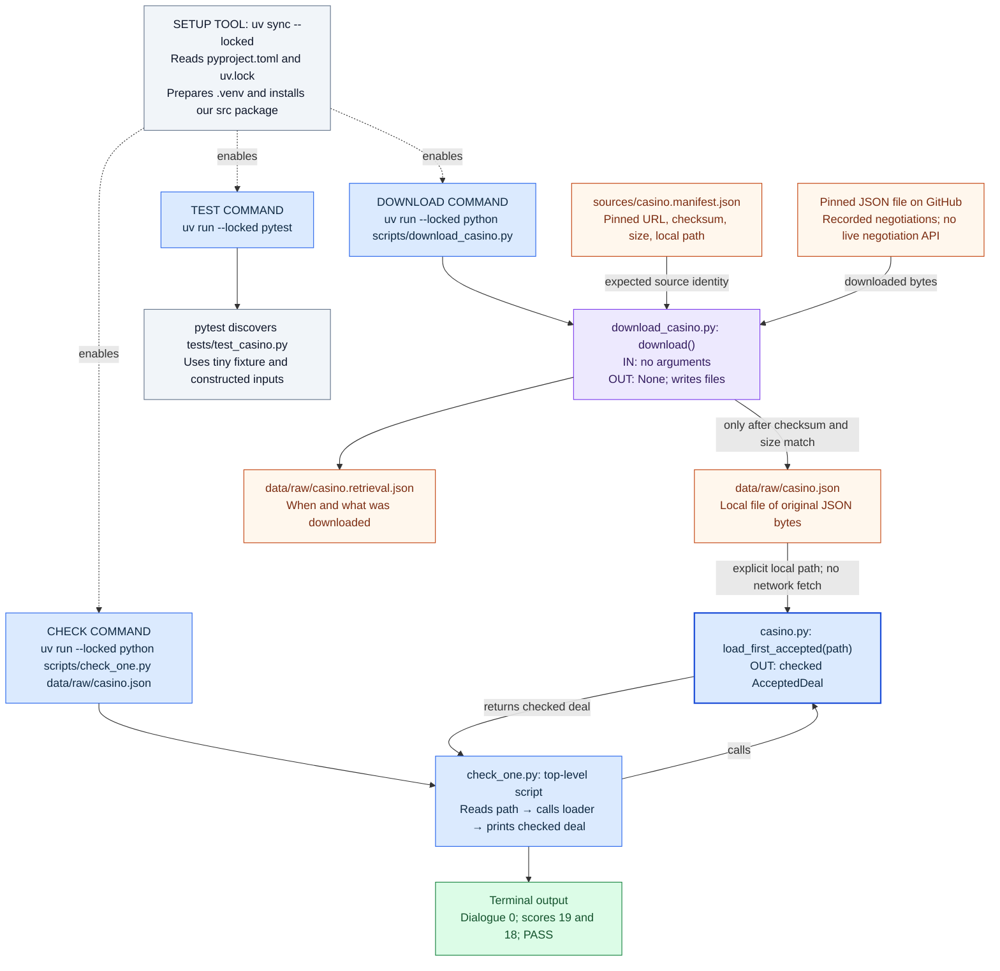

**You are not negotiating through the terminal.** You are reading events that
already happened. The variable `terminal` later in the code means the *last
event's text*, such as `"Accept-Deal"`.

## 2. The complete production call map — who uses which helper?

This is the map to return to whenever you lose track. Each arrow is a **direct
call in our current code**. Constructors are shown as separate “BUILD” boxes.

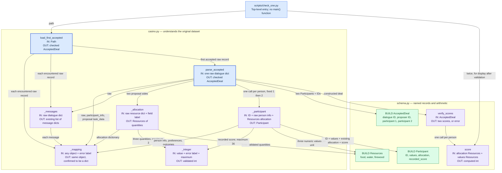

The independent production function `download()` is in map 1 and expanded in
map 10; it calls none of the parsing/scoring functions above.

These helpers are ordinary Python functions. We can think of them as small
tools: the name tells you their job, the arguments tell you what to hand them,
and the return value tells you what comes back.

**Calls are not all independent.** `_allocation()` finishes before
`_participant()` receives that allocation. Both `Participant` objects exist
before `AcceptedDeal` is constructed. Verification happens before returning
the deal. Map 4 shows this execution order.

## 3. Enter through load_first_accepted — from a path to one selected record

Caller: `check_one.py`. Open
[casino.py](../src/evidence_lab/negotiation/casino.py) and find
`load_first_accepted`.

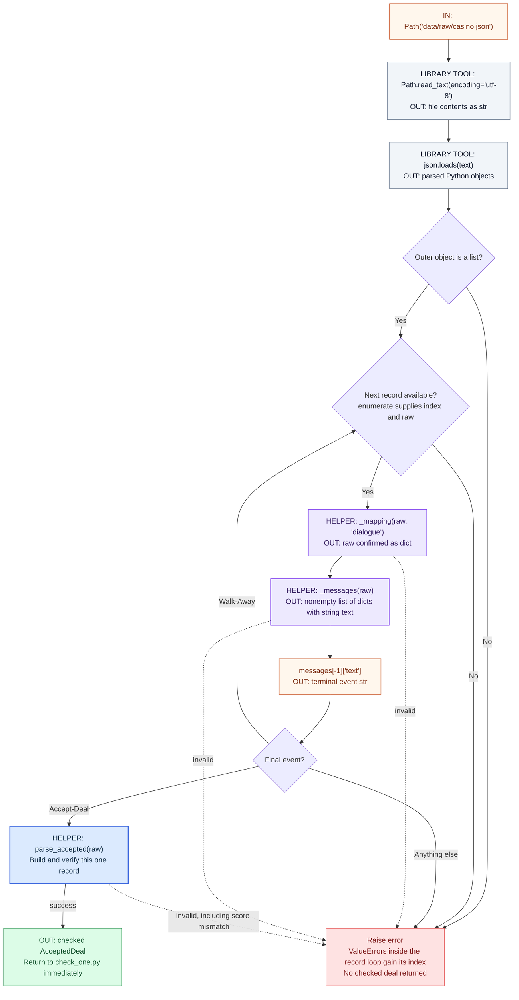

The entire file is decoded, but only the first accepted record is reconstructed.
The index in `enumerate` is the record's position, not necessarily its dialogue ID.
Read/JSON-syntax errors also stop the run; they happen before the record loop.

`_mapping(raw, "dialogue")` checks **that raw is a dictionary**.
The word `"dialogue"` is an error label. It is not a required dictionary key.

## 4. Inside parse_accepted — the exact construction sequence

Caller: `load_first_accepted`, or a test calling it directly.
**This function coordinates construction.** It does not read a file.

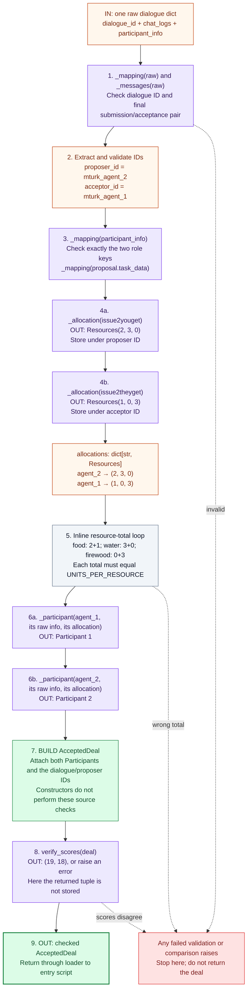

Read quantities in **food, water, firewood** order throughout the examples.
The diagram shows the observed role-2 proposer. The code uses the actual IDs,
so a role-1 proposer is also handled correctly. Dashed error arrows highlight
examples; every validation helper may also raise.

### The contract changes at these boundaries

| Boundary | Exact kind of data | Concrete example / fields |
| --- | --- | --- |
| Disk → read_text | `str` | JSON text, still not Python records |
| Text → json.loads | Require a `list` | Each element is a raw dialogue |
| One selected element → parse_accepted | `dict[str, Any]` | `dialogue_id`, `chat_logs`, `participant_info` |
| raw → _messages | `list[dict[str, Any]]` | Message `text` strings; final messages also supply IDs and proposal quantities |
| Proposal side → _allocation | `Resources` | `food=2, water=3, firewood=0` |
| Two sides keyed by roles | `dict[str, Resources]` | Participant ID → received quantities |
| One person's info + allocation → _participant | `Participant` | ID, values per unit, allocation, recorded score |
| IDs + two Participants | `AcceptedDeal` | Constructed, awaiting score verification |
| AcceptedDeal → verify_scores | `tuple[int, int]` | `(19, 18)`, only if both match |
| parse_accepted → loader → entry | `AcceptedDeal` | The same deal, now score-checked |

Full input structure: [casino.input.md](../sources/casino.input.md).
The [small fixture](../tests/fixtures/casino_dialogue_0.json) shows actual raw keys.
`chat_logs` remains in the raw dictionary; it is not copied into the output
dataclass. The parser reads it to extract the accepted offer.

## 5. The three basic helpers — _mapping, _integer, _messages

These are reused by the higher-level functions. They do not call those
higher-level functions back.

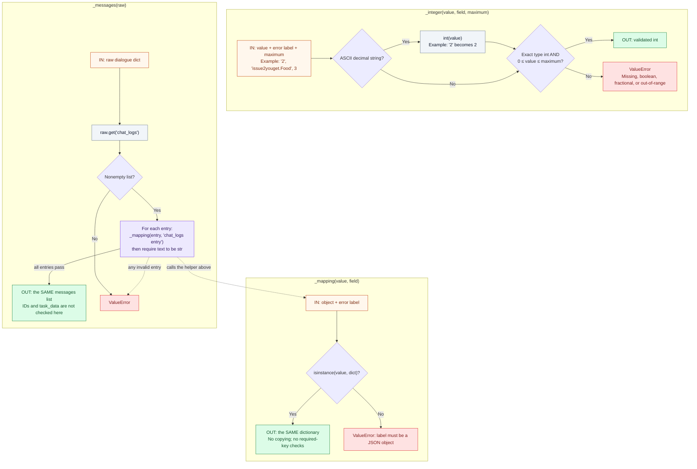

`field` is a human-readable label for error messages, not a lookup key.
`_integer` rejects booleans even though Python treats `bool` as an integer
subtype. It permits digit strings with leading zeros and does not strip spaces.

## 6. _allocation — raw quantities become Resources

Caller: `parse_accepted`, once for each proposal side.
Uses: `_mapping`, `_integer`, and the `Resources` constructor.

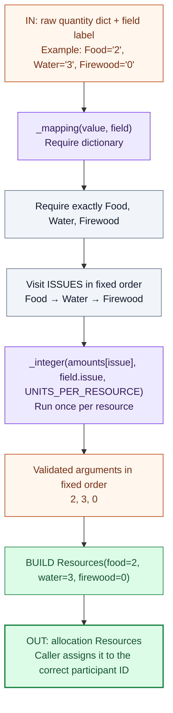

This function checks individual quantities. The cross-person total check runs
later inside `parse_accepted`, when both allocations are available.

## 7. _participant — identity, preferences, allocation, recorded score

Caller: `parse_accepted`, first for role 1, then role 2.
`value` here means **one participant's raw information**, not the full dialogue.

```mermaid
flowchart TD
    IN["IN: participant_id + value + allocation<br/>agent_1 + its raw info + Resources(1,0,3)"]:::data
    INFO["1. _mapping(value, participant_id)<br/>OUT: info dict"]:::helper
    PREF["2. _mapping(info.get('value2issue'), label)<br/>OUT: preferences dict"]:::helper
    RULE["3. Check ranks and resources<br/>High, Medium, Low exactly once<br/>Food, Water, Firewood exactly once"]:::tool
    TRANS["4. Translate using POINTS<br/>High → Firewood → 5<br/>Medium → Food → 4<br/>Low → Water → 3"]:::tool
    VALUES["values dict<br/>Firewood:5, Food:4, Water:3"]:::data
    OUTCOME["5. _mapping(info.get('outcomes'), label)<br/>OUT: outcomes dict"]:::helper
    SCORE["6. _integer(points_scored, label, maximum)<br/>maximum = UNITS_PER_RESOURCE × sum(POINTS.values())<br/>3 × (5+4+3) = 36<br/>OUT: recorded_score = 19"]:::helper
    RES["7. BUILD Resources in ISSUES order<br/>values = Resources(food=4, water=3, firewood=5)"]:::record
    PERSON["8. BUILD Participant<br/>participant_id = agent_1<br/>values = Resources(4,3,5)<br/>allocation = existing Resources(1,0,3)<br/>recorded_score = 19"]:::record
    RETURN["OUT: Participant<br/>Actual score comparison happens later"]:::result
    IN --> INFO --> PREF --> RULE --> TRANS --> VALUES --> OUTCOME --> SCORE --> RES --> PERSON --> RETURN
    classDef data fill:#fff7ed,stroke:#c2410c,color:#7c2d12
    classDef tool fill:#f1f5f9,stroke:#64748b,color:#0f172a
    classDef helper fill:#ede9fe,stroke:#7c3aed,color:#321b5e
    classDef record fill:#dcfce7,stroke:#15803d,color:#14532d
    classDef result fill:#dcfce7,stroke:#15803d,stroke-width:2px,color:#14532d
```

The given `allocation` is attached unchanged. This function creates a second
`Resources` object for **values per unit**. One describes *how many* supplies;
the other describes *how many points per unit*. The record stores both.

## 8. verify_scores uses score — then results return to the entry script

Caller of `verify_scores`: `parse_accepted` (and tests).
Callers of `score`: `verify_scores`, `check_one.py` for display, and tests.

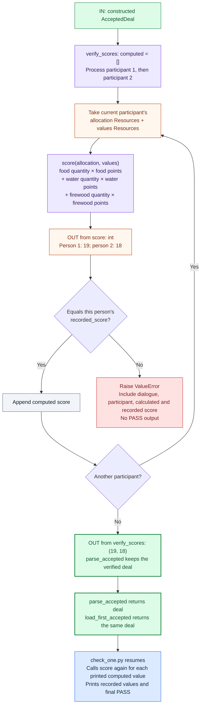

`score` does not access the recorded score. It calculates from allocation and
values alone. `verify_scores` performs the comparison. Returning a tuple is
different from printing; only the entry script prints this result.

## 9. The output contract — where each field came from

These are the three dataclasses defined in
[schema.py](../src/evidence_lab/negotiation/schema.py). Arrows below mean
**contains**, not **calls**.

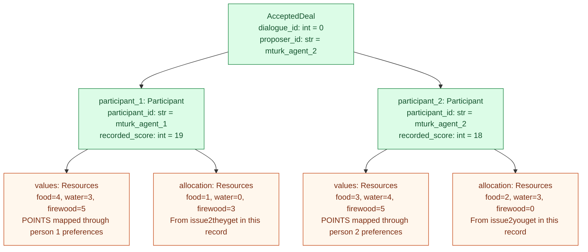

`Participant` and `AcceptedDeal` are containers, not extra processing stages
running in the background. The dataclass decorator supplies their constructors.
Type hints and `frozen=True` do not validate source fields. The checks above do.

## 10. download — the separate acquisition pipeline and its tools

Entry: `scripts/download_casino.py` calls `download()` under its
`if __name__ == "__main__"` guard. `ROOT` is derived from the script location.
There are no function arguments. It reads the manifest from disk.

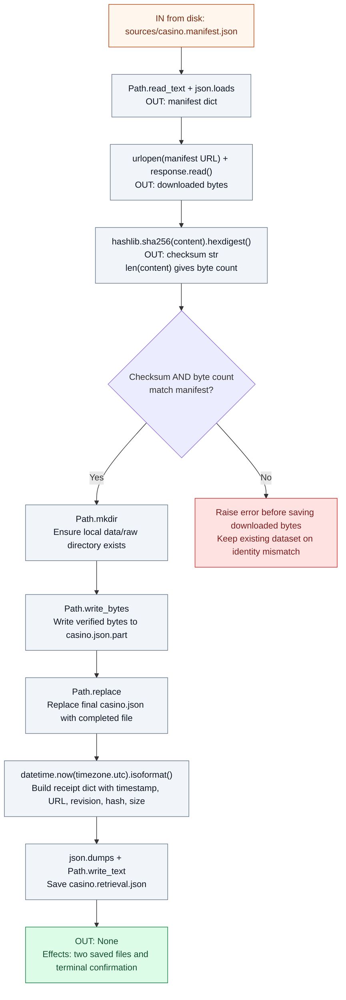

The downloader verifies **file identity**. The parser verifies the **selected
record's structure and scores**. These are different checks. Network/filesystem
errors also propagate. Dataset replacement and receipt writing are separate
operations; they are not one indivisible transaction.

## 11. Tests — which test calls which function?

Tests are another entry into the same functions. They do not run
`check_one.py`, call `download()`, or fetch the complete source.

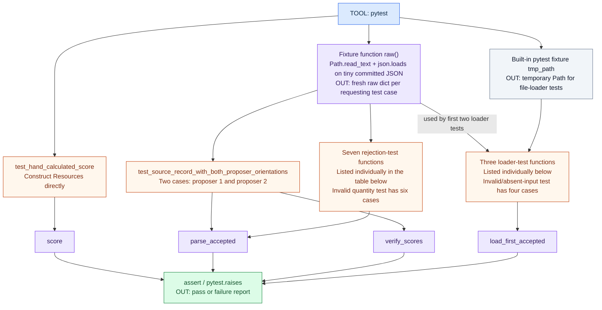

The rejection group contains **seven** test functions: one
parameterized quantity test and six additional rejection tests.

| Every test function in test_casino.py | Inputs / helpers used directly | Expected outcome |
| --- | --- | --- |
| `raw` (fixture provider) | Small fixture Path → read_text → json.loads | New dictionary for each requesting case |
| `test_hand_calculated_score` | Resources constructors → score | Hand answer 19; empty allocation gives 0 |
| `test_source_record_with_both_proposer_orientations` | raw + proposer parameter → parse_accepted → explicit verify_scores | Fixed role allocations/values and (19, 18) for both proposer orientations |
| `test_invalid_quantity_fails` | raw + six quantity parameters → parse_accepted | ValueError for each |
| `test_resources_must_be_conserved` | raw with food total 4 → parse_accepted | ValueError |
| `test_missing_preference_fails` | raw with High removed → parse_accepted | ValueError |
| `test_missing_score_is_not_zero` | raw with score None → parse_accepted | ValueError |
| `test_recorded_score_disagreement_fails` | raw with incorrect recorded score → parse_accepted | ValueError |
| `test_cannot_accept_your_own_proposal` | raw with same proposer/acceptor → parse_accepted | ValueError |
| `test_acceptance_requires_immediately_preceding_submission` | raw with Reject-Deal before acceptance → parse_accepted | ValueError |
| `test_loads_first_accepted_in_file_order` | raw + deepcopy + tmp_path + json.dumps/write_text → load_first_accepted | First accepted ID, after passing a walkaway |
| `test_bad_accepted_record_is_not_skipped` | raw + deepcopy + tmp_path + json.dumps/write_text → load_first_accepted | Error at first bad accepted record despite later good one |
| `test_invalid_or_absent_accepted_input_fails` | Four parameterized inputs + tmp_path + json.dumps/write_text → load_first_accepted | Error for each invalid/absent accepted input |

Test functions normally return `None`; pytest observes assertions and expected
exceptions. Twenty-one cases run because several functions are parameterized.
A rejection test passes when the expected error occurs.

## 12. Tools, files, and rules around the functions

These support the pipeline. They do not automatically become steps inside
`parse_accepted`.

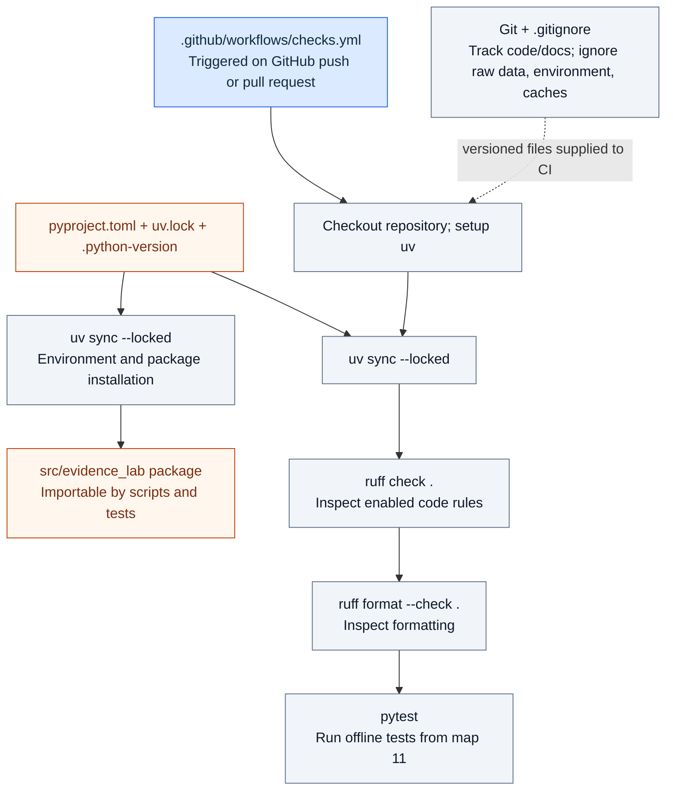

| Rule defined in casino.py | Direct consumers | Meaning |
| --- | --- | --- |
| `PARTICIPANT_IDS` | parse_accepted | Allowed role IDs and fixed output order |
| `ISSUES` | _allocation, _participant | Required raw resource names and constructor order |
| `UNITS_PER_RESOURCE` | _allocation, parse_accepted, _participant | Individual quantity limit, cross-person resource total, and factor in maximum score |
| `POINTS` | _participant | Allowed rank names, points per unit, and maximum score calculation |

The rules describe this pinned dataset. Changing a constant does not change the
downloaded negotiations. The supplied `maximum` argument lets `_integer`
validate both quantities and scores without knowing either rule itself.

| Existing boundary | What it owns | What calls across it |
| --- | --- | --- |
| scripts/download_casino.py | Source acquisition and identity verification | Standard-library network, hashing, and filesystem tools |
| scripts/check_one.py | Command-line path and human-readable output | load_first_accepted, then score for display |
| negotiation/casino.py | Source field names, interpretation, validation, selection | schema constructors and verify_scores |
| negotiation/schema.py | Clean data containers and score arithmetic | verify_scores calls score |
| tests/test_casino.py | Examples proving selected behaviors | Public parser/scoring functions |
| sources/ | Source identity and documented input contract | Downloader reads manifest; people read contract |

### Python tools used inside the functions

| Tool | Input → output / effect | Used by |
| --- | --- | --- |
| `argparse.ArgumentParser`, `add_argument`, `parse_args` | Terminal argument text → object with `args.path` | check_one.py |
| `Path`, `read_text`, `json.loads` | File location → text → Python containers | load_first_accepted, download, raw test fixture |
| `dict.get` / `dict[key]` | Dictionary and key → stored value; get returns None when absent, indexing raises if absent | Source parser helpers |
| `isinstance`, `type` | Value → type check | _mapping, _messages, _integer, parse_accepted, loader |
| `str.isascii`, `str.isdecimal`, `int` | Text → eligibility checks → integer | _integer |
| `set`, `sorted` | Keys/values → collections for exact-key and preference comparisons | _allocation, _participant, parse_accepted |
| `dict.items`, `dict.values` | Dictionary → key/value pairs or just values | _participant and the resource-total loop |
| `enumerate` | Records → index/record pairs | load_first_accepted |
| `len` | Collection or bytes → count | Message checks, download size check |
| `getattr`, `sum` | Resources + field name → quantity; numbers → total | Resource-total loop; sum also derives maximum score in _participant |
| `list.append` | List and score → append to existing list | verify_scores |
| `print` | Values → terminal output | Entry script and downloader |
| `urlopen`, `response.read`, `hashlib.sha256` | URL → bytes → fingerprint | download |
| `Path.mkdir`, `write_bytes`, `replace`, `write_text` | Paths and content → filesystem effects | download; temporary file tests use write_text |
| `datetime.now`, `isoformat`, `json.dumps` | Current time → timestamp text; dictionary → JSON text | Download receipt; tests also serialize JSON |
| `deepcopy` | Nested raw dictionary → independent copy | Tests needing distinct good/bad/later records |
| `pytest.fixture`, `pytest.mark.parametrize`, `pytest.raises` | Supply inputs, repeat cases, expect errors | Tests only |

`if`, `for`, `return`, `raise`, `try`/`except`, and `assert` are language
statements, not extra project functions. Calling `Resources(...)`,
`Participant(...)`, or `AcceptedDeal(...)` constructs an object using the
methods generated by the standard-library `dataclass` decorator.

The two `__init__.py` files contain package docstrings, with no functions or
research actions. Imports load definitions; they do not start a download, select
a record, or run a test.

### One continuous trace to rehearse

```text
Start check_one.py with a local path
    ↓
load_first_accepted(Path)
    read text → decode JSON → choose first accepted raw dictionary
    uses _mapping and _messages
    ↓
parse_accepted(raw)
    _mapping + _messages → identify submission, acceptance, roles
    _allocation(you)   → _mapping + 3 × _integer → Resources
    _allocation(they)  → _mapping + 3 × _integer → Resources
    both allocations  → check totals
    _participant(1)    → 3 × _mapping + _integer → Resources values → Participant
    _participant(2)    → 3 × _mapping + _integer → Resources values → Participant
    build AcceptedDeal
    verify_scores(deal) → score(person 1) + compare
                        → score(person 2) + compare
                        → return (19, 18)
    return checked AcceptedDeal
    ↓
load_first_accepted returns that same AcceptedDeal
    ↓
check_one.py prints both people and scores, then PASS
```

For syntax details use [WALKTHROUGH.md](WALKTHROUGH.md). This map is the
navigation aid: **entry → coordinating function → helper → result → caller**.
