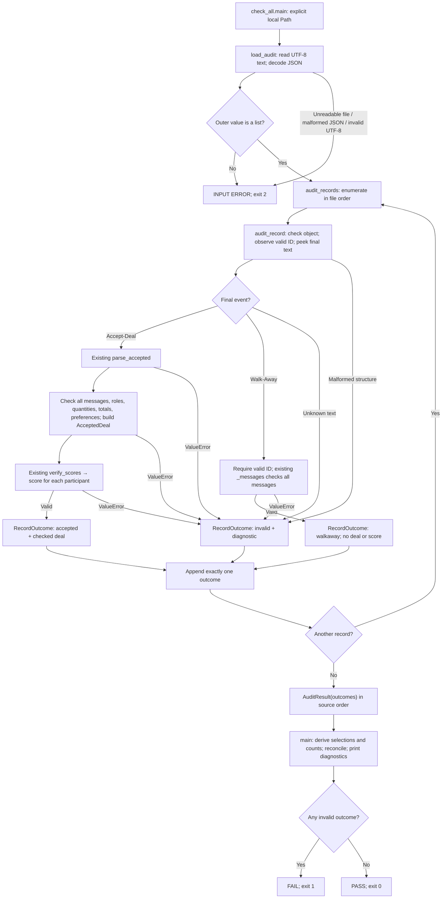

# Milestone 1: follow every record and keep every outcome

The line references in this guide predate the function-comment cleanup. Use the
quoted statements to find their current locations; executable behavior is unchanged.

For the complete self-study sequence, open the [offline HTML study guide](MILESTONE_1_WALKTHROUGH.html)
or its [Markdown version](MILESTONE_1_WALKTHROUGH.md). The HTML is a single file you can copy to a second
device. Both explain the annotated code before the debugger exercises.

The new responsibility is to finish the file. `load_first_accepted` remains useful for one deal; the
audit visits all positions, keeps failures visible, and returns checked deals alongside accounting. Read
one section, predict a value, then inspect it. You can split this guide into three sessions: data
structures, the four-record debugger trace, then fixture experiments.

## See the complete flow first



The diagram describes expected input failures. Unexpected programming exceptions still propagate so they
can be debugged; they are not converted into clean results.

## Predict the small example

`tests/fixtures/casino_audit_small.json` is a constructed teaching list based on the existing reduced
source fixture. Its IDs are teaching identities.

| List position | Dialogue ID | Final event | Validation result |
| ---: | ---: | --- | --- |
| 0 | 100 | Accept-Deal | Valid; participant 2 proposes |
| 1 | 101 | Accept-Deal | Invalid: participant 1 records 20; calculation gives 19 |
| 2 | 102 | Walk-Away | Valid walkaway; no accepted allocation |
| 3 | 103 | Accept-Deal | Valid; participant 1 proposes the same allocation |

Before running, predict **4 records, 3 accepted endings, 2 checked deals, 1 walkaway, 1 invalid record,
FAIL**. The accounting is `4 = 2 + 1 + 1`. An accepted ending means that final text was observed. It does
not prove the record passed validation. Position 1 must remain visible, and position 3 must still be
processed after it. Positions start at zero; IDs identify dialogues.

## Piece 1: retain the existing interpretation

Input: a raw accepted dictionary. Work: the existing parser checks it and constructs named objects.
Output: an `AcceptedDeal`, or `ValueError`. Next: the audit places that result inside one outcome.

The implementation reuses `_mapping`, `_messages`, and `parse_accepted`. Inside that parser, `_integer`,
`_allocation`, `_participant`, `verify_scores`, and `score` retain their jobs. Inspection and Git
comparison confirmed that the parser/scoring executable logic was unchanged; new comments explain its blocks. The one-record
loader and checker remain available.

`Resources(food, water, firewood)` stores either **quantities received** when used as `allocation`, or
**points per unit** when used as `values`:

| Checked field in both valid teaching deals | Food, water, firewood |
| --- | --- |
| `participant_1.allocation` — quantities | 1, 0, 3 |
| `participant_1.values` — points per unit | 4, 3, 5 |
| `participant_2.allocation` — quantities | 2, 3, 0 |
| `participant_2.values` — points per unit | 3, 4, 5 |

Participant 1 scores `1*4 + 0*3 + 3*5 = 19`; participant 2 scores `2*3 + 3*4 + 0*5 = 18`. Each resource
totals three units. Assigned ranks High/Medium/Low become 5/4/3 points per unit. An offer's
`issue2youget` belongs to its proposer. Output `participant_1` always means `mturk_agent_1`, including
dialogue 100 where participant 2 proposes.

`Resources`, `Participant`, and `AcceptedDeal` are dataclasses: constructors group named fields. They do
not validate contents automatically. The parser and score checks perform validation before the audit
exposes a checked deal.

## Piece 2: describe one record's outcome

Input: position, observed identity/ending, and interpretation. Work: store them together in
`RecordOutcome` (`audit.py`, lines 21–51). Output: one named record. Next: `audit_records` collects these
objects in source order.

```python
@dataclass(frozen=True)
class RecordOutcome:
    record_index: int
    dialogue_id: int | None
    terminal: str | None
    status: Literal["accepted", "walkaway", "invalid"]
    deal: AcceptedDeal | None = None
    error: str | None = None
```

| Field | Meaning and reason |
| --- | --- |
| `record_index: int` | Zero-based source position; remains useful without an ID |
| `dialogue_id: int \| None` | Observed nonnegative integer ID, or unavailable |
| `terminal: str \| None` | Observed final text, or unavailable; preserves accepted endings on later failure |
| `status: Literal[...]` | One of the three accounting categories |
| `deal: AcceptedDeal \| None` | Checked accepted deal; absent for invalid records and walkaways |
| `error: str \| None` | Failure explanation; absent for accepted deals and walkaways |

`None` means no value here, not zero or an empty deal. `int | None` permits either kind of value.
`Literal` documents permitted status strings. The colon introduces a type hint; `= None` supplies a
default. Hints help readers/tools, but do not enforce runtime validation. `-> int` similarly describes a
function's returned value. `audit_record` enforces the relationships. `frozen=True` prevents field
reassignment, such as replacing `outcome.status`.

## Piece 3: interpret one raw record

Input: any decoded JSON value plus its position. Work: `audit_record` (`audit.py:111`) starts with
unavailable ID/ending, checks the dictionary, and records a valid integer ID. Important locals are
`candidate_id`, `dialogue_id`, `messages`, `final_text`, `terminal`, and either `deal` or `error`.

The final-message peek at lines 138–151 examines one list entry. On an accepted ending, line 157 calls the
unchanged strict parser, which checks all messages. On a walkaway, lines 168–177 require a valid ID and use
`_messages` to check all message objects/text strings. Walkaway allocations, preferences, scores, and
participant roles are outside this milestone's walkaway contract; no scores or accepted allocations are
invented.

Unknown final text, malformed messages, invalid IDs, and accepted validation failures produce an invalid
outcome via `except ValueError`. Output: exactly one outcome for these expected record problems. Next:
the loop appends it. Because final text is observed first, an earlier malformed message can make an
accepted record invalid while its ending still contributes to the ending count.

## Piece 4: collect outcomes, then derive accounting

Input: an already decoded list. Work: `audit_records` rejects another outer type, visits each position
once, and keeps one outcome. Output: `AuditResult`. Next: the entry script reads its properties.

```python
outcomes = []
for record_index, raw in enumerate(records):
    outcome = audit_record(raw, record_index)
    outcomes.append(outcome)
return AuditResult(outcomes)
```

`enumerate` supplies `(position, item)` pairs. `append` changes the existing list. `return` ends this
function after the loop, rather than after one record. `AuditResult` has one stored field, `outcomes:
list[RecordOutcome]`; its other attributes are derived properties, so separate counters cannot drift
apart.

```python
@property
def accepted_endings(self) -> int:
    return sum(outcome.terminal == "Accept-Deal" for outcome in self.outcomes)
```

`self` is this result object. `@property` lets you read `result.accepted_endings` without parentheses;
the function runs on access. Comparison produces booleans; `sum` counts `True` as 1 and `False` as 0.
`total_records` uses `len(outcomes)`. The list comprehension `[outcome.deal for outcome in self.outcomes
if outcome.deal is not None]` builds a list of existing deals. `walkaways` and `invalid_records`
similarly select outcome references by status. `ok` uses `not any(...)`: `any` detects an invalid status,
and `not` reverses the answer.

These properties scan when accessed; they are not cached. `frozen=True` on `AuditResult` prevents
replacing its field, but its `outcomes` list can still be appended to. Frozen dataclasses do not make
nested lists deeply immutable. The audit and checker treat the completed result as read-only.

## Piece 5: read a file and observe the result

Input: a `Path`. Work: `load_audit` reads UTF-8 text, decodes the whole JSON, and calls `audit_records`.
Output: the result, or a contextual file-level error. Malformed JSON reports line/column; an outer object
instead of a list is an input error. An unreadable file is handled by the script's `OSError` branch. No
outcomes are claimed when the outer input cannot be interpreted.

`check_all.main` obtains `args.path`, calls the loader, materializes each selection once, checks `total =
accepted + walkaway + invalid`, and prints every invalid diagnostic. Exit **0** means no invalid records;
**1** means record failures remain; **2** means input failure. An empty list yields a clean zero-record
audit, not evidence that a dataset was supplied correctly.

Dependencies are `scripts/check_all.py → audit.py → casino.py → schema.py` (the audit also names
`AcceptedDeal` from the schema). File reading, source interpretation, score arithmetic, and display have
separate small jobs. No new framework, database, or reporting system is needed for this milestone.

## Follow the four records in VS Code

Keep `/home/mastii/Desktop/hustle` open. Expand `evidence-lab` in Explorer; paths below are relative to
that folder. Use **Ctrl+P** to open a file, **Ctrl+G** to reach the numbered line, then click left of the
line number to place a red dot. The quoted executable statement is the stable anchor if future edits move
a line. These numbers were checked against the current code.

Open **Run and Debug** with **Ctrl+Shift+D**. Select **Trace CaSiNo audit (small example)** in the
dropdown and press **F5** or its adjacent green triangle. Both `hustle/.vscode/launch.json` and
`evidence-lab/.vscode/launch.json` contain that name, **Trace CaSiNo audit (full dataset)**, and **Trace
first CaSiNo deal**. Their paths account for which folder is open and select the project's
`.venv/bin/python`; the small configuration supplies the fixture path. Use the saved configuration's
start button. Its output appears in **Debug Console**. If the dropdown is stale, use **Ctrl+Shift+P →
Developer: Reload Window**.

In **BREAKPOINTS**, disable old dots for this trace and leave all three exception options unchecked
for the first run: **Raised Exceptions**, **Uncaught Exceptions**, and **User Uncaught Exceptions**.
The expected score error is caught by the audit. At the end, the intentionally invalid example exits
through `SystemExit: 1`; checking **Uncaught Exceptions** can pause on that expected exit at
`check_all.py:121`, after `main` has returned. Its local `args` and `result` are then unavailable.
Use **Shift+F5** to stop, keep only the intended source breakpoint enabled, and start again with
**F5**. Pressing **F5** while paused continues; it does not advance just one line.

**F5** continues to the next dot, **F10** steps over
a statement, **F11** enters a called function, and **Shift+F11** finishes the current function.
**Shift+F5** stops; restart with **Ctrl+Shift+F5**. Breakpoints can also interrupt a step. A highlighted
line is generally about to execute: its new assignment may not exist yet. At a loop stop, `outcome` may
still be from the previous iteration. Selecting a **CALL STACK** frame changes the locals you view; it
does not rewind time. Use WATCH's **+** to add expressions; expressions may be unavailable in other
frames.

Set these stops before starting, then follow one stop at a time:

1. **Before loading — `scripts/check_all.py:37`, `result = load_audit(args.path)`.** Select **main** in
   CALL STACK. Expand Locals → `args` → `path`; Watch `str(args.path)` should be
   `'tests/fixtures/casino_audit_small.json'`. `result` is not assigned yet. Press **F11** to enter
   `load_audit`, inspect its `path`, then **F5** to the loop stop below.

2. **Each loop call — `audit.py:215`, `outcome = audit_record(raw, record_index)`.** Select
   **audit_records**. Expand `records` (length 4), `raw`, and `outcomes`. Watch `record_index`,
   `raw['dialogue_id']`, and `len(outcomes)`: successive values are `(0,100,0)`, `(1,101,1)`,
   `(2,102,2)`, `(3,103,3)` before the call. Predict each status. Use **F11** to enter `audit_record`, or
   **F5** to its next branch stop. Do not interpret an old `outcome` as the current result.

3. **Accepted parser call — `audit.py:157`, `deal = parse_accepted(raw)`.** Select **audit_record**.
   Expand `raw` → `chat_logs`; Watch `record_index`, `dialogue_id`, and `terminal`. First stop: `0`,
   `100`, `'Accept-Deal'`. It repeats for IDs 101 and 103. Press **F11** to enter **parse_accepted**;
   follow its familiar checks, or **F5** to the complete-deal stop.

4. **Complete constructed deal — `casino.py:218`, `verify_scores(deal)`.** Select **parse_accepted**.
   Expand `deal` → both participants → `allocation` and `values`; also expand `allocations`. Watch
   `deal.proposer_id`, `deal.participant_1.recorded_score`, and `deal.participant_2.recorded_score`.
   ID100 shows proposer `'mturk_agent_2'`, scores 19/18, and the Resources values in the table above.
   Construction has finished; score verification is about to run. ID101 has recorded 20/18. ID103
   reverses the proposer while retaining fixed output participants and their quantities/values. Press
   **F11** for **verify_scores**. An optional dot at `schema.py:82`, `if reconstructed !=
   participant.recorded_score:`, lets you expand `participant` and Watch `reconstructed` and
   `participant.recorded_score`: 19/19 then 18/18 for ID100; 19/20 for ID101. Use **F10** for comparisons
   and **F5** to the next audit stop. This function runs repeatedly.

5. **Invalid return — `audit.py:188`, `return RecordOutcome(`.** Select **audit_record**. Expand `raw` and
   inspect `error`; Watch `str(error)`, `record_index`, `dialogue_id`, `terminal`: index1, ID101,
   `'Accept-Deal'`, and `computed score 19 != recorded score 20` in the error. Press **F10** through the
   multiline return or **F5** to the append stop. The failed local deal is never exposed as a checked
   accepted outcome.

6. **Walkaway branch — `audit.py:172`, `_messages(raw)`.** Select **audit_record**. Expand `raw` →
   `chat_logs`; Watch `record_index`, `dialogue_id`, `terminal`: `2`, `102`, `'Walk-Away'`. The valid ID
   is already checked; there is no accepted `deal`. Press **F10** to validate messages, then **F10** at
   line 177's return or **F5** to the append stop.

7. **Each append — `audit.py:220`, `outcomes.append(outcome)`.** Select **audit_records**. Expand
   `outcome` and `outcomes`; Watch `outcome.status`, `outcome.deal`, `outcome.error`, and
   `len(outcomes)`. Statuses are accepted, invalid, walkaway, accepted. Before each append, lengths are
   0/1/2/3. Press **F10** and see 1/2/3/4; expand the added item. Invalid/walkaway have `deal=None`; only
   invalid has an error. Press **F5** to process the next position, including the accepted record after
   failure.

8. **Final selections — `scripts/check_all.py:74`, `print(f"Total records: {result.total_records}")`.**
   Select **main**. Expand `result` → `outcomes` and the three local lists. Watch `result.total_records`
   (4), `result.accepted_endings` (3), `len(accepted_deals)` (2), `len(walkaways)` (1),
   `len(invalid_records)` (1), `accounted` (4), and `result.ok` (`False`). Deal IDs are 100/103; the
   diagnostic is index1/ID101. These properties compute on access. Press **F5**; Debug Console prints the
   reconciled accounting, diagnostic, and `FAIL: audit contains invalid records.` The expected process
   exit is 1.

## Change one small input and explain the difference

In VS Code Explorer, copy the teaching JSON and paste it into the same folder; rename it
`casino_audit_experiment.json`. In the launch JSON for your open folder, duplicate the small-example
configuration, name it **Trace CaSiNo audit (experiment)**, and change its sole `args` path to
`tests/fixtures/casino_audit_experiment.json`. Keep the existing configurations. Save, select the
experiment configuration, and use the same dots. Delete the temporary copy/configuration when finished;
keep the supplied teaching fixture intact.

First predict: changing only ID101's participant1 `points_scored` from **20 to 19** gives 3 valid
accepted deals, 3 accepted endings, 1 walkaway, 0 invalid, `4 = 3 + 1 + 0`, PASS, exit0. Make the edit in
the copy, run, and explain why accepted endings did not change while checked deals did.

Next use the corrected copy and insert `{"text": 7}` as a message before ID100's final
submission/acceptance pair. Predict 3 accepted endings, 2 checked deals, 1 walkaway, 1 invalid, FAIL.
Inspect the invalid outcome: its terminal still says Accept-Deal, while `_messages` rejects the earlier
nonstring text. Restore the copy between experiments. Never edit `data/raw/casino.json`.

## Account for time, memory, and completion

Let **B** be file size, **N** records, and **M** total messages checked. Reading and decoding costs O(B);
the audit loop costs O(N + M), giving **O(B + N + M)** overall. Two participants and three resources add
fixed work per accepted record. The final-entry peek is O(1); it avoids scanning every message once to
choose a branch and again in the existing selected validator. Accepted validation still checks every
message; malformed records may fail early. Each derived selection/count scan is O(N), and `ok` may stop
at the first invalid outcome. `total_records` is O(1). A fixed number of these scans keeps the overall
order linear; repeatedly requesting a property repeats its scan.

This is **not streaming**. The loader holds the full decoded JSON plus outcomes and checked deals (O(N)
additional records). Text/decoded data also consume memory related to B. The script's selected lists
contain references to existing deals/outcomes, not copied nested objects. They still require space.

The full local dataset was verified as **1,030 = 1,005 valid accepted + 25 walkaways + 0 invalid**, with
**1,005 accepted endings**, PASS, exit0. For that run, disable the small-trace dots and choose **Trace
CaSiNo audit (full dataset)**. **61 tests pass: 21 existing and 40 new; Ruff lint and format checks
pass.** [STATUS.md](STATUS.md) records these checks. The new tests cover continuation, proposer
orientation, strict parser failures, malformed records, walkaway checks, accounting, input errors, and
the real checker's three exit statuses without downloading data. Both folders' launch paths were
exercised; the debug adapter also verified an actual audit breakpoint and its variables.

Before moving on, explain the path from file to checked deal to outcome; why 3 accepted endings can yield
only 2 checked deals; why ID103 still runs after ID101 fails; what each Resources object means; why a
walkaway has no deal; where type hints end and validation begins; and why full-file loading uses memory
beyond the outcomes. Reproduce the small accounting and inspect all four outcomes. Milestone 1 is
complete when these behaviors and checks hold. Milestone 2 will measure exact Pareto dominance over
feasible allocations. Milestone 3 will save reproducible study results, run information, and a report.
Neither later milestone is implemented by this audit.
