# Evidence Lab milestone 1: read the program, then watch it run

Version note: this guide preserves the 8 October annotated source layout. Function
comments were subsequently simplified without changing behavior. Find the quoted
statements in current files; the line numbers below belong to the earlier snapshot.

This document is a complete study guide for the code verified on **8 October 2026**. Keep it on your
second device and use VS Code on your first device. You do not need the chat history, an internet
connection, or rendered diagrams to follow it. Every diagram has a plain-text version.

The implementation and its Input/Work/Output comments were checked before this guide was written. The
source line numbers below refer to that commented version. Comments and later edits can move a line; the
quoted statement is the more durable way to find a stop. All file paths are relative to:

```text
/home/mastii/Desktop/hustle/evidence-lab
```

Your VS Code workspace can remain `/home/mastii/Desktop/hustle`. Expand its `evidence-lab` folder to find
these files. This guide explains the current implementation; it does not require another implementation
or introduce the later study milestones.

## 1. A manageable reading plan

Do the reading before the debugger exercises. One logical block is enough for a sitting: read its input,
follow its code, predict its output, and explain that output in your own words. You need not finish the
document in one day.

| Pass | Sections | What to explain before continuing |
| --- | --- | --- |
| A | 2–4 | The practical task, four-record example, and raw/checked structures |
| B | 5–7 | Named records, type hints, and derived accounting |
| C | 8–10 | Launch arguments, file loading, and the loop that keeps every outcome |
| D | 11–13 | Record branches, accepted validation, and score reconstruction |
| E | 14–16 | Display, exit status, execution order, complexity, and verification |
| F | 17–18 | Breakpoints, variables, and deliberate input changes |

A Python code block below shows the statements from the named source, with comments generally omitted to
keep the block small. Fragments are for reading in their function or class context, not independent
copy-and-run programs. Comments remain in the source. Ellipses appear only in schematic data trees.

### 1.1 Use the same small routine for every block

On device 2, read the flowchart and its plain-text equivalent first. On device 1, open the named source
and find the quoted statement. Read the **Input**, **Work**, and **Output** comments above that block,
then its executable lines. Before reading the explanation, say what value enters and what you expect to
leave. Compare your prediction with the explanation, and write one sentence in your own words.

“Output” can mean a **returned value**, a **changed local/list**, **printed text**, or a **raised error**.
The comments name which one applies. For example, the loader returns an `AuditResult`; `append` changes a
list; `print` displays text. These are different effects. A comment describes the work; Python executes
the statements below it.

For each sitting, keep these three short notes:

```text
I am reading: file + function + quoted statement
Its input is: ...
After it succeeds/fails, the next value or action is: ...
```

If a line feels difficult, read the whole enclosing block again. A closing parenthesis, a type hint, or a
helper name makes sense through the block's input and purpose. The checkpoints at the end of each pass
let you test recall before opening the debugger.

### 1.2 Source-reading roadmap

Use this table to choose the file on device 1 while reading the explanation on device 2. The study order
starts with the data containers so later variables have a meaning. Section 15 then reconnects the pieces
in actual execution order. You do not need to trace imports line by line in the debugger yet.

| Read with | Open this project-relative file | Current lines / durable landmark | Purpose |
| --- | --- | --- | --- |
| Sections 2–4 | `tests/fixtures/casino_audit_small.json` | IDs 100, 101, 102, 103 | Know the four inputs and expected outcomes |
| Section 5 | `src/evidence_lab/negotiation/schema.py` | 10–47; `class Resources`, `Participant`, `AcceptedDeal` | Understand the checked objects |
| Section 6 | `src/evidence_lab/negotiation/audit.py` | 8–63; imports, `RecordOutcome`, `AuditResult` | Understand one outcome and the complete ledger |
| Section 7 | `src/evidence_lab/negotiation/audit.py` | 68–105; `@property` methods | Derive counts from the ledger |
| Section 8 | `scripts/check_all.py` | 6–43; `main`, `args`, `result = load_audit(args.path)` | Obtain the path and make the loader call |
| Section 9 | `src/evidence_lab/negotiation/audit.py` | 231–261; `load_audit` | Read/decode the file and handle input errors |
| Section 10 | `src/evidence_lab/negotiation/audit.py` | 196–225; `audit_records` | Keep one outcome for every source position |
| Section 11 | `src/evidence_lab/negotiation/audit.py` | 111–190; `audit_record` | Observe metadata and select a record branch |
| Section 12.2 | `src/evidence_lab/negotiation/casino.py` | 24–30, 56–71, 141–158; `_mapping`, `_messages`, accepted pair | Check structure and identity |
| Sections 12.3–12.5 | `src/evidence_lab/negotiation/casino.py` | 36–50, 77–93, 162–196; `_integer`, `_allocation`, roles and totals | Turn source quantities into a conserved allocation |
| Sections 12.6–12.7 | `src/evidence_lab/negotiation/casino.py` | 99–135, 201–219; `_participant`, `verify_scores(deal)` | Construct both participants and a checked deal |
| Section 13 | `src/evidence_lab/negotiation/schema.py` | 53–95; `score`, `verify_scores` | Reconstruct arithmetic independently |
| Section 14 | `scripts/check_all.py` | 48–121; selections, diagnostics, `SystemExit(main())` | Report accounting and exit status |
| Sections 15–16 | Those same files; `tests/test_audit.py` | Continuous execution and verification tables | Reconnect the whole program and its evidence |
| Sections 17–18 | Same source files; workspace `.vscode/launch.json` | Five-stop first trace, then detailed trace and copied fixture | Observe the work only after reading it |

All line numbers refer to the checked commented source. If later edits move them, search the named
function or quoted statement with **Ctrl+F** rather than assuming the old number still identifies it.

## 2. The practical question and complete flow

Two participants negotiate Food, Water, and Firewood. There are three units of each resource. Assigned
High/Medium/Low preferences are worth 5/4/3 points per unit. A submitted offer describes quantities, and
the source records each participant's claimed score.

For milestone 1 we ask: **Can we interpret every record, reconstruct every valid accepted deal, and
account explicitly for everything else?**

An accepted deal is valid here only after resource and score checks pass. A walkaway has no accepted
allocation. An invalid record must retain a useful diagnostic, and a later valid record must still be
processed.

The following words have specific meanings in this guide:

| Word | Concrete meaning here |
| --- | --- |
| Record / dialogue | One item in the outer JSON list, describing one negotiation |
| Allocation | How many Food, Water, and Firewood units each person receives |
| Preference / value | A resource's importance to one person, converted into points per unit |
| Terminal / ending | The final message text; the variable name does not mean a terminal application |
| Validation | Explicit checks that a value/record satisfies the program's input rules |
| Diagnostic | The text explaining why a record or file could not be accepted |
| Audit / ledger | Inspect all positions and retain their ordered outcomes, including failures |
| Fixture | A small prepared input file used to learn or test particular behavior |

**First zoom: the six main stages.** Follow the completed-audit path before studying its branches.

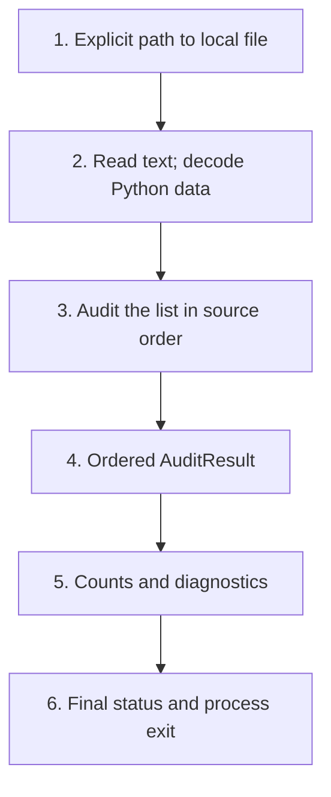

Plain-text version:

```text
local file path → decoded Python data → audit the list in order
                → ordered AuditResult → counts/diagnostics → exit status
```

An empty list takes the same route with zero record iterations. This first view shows the completed
result path; the next view exposes the record choices and file-level failure paths.

**Next zoom: how each record and failure moves through those stages.** Read the branches one at a time.

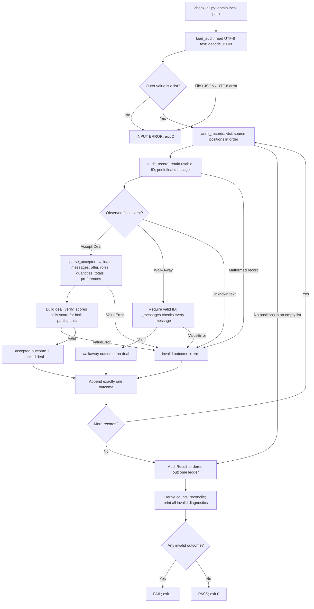

Plain-text version:

```text
path → read text → decode JSON → require outer list
                                 ↓
each position → inspect final event
    accepted → strict parser → allocation + values → score comparison
    walkaway → ID check + message-shape check
    malformed/unknown/failed validation → invalid diagnostic
                                 ↓
append one outcome → next position → completed AuditResult
                                 ↓
derive counts → reconcile → print diagnostics → PASS(0) or FAIL(1)
file/JSON/outer-list failure → INPUT ERROR(2)
```

Unexpected programming exceptions still propagate. This flow does not claim that every possible bug
becomes an ordinary invalid record.

### 2.1 Predict the four-record teaching example

The supplied `tests/fixtures/casino_audit_small.json` is a constructed example based on the reduced
dialogue fixture. Its IDs are teaching identities, rather than four newly observed source dialogues.

| Position | ID | Final event | What should happen |
| ---: | ---: | --- | --- |
| 0 | 100 | Accept-Deal | Valid; participant 2 proposes |
| 1 | 101 | Accept-Deal | Invalid; participant 1 records 20, calculation gives 19 |
| 2 | 102 | Walk-Away | Valid walkaway; no accepted allocation |
| 3 | 103 | Accept-Deal | Valid; participant 1 proposes the same final allocation |

Predict this before reading code:

```text
Total records: 4
Accepted endings: 3
Valid accepted deals: 2
Walkaways: 1
Invalid records: 1
Accounting: 4 = 2 valid accepted + 1 walkaways + 1 invalid
Final status: FAIL; exit code 1
```

An **accepted ending** means the audit observed final text `Accept-Deal`. A **valid accepted deal**
additionally passed all accepted-record validation. ID 101 belongs to the first count and not the second.
The accepted-ending count overlaps the accounting categories; do not add it to the equation.

Position 3 must run after position 1 fails. The original one-record loader could never establish that
because it returned at its first accepted deal.

## 3. Files, definitions, calls, and basic Python

### 3.1 The dependency map

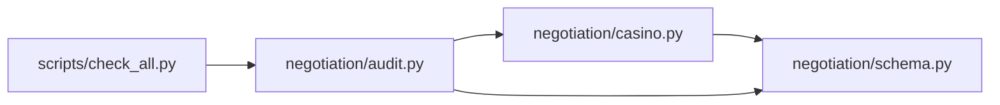

Plain text: `check_all.py → audit.py → casino.py → schema.py`, with the audit also importing the
`AcceptedDeal` type from the schema.

| Full project-relative file | Responsibility |
| --- | --- |
| `scripts/check_all.py` | Arguments, summary, diagnostics, and exit status |
| `src/evidence_lab/negotiation/audit.py` | One outcome per record and derived accounting |
| `src/evidence_lab/negotiation/casino.py` | CaSiNo field meanings and strict accepted validation |
| `src/evidence_lab/negotiation/schema.py` | Named data containers and score arithmetic |
| `scripts/check_one.py` | Existing first-accepted-deal observation |
| `tests/test_casino.py`, `tests/test_audit.py` | Offline examples checking expected behavior |

The audit reuses `_mapping`, `_messages`, and `parse_accepted`. The parser already reuses `_integer`,
`_allocation`, `_participant`, `verify_scores`, and `score`. Existing parser/scoring behavior remains
unchanged; the new source annotations explain it. We keep file reading separate from interpreting an
already decoded record list so tests can supply tiny lists directly.

### 3.2 Definition order differs from running order

Python executes a module's top-level statements when it loads that module. Imports make names available.
Class definitions create classes; decorators configure them. A `def` statement creates a function, but
does not run its body. The body runs when a call reaches it.

For this script, imports load the needed definitions; `main` is defined; the bottom-of-file guard calls
`main`. Inside that call, argument parsing happens before the loader, which runs before the reporting
statements. Properties and helpers execute only when called or accessed. Their location near the top of a
file does not mean they run first in the audit.

### 3.3 Read the recurring syntax

| Syntax | Meaning in our program |
| --- | --- |
| `name = expression` | Evaluate the right side, then assign its result to the name |
| `==`, `!=` | Compare equal / not equal; these do not assign |
| `None` | An explicit absence of a value; not a zero score |
| `True`, `False` | Boolean answers used by conditions |
| `[a, b]` | An ordered, changeable list |
| `(a, b)` | An ordered tuple; its entries cannot be reassigned |
| `{"Food": "2"}` | Dictionary: a key maps to a value |
| `{"Food", "Water"}` | Set: distinct members, used for membership comparisons |
| `items[0]`, `items[-1]` | First element / last element |
| `items[-2:]` | Slice containing the last two elements |
| `raw.get("key")` | Dictionary value, or `None` when the key is absent |
| `raw["key"]` | Required lookup; raises `KeyError` when absent |
| `object.field` | Read a named attribute; a method call also uses a dot |
| `if condition:` | Run its indented block when the condition is true |
| `for name in values:` | Repeat its indented block for successive values |
| `return value` | Finish this call and hand the value to its caller |
| `raise ValueError(...)` | Stop normal execution and seek a matching exception handler |
| `try` / `except` | Attempt a block and handle specified exception types |
| `# ...` | A human comment; no runtime action |
| `"""..."""` | A string; at the beginning of a module/class/function, its docstring |

Indentation is part of Python syntax. It determines which statements belong inside a function, loop,
condition, or handler. Blank lines improve reading. Parentheses allow one expression across several
physical lines; a closing parenthesis does not itself perform an extra separate computation.

`and` requires both conditions, `or` at least one, and `not` reverses a boolean answer. They
short-circuit: Python stops when the result is already known. Empty lists/dictionaries are false in a
condition. `is None` asks whether a value is the absence singleton; `type(value) is int` checks the exact
type.

An integer `2` and text `"2"` are different values/types. A type hint after a colon, or a return hint
after `->`, describes intended use. Python does not automatically validate input because of these hints.

### 3.4 How a call receives input and gives a result back

Read `result = load_audit(args.path)` as three ordered actions: evaluate `args.path`, pass that object
into `load_audit`, and assign the returned object to `result` after the call finishes. Inside the
loader, its parameter name is `path`; it does not need to use the caller's name `args.path`.

```text
main:         args.path ──passed object──→ load_audit: path
main pauses                                loader reads/decodes/audits
main:         result    ←─returned value─ load_audit: completed AuditResult
```

Each active function call has its own local names. This set of names and its execution position is the
call's **frame**. A caller waits while its callee runs; successful `return` resumes the caller. A raised
error instead seeks a matching `except` handler, so normal statements between the raise and handler are
skipped. In section 17 the debugger's CALL STACK shows these active frames.

Passing a dictionary/list to another function does not automatically copy it. `_mapping` returns the
same dictionary, and the audit reads the supplied record. A new `RecordOutcome` is constructed for the
result; the source record is not rewritten. Different functions may also use the same name for unrelated
locals: `_participant`'s `outcomes` is a source dictionary, while `audit_records`'s `outcomes` is the new
ledger list. Always read the function name with the variable name.

## 4. Understand the input and output trees

### 4.1 JSON text becomes Python containers

Input: UTF-8 JSON text on disk. Work: decode the text syntax. Output: Python lists, dictionaries,
strings, numbers, booleans, and `None`.

```text
JSON array [...]             → Python list
JSON object {...}            → Python dict
JSON string "2"              → Python str "2"
JSON number 20               → Python int 20
JSON null / true / false     → Python None / True / False
```

JSON is a storage format, not executable Python. Decoding JSON does not yet prove that its contents
describe a valid CaSiNo dialogue. That interpretation is a separate step. A syntactically valid file
containing `{}` decodes successfully, then fails the requirement for an outer list.

### 4.2 A reduced raw accepted record

This is the shape of ID 100's relevant data, before any conversion:

```text
records: list
└── records[0]: dict
    ├── dialogue_id: 100
    ├── chat_logs: list
    │   ├── [0]: Submit-Deal dictionary
    │   │   ├── id: "mturk_agent_2"             ← proposer
    │   │   ├── text: "Submit-Deal"
    │   │   └── task_data: dict
    │   │       ├── issue2youget: Food="2", Water="3", Firewood="0"
    │   │       └── issue2theyget: Food="1", Water="0", Firewood="3"
    │   └── [1]: Accept-Deal dictionary
    │       ├── id: "mturk_agent_1"             ← acceptor
    │       └── text: "Accept-Deal"
    └── participant_info: dict
        ├── mturk_agent_1
        │   ├── value2issue: High=Firewood, Medium=Food, Low=Water
        │   └── outcomes.points_scored: 19
        └── mturk_agent_2
            ├── value2issue: High=Firewood, Medium=Water, Low=Food
            └── outcomes.points_scored: 18
```

`you` means the proposer, which can be either participant. Fixed output `participant_1` always means
`mturk_agent_1`; `participant_2` always means `mturk_agent_2`. The source's key insertion order is not
the order used to construct resource fields; `ISSUES` explicitly provides that order.

### 4.3 What the checked deal will contain

```text
AcceptedDeal
├── dialogue_id: 100
├── proposer_id: "mturk_agent_2"
├── participant_1: Participant
│   ├── participant_id: "mturk_agent_1"
│   ├── values: Resources(food=4, water=3, firewood=5)       points/unit
│   ├── allocation: Resources(food=1, water=0, firewood=3)   quantities
│   └── recorded_score: 19
└── participant_2: Participant
    ├── participant_id: "mturk_agent_2"
    ├── values: Resources(food=3, water=4, firewood=5)       points/unit
    ├── allocation: Resources(food=2, water=3, firewood=0)   quantities
    └── recorded_score: 18
```

The same `Resources` class serves two meanings. Read its containing field before interpreting it:
`allocation` contains units; `values` contains points per unit. `recorded_score` is a source claim kept
separate from the independently calculated score. Constructing these objects alone does not validate
them.

### 4.4 The finished outcome ledger

```text
AuditResult
└── outcomes: list[RecordOutcome]
    ├── [0]: index=0, id=100, terminal=Accept-Deal, status=accepted,
    │        deal=checked AcceptedDeal, error=None
    ├── [1]: index=1, id=101, terminal=Accept-Deal, status=invalid,
    │        deal=None, error="... computed score 19 != recorded score 20"
    ├── [2]: index=2, id=102, terminal=Walk-Away, status=walkaway,
    │        deal=None, error=None
    └── [3]: index=3, id=103, terminal=Accept-Deal, status=accepted,
             deal=checked AcceptedDeal, error=None
```

`record_index` locates a position even if an ID is missing. `dialogue_id` is identity when a usable
nonnegative integer is observed. `terminal` retains observed final text even when deeper checks fail.
Each position has exactly one accounting status; only accepted has a deal, and only invalid has an error.

### Checkpoint A — the problem and the two data shapes

Before looking back, explain why four raw dictionaries become four `RecordOutcome` objects but only two
`AcceptedDeal` objects. Then explain why the three accepted endings do not belong in the accounting sum.

Check your answer: IDs 100 and 103 pass all accepted checks; ID 101 retains acceptance but fails its score
check; ID 102 is a walkaway. The exclusive status counts are 2 accepted + 1 walkaway + 1 invalid = 4.
Accepted ending is an observed event that can overlap accepted or invalid status.

## 5. The reused schema: containers before calculations

### 5.1 Resources

Input: three intended integer fields. Work: group them. Output: one Resources object; the containing
field determines whether it represents units or points/unit.

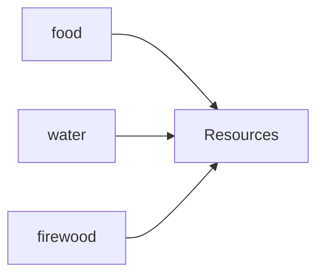

Plain text: `food + water + firewood → one Resources object`.

Source: `src/evidence_lab/negotiation/schema.py:3,10–18`.

```python
from dataclasses import dataclass


@dataclass(frozen=True)
class Resources:
    food: int
    water: int
    firewood: int
```

- `from ... import ...` makes the named standard-library tool available.
- `class Resources:` defines a new named kind of object.
- `@dataclass(...)` is a decorator: Python applies it to the class definition. It generates conveniences
  including construction, readable representation, and comparison of field values.
- The three annotated fields define constructor order: food, water, firewood.
- `frozen=True` prevents ordinary reassignment such as `r.food = 2`.
- It does not check that you supplied actual integers. Explicit parser checks are still needed before
  calling the constructor on external data.

Predict `Resources(1, 0, 3)`: its fields will be food=1, water=0, firewood=3. Its numeric meaning is
still determined by where that object is used.

### 5.2 Participant and AcceptedDeal

Input: identity, numeric values, allocation, and recorded score for each person. Work: group a person's
fields, then group the two people and dialogue/proposer IDs. Output: the nested object tree from section
4.3.

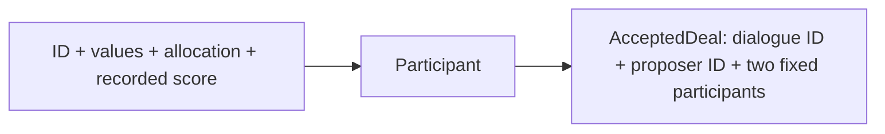

Plain text: `person fields → Participant; two Participants + deal IDs → AcceptedDeal`.

Source: `src/evidence_lab/negotiation/schema.py:25–47`.

```python
@dataclass(frozen=True)
class Participant:
    participant_id: str
    values: Resources
    allocation: Resources
    recorded_score: int


@dataclass(frozen=True)
class AcceptedDeal:
    dialogue_id: int
    proposer_id: str
    participant_1: Participant
    participant_2: Participant
```

`str` describes text; `int` describes a whole number; `Resources` and `Participant` in hints name the
kinds of nested objects expected. These classes have no score-calculation statement in their bodies.
Construction stores the supplied fields. Later validation determines whether they can be returned as a
checked deal.

The accepted parser constructs participant 1 using `PARTICIPANT_IDS[0]` and participant 2 using `[1]`.
Reversing proposer/acceptor roles does not reverse these output fields. We will inspect that with ID 103.

## 6. New named records: one outcome and one result

### 6.1 Audit imports

Input: standard-library and project modules. Work: make their names available. Output: tools and types
used by the audit definitions.

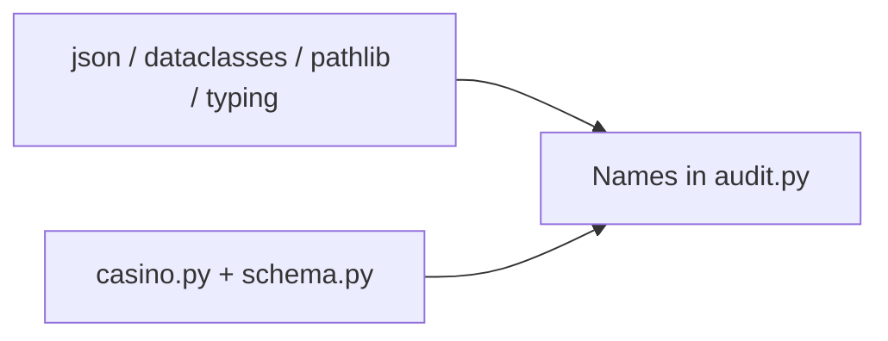

Plain text: `standard tools + existing parser/schema → audit names`.

Source: `src/evidence_lab/negotiation/audit.py:8–14`.

```python
import json
from dataclasses import dataclass
from pathlib import Path
from typing import Literal

from evidence_lab.negotiation.casino import _mapping, _messages, parse_accepted
from evidence_lab.negotiation.schema import AcceptedDeal
```

`json` will decode text; `dataclass` defines compact named records; `Path` represents file locations;
`Literal` documents specific string choices. The last two imports reuse existing project definitions. An
underscore in `_mapping` signals an internal helper by convention; Python still permits this call. These
imports do not download data or automatically run an audit.

### 6.2 RecordOutcome, field by field

Input: position, retained metadata, status, optional checked deal/diagnostic. Work: store related
information together. Output: one `RecordOutcome`.

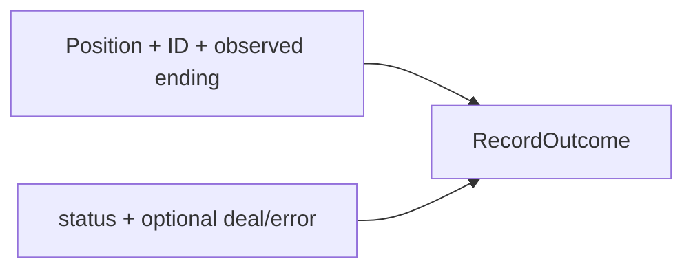

Plain text: `source location + metadata + interpretation → RecordOutcome`.

Source: `src/evidence_lab/negotiation/audit.py:21–51`.

```python
@dataclass(frozen=True)
class RecordOutcome:
    record_index: int
    dialogue_id: int | None
    terminal: str | None
    status: Literal["accepted", "walkaway", "invalid"]
    deal: AcceptedDeal | None = None
    error: str | None = None
```

| Field/type | Why it exists |
| --- | --- |
| `record_index: int` | Zero-based source position; diagnoses even a broken identity |
| `dialogue_id: int \| None` | Usable observed ID, or unavailable |
| `terminal: str \| None` | Observed ending, or unavailable; can survive later failure |
| `status: Literal[...]` | Documents the three permitted accounting strings |
| `deal: AcceptedDeal \| None` | Checked accepted result, absent otherwise |
| `error: str \| None` | Invalid reason, absent on the two valid paths |

`|` means either listed type. `None` is absence, not zero. The final `= None` on `deal` and `error`
supplies a default when the caller omits that argument. The other fields must be supplied to ordinary
constructor calls.

These hints and `Literal` do not enforce the permitted combinations at runtime. For example, Python would
let direct construction assign an unrelated status string. Our `audit_record` branches enforce the
intended relationships. The audit returns `accepted` with a checked deal, `walkaway` without a deal, or
`invalid` with a diagnostic and no deal.

Positional construction follows field order. A keyword such as `error=...` names the field explicitly and
allows the `deal` default to remain `None`.

### 6.3 AuditResult: one stored list

Input: the complete outcome list in source order. Work: group it in a named result. Output: `AuditResult`
with derived properties explained next.

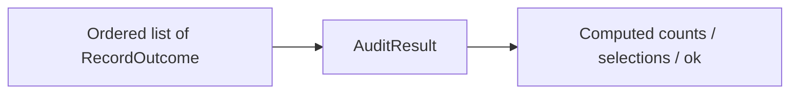

Plain text: `one stored outcome list → counts and selections when accessed`.

Source: `src/evidence_lab/negotiation/audit.py:58–63`.

```python
@dataclass(frozen=True)
class AuditResult:
    outcomes: list[RecordOutcome]
```

`list[RecordOutcome]` documents a list whose entries are outcomes. There are no separate stored
accepted/walkaway/invalid counters to update in the loop. All accounting derives from this list.

Frozen prevents replacing `result.outcomes` with a different list. It does not prevent
`result.outcomes.append(...)`: the list itself is mutable. Frozen dataclasses do not deeply freeze nested
collections. The completed audit and its caller treat this result as read-only.

## 7. AuditResult properties: derive rather than maintain counters

Each block below is indented inside `AuditResult` in the source. `self` is the particular result object
receiving the access. A property is a function that can be read using attribute syntax, such as
`result.total_records`. It runs on that access; it is not a stored or cached answer.

### 7.1 Total and observed accepted endings

Input: the outcome list. Work: count its elements, then count observed final text matches. Output:
integer 4 and integer 3 for the teaching example.

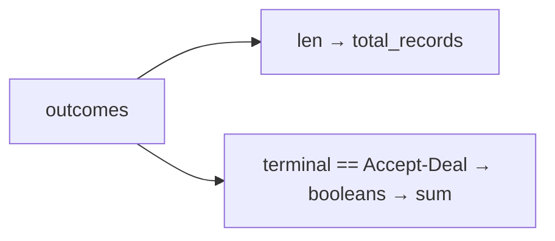

Plain text: `list length → total; terminal comparisons → accepted-ending count`.

Source: `src/evidence_lab/negotiation/audit.py:68–77`.

```python
@property
def total_records(self) -> int:
    return len(self.outcomes)


@property
def accepted_endings(self) -> int:
    return sum(outcome.terminal == "Accept-Deal" for outcome in self.outcomes)
```

- `@property` decorates the following method to support attribute-style access.
- `def ... (self) -> int:` defines a method returning an intended integer.
- `len` returns the number of list entries, irrespective of status.
- `outcome.terminal == "Accept-Deal"` produces `True` or `False`.
- `... for outcome in self.outcomes` is a generator expression: produce each comparison result in turn,
  without building a boolean list first.
- `sum` treats `True` as 1 and `False` as 0: `[True, True, False, True]` sums to 3.

ID 101's retained final text contributes one even though its status is invalid. The record position and
dialogue ID need not have equal numbers.

### 7.2 Select checked accepted deals

Input: every outcome's `deal` field. Work: select non-None fields. Output: a new list containing the
existing checked deals for IDs 100 and 103.

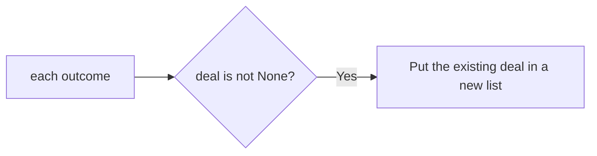

Plain text: `outcomes → keep non-None deal fields → list[AcceptedDeal]`.

Source: `src/evidence_lab/negotiation/audit.py:82–84`.

```python
@property
def accepted_deals(self) -> list[AcceptedDeal]:
    return [outcome.deal for outcome in self.outcomes if outcome.deal is not None]
```

This is a list comprehension. Read it as: for each outcome, if its deal is present, put that deal into
the new list. The output items are deal objects, not the surrounding outcome objects. It does not parse
or recalculate scores. It builds a list of references to the existing checked objects.

### 7.3 Select walkaways and invalid records

Input: outcomes and their statuses. Work: filter by status. Output: two lists of `RecordOutcome`, because
these cases have metadata/diagnostics rather than checked accepted deals.

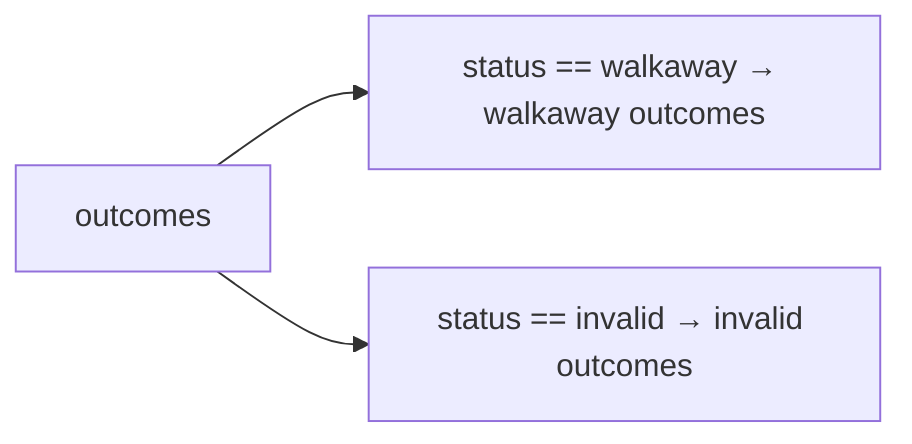

Plain text: `status filter → selected outcome references`.

Source: `src/evidence_lab/negotiation/audit.py:89–98`.

```python
@property
def walkaways(self) -> list[RecordOutcome]:
    return [outcome for outcome in self.outcomes if outcome.status == "walkaway"]


@property
def invalid_records(self) -> list[RecordOutcome]:
    return [outcome for outcome in self.outcomes if outcome.status == "invalid"]
```

The expression before `for` is now `outcome`, rather than `outcome.deal`. The first list contains index
2/ID 102. The second contains index 1/ID 101 and its error. Comprehensions preserve the order of selected
source entries.

### 7.4 Derive the final validity flag

Input: statuses. Work: ask whether any is invalid, then reverse that answer. Output: a boolean; `False`
for the teaching example.

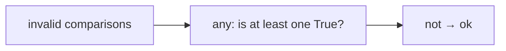

Plain text: `any invalid? → reverse answer → no-invalid flag`.

Source: `src/evidence_lab/negotiation/audit.py:103–105`.

```python
@property
def ok(self) -> bool:
    return not any(outcome.status == "invalid" for outcome in self.outcomes)
```

`any` returns `True` on its first true comparison, so it can stop early. `not True` is `False`. For an
empty list, `any` is `False` and `ok` is `True`: there are no invalid records. That means a complete
zero-record audit, not proof that the intended source file was present.

Repeated access recomputes these properties. `total_records` uses constant-time list length; the other
properties inspect list entries. The entry script materializes each selection once rather than repeatedly
selecting it for display.

### Checkpoint B — containers and properties

Predict what `result.accepted_deals` contains and whether reading it runs the parser again. Explain why
`Resources(1, 0, 3)` and `Resources(4, 3, 5)` need their containing field names to be meaningful.

Check your answer: the property creates a list of the two existing checked deal objects, without
reparsing them. In the `allocation` field, `Resources(1, 0, 3)` represents quantities received; in the
`values` field, `Resources(4, 3, 5)` represents points per unit. Hints and dataclass construction store
these fields; the explicit parser checks enforce
validity. Every derived count comes from the one stored outcome list.

## 8. The entry script: obtain a Path before opening a file

### 8.1 Imports and main definition

Input: standard-library modules and the audit loader. Work: import definitions and define `main`. Output:
names that the bottom guard can call later.

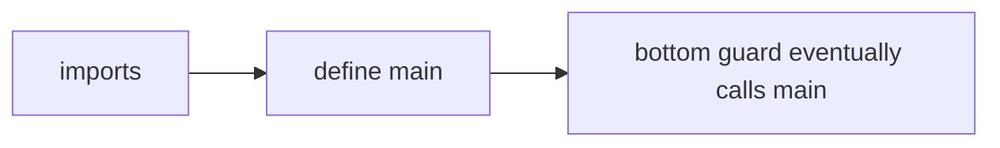

Plain text: `imports → function definition → later call`.

Source: `scripts/check_all.py:6–17`.

```python
import argparse
import sys
from pathlib import Path

from evidence_lab.negotiation.audit import load_audit
```

Source: `scripts/check_all.py:17`.

The function-header reading fragment is:

```python
def main() -> int:
```

Its indented body follows in the later sections; this header is not an independent runnable program.
`argparse` reads command-line arguments, `sys.stderr` provides the error output stream, and `Path`
represents a file location. `load_audit` is our project function. `main() -> int` states that this entry
function returns an intended integer status, rather than the audit object itself.

### 8.2 Construct rules, then read actual arguments

Input: the launch argument containing the filename. Work: configure one required positional argument and
convert its text into a `Path`. Output: `args`, an `argparse.Namespace` whose `args.path` names the file.

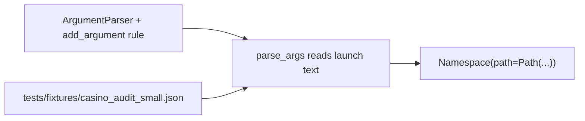

Plain text: `parser rules + argument text → Namespace with Path attribute`.

Source: `scripts/check_all.py:21–31`.

```python
parser = argparse.ArgumentParser(description="Audit every CaSiNo record")
parser.add_argument("path", type=Path, help="explicit path to local CaSiNo JSON")
args = parser.parse_args()
```

- The first line constructs an argument reader and stores it as `parser`. `description=` names a
  constructor argument used in help text.
- `add_argument` configures a rule; it does not read the dataset. `"path"` names a required positional
  argument. `type=Path` tells argparse to convert supplied text with `Path(...)`. `help=` explains the
  argument to a person.
- `parse_args()` reads the actual process arguments and applies those rules. The resulting Namespace is a
  small object with named attributes.

The launch file's JSON `"args": ["tests/fixtures/casino_audit_small.json"]` is configuration text used to
start Python. The Python local `args` is the Namespace produced afterward. They are related, but are
different objects. `args.path` is still a location, not JSON contents.

If launched without the required path, argparse reports missing arguments and exits with code 2 before
assigning `args`. Use the saved launch configuration for the learning session; it supplies the argument.

### 8.3 Call the loader and handle file-level failure

Input: `args.path`. Work: read/decode/interpret the whole file. Output: a completed `AuditResult`, or an
input-error message and return 2.

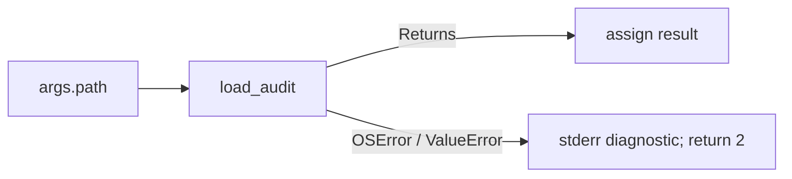

Plain text: `Path → loader → result; file-level exception → input error`.

Source: `scripts/check_all.py:32–43`.

```python
try:
    result = load_audit(args.path)
except (OSError, ValueError) as error:
    print(f"INPUT ERROR: {error}", file=sys.stderr)
    return 2
```

The right-hand call must finish before `result` is assigned. The tuple of exception classes means this
handler accepts either type. `as error` binds the exception object for this handler. `print` normally
uses standard output; `file=sys.stderr` chooses the standard error stream for an input diagnostic. The
`f` prefix substitutes the exception's string into braces.

A record validation failure ordinarily stays inside a returned invalid outcome; it does not reach this
file-level handler. We now follow the loader and loop before returning to the remaining statements in
`main`.

## 9. load_audit: decoding is separate from record interpretation

### 9.1 Read and decode

Input: a `Path` pointing to UTF-8 JSON. Work: read all text, then decode JSON. Output: `records`, the
decoded outer value. It is not yet known to be a list.

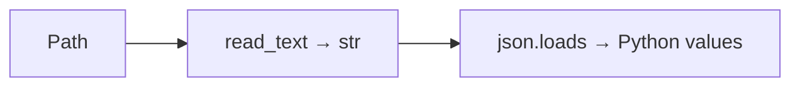

Plain text: `file location → complete text → decoded Python containers`.

Source: `src/evidence_lab/negotiation/audit.py:231–237`.

```python
def load_audit(path: Path) -> AuditResult:
    try:
        records = json.loads(path.read_text(encoding="utf-8"))
```

This is the beginning of the function; its handlers and second block follow. `path` is a local parameter.
In the assignment, the nested `read_text` call runs first and returns a string. `encoding="utf-8"`
specifies how bytes become text. `json.loads` then decodes that string. Only after both succeed is the
result assigned to `records`.

The word `loads` means load from a string. This call does not validate resources, walkaways, or scores.
For the small example, `records` becomes a list of four dictionaries. For valid JSON `{}`, it becomes a
dictionary.

### 9.2 Add context to decoding failures

Input: a JSON decoder or UTF-8 error. Work: produce a file-level `ValueError` with a clear path/reason.
Output: an exception for the caller, not an outcome.

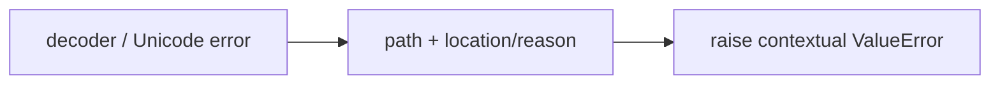

Plain text: `decoding exception → contextual input exception`.

Source: `src/evidence_lab/negotiation/audit.py:238–250`.

```python
except json.JSONDecodeError as error:
    raise ValueError(
        f"Cannot audit {path}: malformed JSON at line {error.lineno}, "
        f"column {error.colno}: {error.msg}"
    ) from error
except UnicodeError as error:
    raise ValueError(f"Cannot audit {path}: file must be UTF-8 text") from error
```

These handlers belong to the preceding `try` in `load_audit`. The decoder exception supplies `lineno`,
`colno`, and `msg`. Adjacent string literals in parentheses concatenate into one string; the split source
lines do not create two messages. `raise ... from error` preserves the original exception as the cause of
the new one. It adds context rather than silently discarding the cause.

An `OSError`, such as a missing file, is not caught here. It propagates to the script's `(OSError,
ValueError)` handler. A different unexpected exception also propagates unless a caller explicitly handles
its type.

### 9.3 Interpret the decoded value

Input: `records`. Work: call `audit_records`, which checks the outer list and interprets each item.
Output: the completed result, or a contextual outer error.

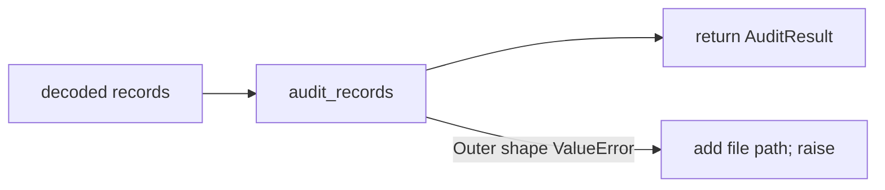

Plain text: `decoded value → audit loop → result; wrong outer type → input error`.

Source: `src/evidence_lab/negotiation/audit.py:255–261`.

```python
try:
    return audit_records(records)
except ValueError as error:
    raise ValueError(f"Cannot audit {path}: {error}") from error
```

`return audit_records(records)` evaluates the call first, then returns its result. Expected per-record
validation failures are already converted into outcomes inside `audit_record`. Therefore an invalid
accepted row can still yield a completed `AuditResult`. The wrong outer shape has no meaningful record
position to blame, so it remains a file-level failure.

## 10. audit_records: finish the loop before returning

Input: an already decoded value expected to be a list. Work: require that list, interpret every position
once, append one outcome each time. Output: an `AuditResult` preserving source order.

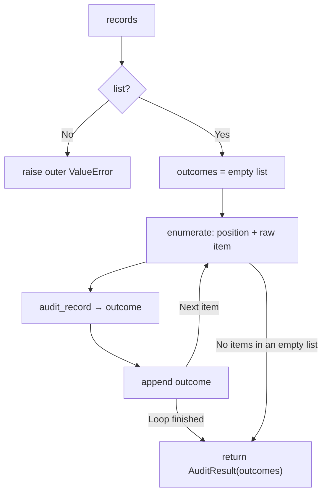

Plain text: `require list → start accumulator → interpret/append each item → return once`.

Source: `src/evidence_lab/negotiation/audit.py:196–225`.

```python
def audit_records(records: list[object]) -> AuditResult:
    if not isinstance(records, list):
        raise ValueError("CaSiNo JSON must be a list of dialogues")
    outcomes = []
    for record_index, raw in enumerate(records):
        outcome = audit_record(raw, record_index)
        outcomes.append(outcome)
    return AuditResult(outcomes)
```

- `object` in the hint allows any decoded value per position, including a bad value such as `None`. A
  malformed item still needs an explicit outcome.
- `isinstance(records, list)` performs an actual runtime outer-type check.
- `outcomes = []` creates the changeable accumulator, initially length 0.
- `enumerate(records)` produces `(0, first_item)`, `(1, second_item)`, and so on. The two loop names
  receive the corresponding pair each iteration.
- `audit_record(raw, record_index)` interprets the current raw value and returns one outcome. The
  assignment completes after that call returns.
- `append` adds the same outcome object to the end of the existing list.
- The last `return` is outside the loop's indentation. It runs only after the loop finishes, unlike
  returning on the first accepted deal.

Important variable changes for the teaching example:

| At the call | Current index/ID | `len(outcomes)` before append | New status | Length after append |
| --- | --- | ---: | --- | ---: |
| First iteration | 0 /100 | 0 | accepted | 1 |
| Second iteration | 1 /101 | 1 | invalid | 2 |
| Third iteration | 2 /102 | 2 | walkaway | 3 |
| Fourth iteration | 3 /103 | 3 | accepted | 4 |

On reaching a new call line, `outcome` might still name the previous iteration's result. `record_index`
and `raw` have already advanced, but the new assignment has not completed. The debugger exercise will
make this visible.

For `[]`, the loop body never runs and the function returns `AuditResult([])`. It creates no fictitious
record merely to produce a result.

### Checkpoint C — path, decoding, and complete iteration

Predict the types of `args.path`, the decoded `records`, and the returned `result` for the teaching input.
Then find the indentation that ensures ID 103 is visited after ID 101 fails.

Check your answer: `Path`, a list of four raw dictionaries, and `AuditResult`, respectively. The loop
appends the invalid outcome and continues; `return AuditResult(outcomes)` sits outside that loop. `[]`
returns an empty ledger, while a decoded `{}` fails the outer-list check before any record is audited.

## 11. audit_record: retain metadata, choose a validator, return one outcome

### 11.1 Begin with unavailable metadata

Input: one decoded value and its source position. Work: initialize safe metadata, then start expected
validation inside `try`. Output: locals that can be retained even if a later check fails.

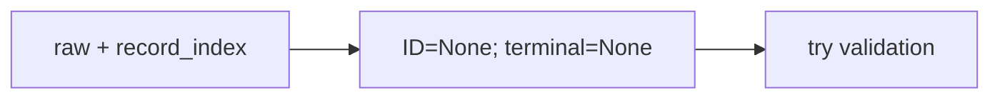

Plain text: `unknown metadata → fill only when observed → preserve on failure`.

Source: `src/evidence_lab/negotiation/audit.py:111–125`.

```python
def audit_record(raw: object, record_index: int) -> RecordOutcome:
    dialogue_id = None
    terminal = None
    try:
        raw = _mapping(raw, "dialogue")
```

This function continues through the following blocks. Each call gets fresh locals. Initializing
`dialogue_id` and `terminal` before the `try` ensures the handler can construct an outcome even if the
first dictionary check fails. `_mapping` returns the same dictionary or raises `ValueError`; it does not
copy, repair, or check required keys.

The helper's complete implementation is short:

Source: `src/evidence_lab/negotiation/casino.py:24–30`.

```python
def _mapping(value: object, field: str) -> dict[str, Any]:
    if not isinstance(value, dict):
        raise ValueError(f"{field} must be a JSON object")
    return value
```

`field` contributes a location label to the diagnostic. `dict[str, Any]` describes string keys whose
values may have different types; `Any` was imported from `typing` in `casino.py:5`. This hint does not
perform the dictionary check. The `if` performs it; `return value` hands back the unchanged object.

### 11.2 Observe an ID without losing the chance to observe the ending

Input: the dictionary's ID value, possibly absent or malformed. Work: retain only a nonnegative exact
integer. Output: usable `dialogue_id` or `None`.

```mermaid
flowchart LR
    C["candidate_id"] --> VALID{"exact int and nonnegative?"}
    VALID -->|Yes| KEEP["retain dialogue_id"]
    VALID -->|No| NONE["keep None; continue observing ending"]
```

Plain text: `candidate ID → keep if usable; otherwise remain unavailable`.

Source: `src/evidence_lab/negotiation/audit.py:131–133`.

```python
candidate_id = raw.get("dialogue_id")
if type(candidate_id) is int and candidate_id >= 0:
    dialogue_id = candidate_id
```

`.get` supplies `None` when the key is missing. `type(...) is int` rejects `True`, floats, and numeric
strings. Python considers `bool` a subclass of `int`, so `isinstance(True, int)` alone would be too
permissive here. The `and` short-circuits: an unsuitable type is not compared with zero.

This observation step does not immediately raise for a bad ID. It allows the audit to retain a readable
final `Accept-Deal` before the selected validator rejects the ID. `candidate_id` keeps the original value
for a walkaway error.

### 11.3 Peek at the last message once

Input: `chat_logs`, possibly missing or malformed. Work: make last-element access safe, check that
entry's dictionary/text, then retain its text. Output: observed `terminal` or an expected validation
exception.

```mermaid
flowchart LR
    L["chat_logs"] --> SAFE["nonempty list"] --> LAST["last entry object"] --> TEXT["text is str"] --> TERM["terminal"]
```

Plain text: `nonempty list → last dictionary → string text → terminal`.

Source: `src/evidence_lab/negotiation/audit.py:138–151`.

```python
messages = raw.get("chat_logs")
if not isinstance(messages, list) or not messages:
    raise ValueError("chat_logs must be a nonempty list")
final_message = _mapping(messages[-1], "final chat_logs entry")
final_text = final_message.get("text")
if not isinstance(final_text, str):
    raise ValueError("final chat_logs entry must have a text string")
terminal = final_text
```

`or not messages` rejects an empty list. That guard runs before `messages[-1]`, so empty input cannot
cause accidental last-element indexing. `_mapping` checks only the final entry here. The second type
check requires actual text. The assignment to `terminal` happens after the final text passes.

This is an O(1) branch-selection peek: it examines one entry irrespective of message count. It does not
replace a complete message scan. The accepted parser or the walkaway validator will still check every
message's required shape. For example, an earlier `{"text": 7}` can later invalidate the record while the
observed final accepted text remains in `terminal`.

### 11.4 Accepted path

Input: a raw record observed to end in `Accept-Deal`. Work: call the existing strict parser. Output:
accepted outcome with a deal, only if the call succeeds.

```mermaid
flowchart LR
    T["Accept-Deal"] --> P["parse_accepted(raw)"]
    P -->|Returns checked deal| O["accepted RecordOutcome"]
    P -->|ValueError| E["handler: invalid outcome"]
```

Plain text: `accepted ending → strict parser → checked deal or diagnostic`.

Source: `src/evidence_lab/negotiation/audit.py:156–162`.

```python
if terminal == "Accept-Deal":
    deal = parse_accepted(raw)
    return RecordOutcome(record_index, dialogue_id, terminal, "accepted", deal)
```

The returned constructor arguments follow RecordOutcome's field order. `error` is omitted and defaults to
`None`. A failed parser call does not complete the assignment or reach the accepted return. It transfers
control to the handler.

Only this branch has a successful local `deal`. ID 100 and ID 103 return accepted outcomes; ID 101
reaches the score-mismatch handler. Section 12 follows the parser in detail, so the reuse does not
conceal its validation work.

### 11.5 Walkaway path

Input: an observed `Walk-Away`. Work: require the usable ID, validate all message shapes, and construct
an outcome. Output: walkaway without a deal/score.

```mermaid
flowchart LR
    W["Walk-Away"] --> ID["Require usable ID"] --> MSG["_messages checks every entry"] --> O["walkaway; deal=None; error=None"]
```

Plain text: `walkaway → ID check → complete message-shape check → outcome`.

Source: `src/evidence_lab/negotiation/audit.py:167–177`.

```python
if terminal == "Walk-Away":
    if dialogue_id is None:
        raise ValueError(
            f"dialogue_id must be a nonnegative integer; got {candidate_id!r}"
        )
    _messages(raw)
    return RecordOutcome(record_index, dialogue_id, terminal, "walkaway")
```

`is None` recognizes unusable or missing identity. `{candidate_id!r}` uses the value's representation,
making a string such as `"102"` distinguishable from integer 102. `_messages(raw)` runs for its checks;
its returned list is not assigned because we only need validation here. Omitted deal/error both default
to `None`.

A walkaway has no accepted allocation, so this path does not invent zero scores or call the accepted
parser. Its contract requires identity and message structure. Unused preferences, offer data, and
participant-role IDs are not accepted-deal checks for a walkaway.

### 11.6 Unknown endings and expected record failures

Input: unknown final text, or a `ValueError` from previous checks. Work: attach the retained metadata and
error string. Output: invalid outcome; the loop continues.

```mermaid
flowchart LR
    UNKNOWN["Unsupported final text"] --> RAISE["raise ValueError"] --> HANDLE["except ValueError"]
    FAIL["Any expected record-validation ValueError"] --> HANDLE
    HANDLE --> OUT["invalid RecordOutcome; deal=None"]
```

Plain text: `expected record failure → one invalid outcome → next loop position`.

Source: `src/evidence_lab/negotiation/audit.py:182–190`.

```python
    raise ValueError(f"Unexpected final event: {terminal!r}")
except ValueError as error:
    return RecordOutcome(
        record_index, dialogue_id, terminal, "invalid", error=str(error)
    )
```

The first line is the final statement inside the earlier `try`; it is reached only when neither
recognized branch returned. The handler belongs to that `try`. `str(error)` converts the diagnostic to
stored text. `error=...` is a keyword argument: deal remains its default `None`, rather than accidentally
receiving the diagnostic as the fifth positional argument.

`terminal` and `dialogue_id` keep whatever usable information was observed before failure. An early
non-dictionary record can have both as `None`. The handler catches `ValueError`, not every exception. A
programming `RuntimeError`, unexpected `TypeError`, or another uncaught exception remains visible for
debugging. Source failures are not repaired or silently dropped.

## 12. The reused accepted parser, with every step exposed

The parser's job has not changed. Its input is one raw accepted dictionary; its output is an
`AcceptedDeal` only after all checks succeed. The audit gives each parser failure a record outcome,
rather than weakening the parser.

### 12.1 Constants and schema imports

Input: the pinned CaSiNo scoring/resource rules and schema definitions. Work: name them once. Output:
constants/helpers used by the following blocks.

```mermaid
flowchart LR
    RULE["2 participant IDs; 3 resources; 3 units; ranks 5/4/3"] --> CHECK["parser checks and construction"]
```

Plain text: `fixed source rules → quantity, role, preference, and score checks`.

Source: `src/evidence_lab/negotiation/casino.py:3–18`.

```python
import json
from pathlib import Path
from typing import Any

from evidence_lab.negotiation.schema import (
    AcceptedDeal,
    Participant,
    Resources,
    verify_scores,
)

PARTICIPANT_IDS = ("mturk_agent_1", "mturk_agent_2")
ISSUES = ("Food", "Water", "Firewood")
UNITS_PER_RESOURCE = 3
POINTS = {"High": 5, "Medium": 4, "Low": 3}
```

The multiline import is one import statement. `json`/`Path` also support the existing first-deal loader.
`Any` describes heterogeneous raw values. Tuples give fixed participant/resource order. `POINTS` maps
rank names to numeric points per unit. Uppercase names indicate intended constants by convention; Python
does not prevent reassignment automatically.

### 12.2 Identity, all messages, and the final pair

Input: one raw dictionary. Work: require identity and message structure, then require a submission
immediately before acceptance. Output: `proposal` and `acceptance` dictionaries from the final pair.

```mermaid
flowchart LR
    RAW["raw"] --> ID["dictionary + valid ID"] --> MSG["_messages scans all entries"] --> PAIR["last two: Submit-Deal then Accept-Deal"]
```

Plain text: `identity → complete message scan → final accepted offer pair`.

Source: `src/evidence_lab/negotiation/casino.py:141–158`.

```python
def parse_accepted(raw: dict[str, Any]) -> AcceptedDeal:
    raw = _mapping(raw, "dialogue")
    dialogue_id = raw.get("dialogue_id")
    if type(dialogue_id) is not int or dialogue_id < 0:
        raise ValueError("dialogue_id must be a nonnegative integer")
    messages = _messages(raw)
    if len(messages) < 2 or messages[-1]["text"] != "Accept-Deal":
        raise ValueError(f"Dialogue {dialogue_id}: expected a final Accept-Deal")
    proposal, acceptance = messages[-2:]
    if proposal["text"] != "Submit-Deal":
        raise ValueError("Accept-Deal must immediately follow Submit-Deal")
```

The dictionary check remains safe even when called directly outside the audit. The ID condition uses
`or`: if its type is wrong, Python does not attempt a numeric comparison. `_messages` guarantees a
nonempty list of dictionaries with text strings. The pair condition additionally requires at least two
messages and an accepted final text.

`messages[-2:]` selects the last two entries. Assignment to two names unpacks that pair, first proposal
then acceptance. The immediately preceding text must be `Submit-Deal`; an older submission elsewhere is
insufficient.

The complete message helper is reused on both accepted and walkaway paths:

Source: `src/evidence_lab/negotiation/casino.py:56–71`.

```python
def _messages(raw: dict[str, Any]) -> list[dict[str, Any]]:
    messages = raw.get("chat_logs")
    if not isinstance(messages, list) or not messages:
        raise ValueError("chat_logs must be a nonempty list")
    for message in messages:
        message = _mapping(message, "chat_logs entry")
        if not isinstance(message.get("text"), str):
            raise ValueError("chat_logs entry must have a text string")
    return messages
```

The loop checks every message, not only the last pair. It changes the local name `message` to the
helper's same dictionary; it does not rewrite entries. This checks shape, not the meaning of ordinary
dialogue text or every role ID. Only after all entries pass does it return the original list.

### 12.3 Distinct roles and required top-level mappings

Input: proposal/acceptance dictionaries and raw participant information. Work: check the two known roles
are distinct, then require the two participant entries and offer dictionary. Output: IDs, `info`, and
`task`.

```mermaid
flowchart LR
    PAIR["proposal + acceptance"] --> ROLES["known different IDs"] --> MAPS["participant_info + task_data mappings"]
```

Plain text: `offer pair → known distinct roles → source mappings ready`.

Source: `src/evidence_lab/negotiation/casino.py:141,162–178`.

The repeated function header preserves the source indentation. In the actual function, the dictionary,
ID, and message-pair checks from section 12.2 occur before this block; it is a reading fragment from the
same function, rather than a separate replacement function.

```python
def parse_accepted(raw: dict[str, Any]) -> AcceptedDeal:
    proposer_id = proposal.get("id")
    acceptor_id = acceptance.get("id")
    if (
        proposer_id not in PARTICIPANT_IDS
        or acceptor_id not in PARTICIPANT_IDS
        or proposer_id == acceptor_id
    ):
        raise ValueError(
            "Proposal and acceptance must come from the two different roles"
        )
    info = _mapping(raw.get("participant_info"), "participant_info")
    if set(info) != set(PARTICIPANT_IDS):
        raise ValueError("participant_info must contain exactly mturk_agent_1 and 2")
    task = _mapping(proposal.get("task_data"), "Submit-Deal.task_data")
```

`not in` tests membership. Any of three bad conditions rejects the pair, including someone accepting
their own proposal. `set(info)` extracts the dictionary's keys into a set, so exact-key equality ignores
insertion order but rejects missing or additional participants. `_mapping` requires dictionaries before
these deeper accesses.

### 12.4 Convert an allocation: keys, quantities, ordered construction

Input: a raw allocation dictionary and its diagnostic field name. Work: require exactly three issue keys,
validate each number, then construct Resources. Output: received quantities as integers in
food/water/firewood order.

```mermaid
flowchart LR
    RAW["allocation dict"] --> KEYS["exact issue keys"] --> NUM["_integer for each issue"] --> R["Resources of quantities"]
```

Plain text: `exact keys → checked integers → Resources allocation`.

Source: `src/evidence_lab/negotiation/casino.py:77–93`.

```python
def _allocation(value: object, field: str) -> Resources:
    amounts = _mapping(value, field)
    if set(amounts) != set(ISSUES):
        raise ValueError(f"{field} must contain exactly Food, Water, Firewood")
    return Resources(
        *(
            _integer(amounts[issue], f"{field}.{issue}", UNITS_PER_RESOURCE)
            for issue in ISSUES
        )
    )
```

After exact-key validation, `amounts[issue]` is a required lookup of a known key. The generator visits
`ISSUES`, not raw key order. `f"{field}.{issue}"` names a specific quantity in an error. The maximum
passed here is 3.

The `*` inside the call unpacks the three generated integers into separate constructor arguments. It is
not multiplication in this position. For ID 100's proposer side, this becomes `Resources(2, 3, 0)`,
meaning quantities.

The integer helper provides the actual numeric validation:

Source: `src/evidence_lab/negotiation/casino.py:36–50`.

```python
def _integer(value: object, field: str, maximum: int) -> int:
    if isinstance(value, str) and value.isascii() and value.isdecimal():
        value = int(value)
    if type(value) is not int or not 0 <= value <= maximum:
        raise ValueError(
            f"{field} must be an integer from 0 to {maximum}; got {value!r}"
        )
    return value
```

Only ASCII decimal strings are converted: `"3"` becomes integer 3. Floats, booleans, `None`, negative
text, and arbitrary text are not coerced into a plausible quantity. `and` first checks string type before
calling string methods. `isascii` requires ASCII characters; `isdecimal` requires decimal digits. The
chained comparison `0 <= value <= maximum` is inclusive.

The exact-int condition again rejects booleans. `or` stops before comparing an unsuitable type
numerically. `!r` shows the representation of the value after optional conversion: rejected text
such as `"bad"` is quoted, while a converted out-of-range `"99"` is reported as integer `99`. `return`
only occurs after the checks pass.

### 12.5 Associate quantities with roles, then conserve every resource

Input: proposer/acceptor IDs and two raw offer sides. Work: convert both sides, assign them to correct
IDs, and require each cross-person resource total to be 3. Output: two valid, conserved allocations.

```mermaid
flowchart LR
    OFFER["you / they offer sides"] --> MAP["proposer / acceptor Resources"] --> SUM["food, water, firewood totals"] --> CHECK["each total = 3"]
```

Plain text: `offer sides → role allocations → three conservation checks`.

Source: `src/evidence_lab/negotiation/casino.py:183–196`.

```python
allocations = {
    proposer_id: _allocation(task.get("issue2youget"), "issue2youget"),
    acceptor_id: _allocation(task.get("issue2theyget"), "issue2theyget"),
}
for resource in ("food", "water", "firewood"):
    total = sum(getattr(amounts, resource) for amounts in allocations.values())
    if total != UNITS_PER_RESOURCE:
        raise ValueError(
            f"{resource}: allocations must sum to {UNITS_PER_RESOURCE}; got {total}"
        )
```

The dictionary keys are evaluated IDs, not literal strings `"proposer_id"`. `issue2youget` is the
proposer's quantity side. `allocations.values()` yields the two Resources allocations. `getattr(amounts,
resource)` reads a named field such as `amounts.food` using the resource string. The generator supplies
both quantities to `sum`.

ID 100 totals are food `2+1=3`, water `3+0=3`, firewood `0+3=3`. Individual range checks cannot establish
conservation: quantities 3 and 1 are each permitted, but sum to 4 and fail this block. ID 103 reverses
which role submitted the sides, while the ID-keyed allocation mapping still gives participant 1 its
correct units.

### 12.6 Convert preferences and read the recorded claim

Input: a fixed participant ID, that person's source information, and an already checked allocation. Work:
validate preferences, map ranks to per-unit points, read a bounded recorded score, and construct
Participant. Output: a Participant ready for independent score verification.

```mermaid
flowchart LR
    PREF["rank → issue preferences"] --> VALID["each rank and issue once"] --> VAL["issue → points/unit"]
    CLAIM["source points_scored"] --> BOUND["integer 0..36"]
    VAL --> P["Participant"]
    BOUND --> P
    ALLOC["existing allocation"] --> P
```

Plain text: `preferences → numeric values; recorded claim + allocation → Participant`.

Source: `src/evidence_lab/negotiation/casino.py:99–116`.

```python
def _participant(
    participant_id: str, value: object, allocation: Resources
) -> Participant:
    info = _mapping(value, participant_id)
    preferences = _mapping(info.get("value2issue"), f"{participant_id}.value2issue")
    if set(preferences) != set(POINTS) or sorted(
        preferences.values(), key=str
    ) != sorted(ISSUES):
        raise ValueError(
            f"{participant_id}: High, Medium, Low must name each issue once"
        )
    values = {preferences[rank]: points for rank, points in POINTS.items()}
```

`set(preferences)` must be exactly the three rank keys. Sorted preference values must match the three
resource names once each, so repeated or unknown issues fail. `sorted` creates ordered lists for
comparison; `key=str` supplies a consistent sorting key even for malformed mixed values. It does not
convert the stored preferences into valid resource names.

The final line is a dictionary comprehension. `POINTS.items()` supplies pairs such as `("High", 5)`.
`preferences[rank]` becomes the resource key; `points` becomes its value. Participant 1's preferences
yield the numeric mapping `{"Firewood": 5, "Food": 4, "Water": 3}`. These are points per unit.

Source continuation: `src/evidence_lab/negotiation/casino.py:121–135`.

```python
outcomes = _mapping(info.get("outcomes"), f"{participant_id}.outcomes")
recorded_score = _integer(
    outcomes.get("points_scored"),
    f"{participant_id}.points_scored",
    UNITS_PER_RESOURCE * sum(POINTS.values()),
)
return Participant(
    participant_id=participant_id,
    values=Resources(*(values[issue] for issue in ISSUES)),
    allocation=allocation,
    recorded_score=recorded_score,
)
```

This local `outcomes` is the source participant's outcome dictionary, distinct from the audit's outcome
list in another function/frame. Its recorded score maximum is `3 * (5+4+3) = 36`. A missing score becomes
`None` and fails; it is not replaced with zero. ID 101's claim 20 is within range and therefore passes
this numeric block; arithmetic comparison will reject it later.

Named constructor arguments state each Participant field. The inner Resources generator orders values as
Food/Water/Firewood, producing participant 1's `Resources(4, 3, 5)` **points per unit**.
`allocation=allocation` preserves the checked quantities already assigned to this fixed participant ID.

### 12.7 Construct the full deal, verify, then return

Input: checked IDs, raw participant information, and conserved ID-keyed allocations. Work: construct both
Participants in fixed order, group them, then independently verify both scores. Output: a checked
AcceptedDeal.

```mermaid
flowchart LR
    ONE["_participant for fixed ID 1"] --> D["AcceptedDeal"]
    TWO["_participant for fixed ID 2"] --> D
    D --> V["verify_scores"] --> R["return checked deal"]
```

Plain text: `fixed participant construction → deal → verify both scores → return`.

Source: `src/evidence_lab/negotiation/casino.py:201–219`.

```python
deal = AcceptedDeal(
    dialogue_id=dialogue_id,
    proposer_id=proposer_id,
    participant_1=_participant(
        PARTICIPANT_IDS[0],
        info[PARTICIPANT_IDS[0]],
        allocations[PARTICIPANT_IDS[0]],
    ),
    participant_2=_participant(
        PARTICIPANT_IDS[1],
        info[PARTICIPANT_IDS[1]],
        allocations[PARTICIPANT_IDS[1]],
    ),
)
verify_scores(deal)
return deal
```

Nested constructor arguments are evaluated before the outer constructor finishes and assigns `deal`.
Participant 1 uses ID tuple position 0 even if participant 2 proposed. Participant 2 uses position 1.
Missing/malformed participant information can raise before a complete deal exists.

At `verify_scores(deal)`, construction is finished but its arithmetic check is about to run. The
verification result is not assigned here; successful completion is sufficient. `return deal` runs only
afterward. ID 101 can have a complete local deal before verification fails, but that object is never
returned as a checked deal in its audit outcome.

## 13. Score reconstruction: quantities times points per unit

### 13.1 Calculate without reading the recorded claim

Input: a Resources allocation and Resources per-unit values. Work: multiply corresponding fields and add.
Output: an independently calculated integer.

```mermaid
flowchart LR
    Q["received units"] --> MUL["multiply each resource by its points/unit"]
    V["points per unit"] --> MUL
    MUL --> SUM["add three contributions → score"]
```

Plain text: `food units×value + water units×value + firewood units×value → score`.

Source: `src/evidence_lab/negotiation/schema.py:53–62`.

```python
def score(allocation: Resources, values: Resources) -> int:
    return (
        allocation.food * values.food
        + allocation.water * values.water
        + allocation.firewood * values.firewood
    )
```

`*` between numbers is multiplication; `+` adds. Dots read object fields. The parentheses group one
returned expression across source lines. This function has no `recorded_score` parameter and reads no
source-score field. That separation makes the comparison an independent reconstruction.

For participant 1: `1*4 + 0*3 + 3*5 = 19`. For participant 2: `2*3 + 3*4 + 0*5 = 18`. Zero allocated
water for participant 1 contributes zero to this accepted score; that is different from inventing a
walkaway score.

### 13.2 Compare each person, keep only checked calculations

Input: the constructed AcceptedDeal. Work: calculate each fixed participant's score, compare with its
recorded claim, and append only matching calculations. Output: `(19, 18)` for both valid teaching deals,
or a detailed ValueError.

```mermaid
flowchart TD
    INIT["computed = empty list"] --> P["participant 1 then participant 2"]
    P --> S["score → reconstructed"] --> CHECK{"matches recorded_score?"}
    CHECK -->|No| E["raise ID / participant / score diagnostic"]
    CHECK -->|Yes| ADD["append reconstructed"]
    ADD -->|Next person| P
    ADD -->|Finished| R["return scores as tuple"]
```

Plain text: `calculate → compare → append, twice → return pair; mismatch → error`.

Source: `src/evidence_lab/negotiation/schema.py:68–95`.

```python
def verify_scores(deal: AcceptedDeal) -> tuple[int, int]:
    computed = []
    for participant in (deal.participant_1, deal.participant_2):
        reconstructed = score(participant.allocation, participant.values)
        if reconstructed != participant.recorded_score:
            raise ValueError(
                f"Dialogue {deal.dialogue_id}, {participant.participant_id}: "
                f"computed score {reconstructed} != recorded score "
                f"{participant.recorded_score}"
            )
        computed.append(reconstructed)
    return computed[0], computed[1]
```

The tuple in the loop supplies fixed participant order. `reconstructed` receives each new calculation
after `score` returns. Comparison uses the recorded claim only now. On mismatch, the f-strings include
dialogue ID, participant ID, calculated value, and recorded value.

For ID 100, `computed` progresses `[] → [19] → [19,18]`. For ID 101, participant 1 comparison is 19
versus 20; the exception occurs before append. `return computed[0], computed[1]` returns a tuple because
comma-separated return values form a pair. The parser returns its deal after this check; the audit
converts the expected mismatch into an invalid outcome.

### Checkpoint D — validation and independent arithmetic

Explain why participant 1 receives `(1, 0, 3)` units even when participant 2 proposes. Then predict what
happens to ID 101 at `verify_scores`: does the audit keep its constructed deal as an accepted result?

Check your answer: offer `you` follows the proposer and `they` follows the acceptor; an ID-keyed mapping
then supplies each fixed participant's allocation. ID 101's participant 1 reconstruction is
`1×4 + 0×3 + 3×5 = 19`, which differs from claim 20. The parser raises before returning; `audit_record`
returns invalid with `deal=None` and a diagnostic. Its retained `terminal` remains `Accept-Deal`.

## 14. Return to main: accounting, diagnostics, and exit status

### 14.1 Materialize three selections and reconcile

Input: the completed `result`. Work: select three categories once and add their lengths. Output: local
lists and `accounted=4` for the small example.

```mermaid
flowchart LR
    R["AuditResult"] --> SEL["accepted deals / walkaway outcomes / invalid outcomes"]
    SEL --> COUNT["sum lengths"] --> CHECK["compare with total_records"]
```

Plain text: `result properties → three selection lists → reconciled category count`.

Source: `scripts/check_all.py:48–69`.

```python
accepted_deals = result.accepted_deals
walkaways = result.walkaways
invalid_records = result.invalid_records
accounted = len(accepted_deals) + len(walkaways) + len(invalid_records)
if accounted != result.total_records:
    raise RuntimeError("Audit accounting does not reconcile")
```

Attribute access invokes the property methods described in section 7. The lists refer to existing
objects; the script does not reparse deals or invent walkaway scores. `len` counts entries, so the
equation is 2+1+1=4. Accepted endings are deliberately absent from this sum.

The comparison guards against an accounting-program bug. Its `RuntimeError` is outside the earlier
loading `try`; it is not disguised as a source problem or a clean result. Under our enforced outcome
relationships the categories are exclusive and cover all positions, so the count reconciles.

### 14.2 Print summary labels and the equation

Input: result counts and the three materialized lists. Work: substitute values into labelled text.
Output: six lines describing the audit.

```mermaid
flowchart LR
    COUNTS["total / endings / three category lengths"] --> TEXT["f-strings"] --> OUT["print to stdout"]
```

Plain text: `counts → labelled strings → standard output`.

Source: `scripts/check_all.py:74–82`.

```python
print(f"Total records: {result.total_records}")
print(f"Accepted endings: {result.accepted_endings}")
print(f"Valid accepted deals: {len(accepted_deals)}")
print(f"Walkaways: {len(walkaways)}")
print(f"Invalid records: {len(invalid_records)}")
print(
    f"Accounting: {result.total_records} = {len(accepted_deals)} valid accepted "
    f"+ {len(walkaways)} walkaways + {len(invalid_records)} invalid"
)
```

`print` ends its output with a newline by default. The last call combines two adjacent f-strings into one
line of text. Properties compute when read; `len(accepted_deals)` uses the already selected list. Printed
observation is not official study output/report machinery, which belongs to milestone 3.

### 14.3 Print every invalid record, including missing IDs

Input: the ordered invalid outcomes. Work: choose an identity label and print position plus reason for
each. Output: one diagnostic per invalid position.

```mermaid
flowchart LR
    I["each invalid outcome"] --> ID{"usable dialogue ID?"}
    ID -->|Yes| KNOWN["dialogue number label"]
    ID -->|No| NONE["ID unavailable label"]
    KNOWN --> PRINT["position + label + diagnostic"]
    NONE --> PRINT
```

Plain text: `invalid outcome → choose ID label → print location and reason`.

Source: `scripts/check_all.py:87–100`.

```python
for outcome in invalid_records:
    identity = (
        f"dialogue {outcome.dialogue_id}"
        if outcome.dialogue_id is not None
        else "dialogue ID unavailable"
    )
    print(f"Record index {outcome.record_index}; {identity}: {outcome.error}")
```

The conditional expression is `value_if_true if condition else value_if_false`. It selects a string, not
a different record category. `None` chooses the unavailable-ID label; integer 0 is a valid identity and
keeps its number. The loop visits every invalid outcome, preserving source order.

For the teaching example, the complete printed diagnostic is:

```text
Record index 1; dialogue 101: Dialogue 101, mturk_agent_1: computed score 19 != recorded score 20
```

Position remains available even when no valid dialogue ID can be established. Having two valid deals does
not hide this bad record.

### 14.4 Return failure or success

Input: the result's no-invalid flag. Work: print final status and return an integer. Output: 1 for the
baseline teaching example; 0 for a clean audit.

```mermaid
flowchart LR
    OK{"result.ok?"} -->|False| FAIL["print FAIL; return 1"]
    OK -->|True| PASS["print PASS; return 0"]
```

Plain text: `invalid present → FAIL/1; no invalid → PASS/0`.

Source: `scripts/check_all.py:105–113`.

```python
if not result.ok:
    print("FAIL: audit contains invalid records.")
    return 1
print("PASS: all records accounted for; no invalid records.")
return 0
```

`not result.ok` is true for the supplied example. That branch returns from `main`, so the following PASS
print cannot execute in that call. This failure status is intentional: expected source defects remain
visible.

### 14.5 The bottom guard and SystemExit evaluation order

Input: Python's module-name variable. Work: call `main` only when this script is the direct entry point,
then use its integer result as the process exit code. Output: process status 0/1/2 for the normal paths.

```mermaid
flowchart LR
    NAME{"__name__ == __main__?"} -->|Yes| MAIN["run main completely"] --> CODE["returned integer"] --> EXIT["raise SystemExit(integer)"]
    NAME -->|No| IMPORT["leave main defined; do not start it"]
```

Plain text: `direct entry → main returns integer → SystemExit ends process`.

Source: `scripts/check_all.py:120–121`.

```python
if __name__ == "__main__":
    raise SystemExit(main())
```

Python sets `__name__` to `"__main__"` when directly running this file. On import, it has a module name,
so the guard does not start `main`.

On the last line, Python first evaluates `main()`. That call runs the complete audit and returns 1 for
the teaching example. Only then does Python construct `SystemExit(1)` and raise it. It is a normal
mechanism for setting exit status; it is not another score-validation failure.

| Code | Meaning in this checker |
| ---: | --- |
| 0 | Completed audit with no invalid records |
| 1 | Completed audit retaining one or more invalid records |
| 2 | Input failure: arguments/file/JSON/UTF-8/outer structure |

If a debugger pauses on this final exception after `main` returns, the `main` frame and its locals no
longer exist. Section 17 explains how to recover and restart at the useful pre-load breakpoint.

## 15. Rehearse one continuous execution

This is runtime order, rather than the order in which definitions appear:

```text
Start check_all.py with fixture path
  import modules; define main; bottom guard calls main
  configure/read arguments → args.path
  load_audit → read text → decode complete JSON
  audit_records → require list → outcomes=[]
    index 0/ID 100 → observe Accept-Deal → strict parser → scores 19/18
                 → accepted outcome → append (length 1)
    index 1/ID 101 → observe Accept-Deal → strict parser → mismatch 19/20
                 → invalid outcome → append (length 2)
    index 2/ID 102 → observe Walk-Away → ID + all-message shape checks
                 → walkaway outcome → append (length 3)
    index 3/ID 103 → observe Accept-Deal → opposite proposer → scores 19/18
                 → accepted outcome → append (length 4)
  return AuditResult → load_audit returns → main assigns result
  select lists → accounted=4 → print counts + diagnostic → FAIL → return 1
  main frame ends → raise SystemExit(1) → process exits 1
```

The dependency structure is sufficient because each function solves a concrete part of this path. Small
typed records keep related results inspectable. An extra service layer, generic source framework, or
database would not solve a necessary milestone 1 problem here.

The existing `load_first_accepted`, in `src/evidence_lab/negotiation/casino.py:226–252`, still reads a
list and returns inside its loop on its first encountered accepted record. The audit's `return
AuditResult(outcomes)` is outside its loop. That placement explains the difference between one-deal
observation and complete record accounting.

## 16. Complexity, verification, and what is complete

### 16.1 Time and memory connected to actual work

Let **B** be file size, **N** number of records, and **M** the number of message entries inspected across
validation. File reading/decoding costs O(B). The audit visits N positions and validates message lists,
costing O(N+M). Together this is **O(B+N+M)**.

Two participants and three resources add fixed work per accepted record. The last-message peek costs O(1)
and avoids a full message scan merely to choose a validator followed by another full scan in that
validator. The unchanged accepted parser still checks every message; the walkaway branch does likewise.
Malformed input may fail before reaching all later entries.

`total_records` uses O(1) list length. Derived selections, accepted-ending count, and the worst-case `ok`
check cost O(N); `ok` can stop early on an invalid record. The script uses a fixed number of such scans,
keeping overall time linear. Repeated Watch/property requests repeat scans, rather than reading a cached
result.

This loader is **not streaming** and is not constant-memory processing. It reads the complete text and
keeps the decoded JSON while building outcomes and checked deals. Besides text/decoded input space
related to B, the ledger and deals need O(N) additional records. The script's selection lists contain
references to existing objects; they still take list space but do not copy entire nested deals. After the
loader returns, raw input can be released; the returned result remains in memory.

### 16.2 Meaningful offline tests

There are **61 test cases: 21 existing parser/scoring cases and 40 audit cases**. A parameterized test
function runs once per supplied case, so function count and case count differ. A rejection test passes
when the expected error occurs.

| Function in `tests/test_audit.py` | What its assertions establish |
| --- | --- |
| `test_small_example_keeps_every_outcome_and_continues_after_error` | All four positions remain; the later valid record runs; counts reconcile |
| `test_both_proposers_preserve_fixed_participant_allocations` | Opposite proposer roles keep fixed participant objects and scores |
| `test_several_valid_accepted_records_are_all_processed` | Multiple accepted records are processed rather than returning after one |
| `test_audit_preserves_strict_accepted_parser_failures` | Missing information, bad score/preferences/quantity/totals/pair/roles remain invalid |
| `test_unknown_or_malformed_record_has_a_diagnostic` | Nonobjects and malformed/unknown messages retain visible reasons |
| `test_accepted_ending_is_counted_even_when_the_record_is_invalid` | Observable final acceptance survives earlier-message/ID failure |
| `test_walkaway_does_not_invent_a_deal_or_validate_unused_fields` | Walkaway scope creates no accepted deal or score |
| `test_walkaway_requires_a_nonnegative_integer_dialogue_id` | None, boolean, negative, string, and float identities fail |
| `test_walkaway_requires_every_message_to_have_valid_shape` | Earlier malformed messages also invalidate a walkaway |
| `test_empty_list_is_a_clean_complete_audit` | Zero records reconcile cleanly |
| `test_record_interpreter_rejects_non_list_outer_input` | Outer shape errors remain file-level failures |
| `test_file_input_errors_are_contextual` | JSON, UTF-8, and outer-list errors name the input file |
| `test_checker_exit_status_distinguishes_results_from_input_failure` | The actual script returns 0/1/2 for the three normal outcome classes |

The retained `tests/test_casino.py` independently checks arithmetic, proposer orientation, quantities,
conservation, preferences, missing/mismatched scores, roles/final pair, and first-deal loader behavior.
Tests use small local inputs and temporary files; running them does not download the source.

### 16.3 Verified state on 8 October 2026

- All **61 offline tests** passed, plus Ruff lint and formatting checks.
- The full local source returned **1,030 records, 1,005 accepted endings, 1,005 valid accepted deals, 25
  walkaways, 0 invalid**; accounting **1,030 = 1,005 + 25 + 0**, PASS, exit 0.
- The supplied small example returned **4 = 2 + 1 + 1**, three accepted endings, the ID 101 mismatch
  diagnostic, FAIL, exit 1 as intended.
- The existing one-deal checker still reconstructed dialogue 0's scores 19/18.
- The dataset still matched its manifest SHA256 and **4,300,019-byte** size. Source annotations left all
  ten Python files' executable syntax trees unchanged.
- All six saved launch configurations were exercised using their actual
  interpreter/program/working-directory/argument paths. The installed debug adapter verified **all 22
  A–V breakpoint anchors below across 75 actual stops**, including both proposer orientations,
  intermediate checks, diagnostics, and final counts. This was adapter verification, not automated
  VS Code UI interaction.
- All five experiment variants below were independently checked on temporary copies.

[STATUS.md](STATUS.md) records the verified state; the source fingerprint is in
`sources/casino.manifest.json`. Reading this guide does not require fetching either document from a
remote service. No remaining milestone 1 implementation work was identified by these checks. Your
remaining work is understanding and self-study, rather than another implementation step.

### Checkpoint E — reporting, completion, and three kinds of failure

Say what completes before `result = load_audit(args.path)` assigns. Predict the baseline final status,
and explain how a bad row differs from a file that is not valid JSON.

Check your answer: reading, decoding, all four record interpretations, and the completed ledger return
before assignment. The ledger reconciles but contains an invalid row, so `main` prints FAIL and returns
`1`. Malformed JSON cannot produce a record ledger and gives input error 2. Unexpected programming
exceptions remain visible. Only a no-invalid completed audit prints PASS and returns 0.

You have now read every implemented block needed for the trace. In the next section, first observe the
five-stop route to reconnect the complete program. Then use the detailed trace to zoom into the checks
you have already read.

## 17. Hands-on debugger: after the reading

### 17.1 Open the right folder and select the saved configuration

On device 1, keep VS Code open at `/home/mastii/Desktop/hustle`. On device 2, keep this section visible.
In Explorer, expand `evidence-lab`. Use **Ctrl+P** to find a source file and **Ctrl+G** to reach a line.
Click immediately left of the line number, or press **F9**, to set its red-dot breakpoint.

If an old debug session is still active, stop it with **Shift+F5**. Open **Run and Debug** using
**Ctrl+Shift+D**. In its configuration dropdown, choose **Trace CaSiNo audit (small example)**. Complete
the exception-checkbox and red-dot setup in sections 17.2–17.3 before starting. The saved configuration
chooses the script and fixture regardless of which editor file is visible. Its output will appear in
**Debug Console**.

Both workspace launch files contain these three names:

| Configuration | Script/input |
| --- | --- |
| `Trace first CaSiNo deal` | Existing `check_one.py`; `data/raw/casino.json` |
| `Trace CaSiNo audit (small example)` | New `check_all.py`; four-record fixture |
| `Trace CaSiNo audit (full dataset)` | New `check_all.py`; `data/raw/casino.json` |

The two audit entries were added during milestone 1. The file used while `hustle` is open is
`/home/mastii/Desktop/hustle/.vscode/launch.json`; the project's `.vscode/launch.json` is for opening
`evidence-lab` itself.

The exact small-example entry for the **hustle** folder is:

```json
{
  "name": "Trace CaSiNo audit (small example)",
  "type": "debugpy",
  "request": "launch",
  "program": "${workspaceFolder}/evidence-lab/scripts/check_all.py",
  "args": ["tests/fixtures/casino_audit_small.json"],
  "cwd": "${workspaceFolder}/evidence-lab",
  "python": "${workspaceFolder}/evidence-lab/.venv/bin/python",
  "console": "internalConsole",
  "internalConsoleOptions": "openOnSessionStart",
  "redirectOutput": true,
  "justMyCode": true
}
```

| Field/type | What it controls |
| --- | --- |
| `name: string` | Label you select in Run and Debug |
| `type: string` | Python debug adapter (`debugpy`) |
| `request: string` | Start a new process (`launch`) |
| `program: string` | Python entry file, independent of which file is visible |
| `args: list of strings` | Text arguments passed to that Python process |
| `cwd: string` | Working directory, from which relative input paths resolve |
| `python: string` | Exact project interpreter used to start the process |
| `console: string` | Use the internal Debug Console |
| `internalConsoleOptions: string` | Open that console when the session starts |
| `redirectOutput: boolean` | Send process output into the debug console |
| `justMyCode: boolean` | Prefer stepping through your own source |

`${workspaceFolder}` is a VS Code placeholder replaced with the open folder's path. It is not a Python
variable. With `hustle` open, `cwd` resolves to `hustle/evidence-lab`, so the relative fixture argument
points to the intended file. The project-folder configuration removes the additional `evidence-lab/` path
component because its workspace folder is already that directory.

### 17.2 Make pauses predictable

In the **BREAKPOINTS** area, uncheck old ordinary breakpoints from earlier sessions. For the first trace,
leave **all three exception options unchecked**: **Raised Exceptions**, **Uncaught Exceptions**, and
**User Uncaught Exceptions**. Expected score `ValueError` is caught by the audit. Exception settings
could pause before its intended handler; a nonzero `SystemExit` can also pause after `main` has already
returned. Ordinary red dots are enough for this exercise.

| Control | Key | Effect |
| --- | --- | --- |
| Continue | F5 | Run to a breakpoint or completion |
| Step Over | F10 | Advance the current statement, running calls without walking through them |
| Step Into | F11 | Enter a called function |
| Step Out | Shift+F11 | Finish this call and return to its caller |
| Stop | Shift+F5 | End the debug process |
| Restart | Ctrl+Shift+F5 | Start this same configuration again |

Breakpoints may interrupt a step. Multiline expressions can produce several stops or take several steps;
follow the statement/frame rather than counting an exact number of F5/F10 presses. Loop and helper dots
can repeat many times. Use toolbar buttons or your keyboard's Fn key if function keys control media.

The highlighted line is generally **about to execute**. An assignment's new value may not exist yet; a
loop variable may retain the previous iteration's value until that assignment finishes. In **VARIABLES →
Locals**, expand the triangle beside a dictionary/list/object, then its nested fields. In **WATCH**,
press **+** to add an expression. A Watch expression can be unavailable in a different function frame.
Selecting a **CALL STACK** frame changes whose locals you inspect; it does not rewind execution.

### 17.3 First run: only five kinds of stop

Set **only A, C, Q, T, and V** from this table. Leave all other ordinary dots unchecked and all three
exception options unchecked. The labels match the detailed descriptions in section 17.4.

| Stop | File / line | Put the red dot on | Inspect before continuing |
| --- | --- | --- | --- |
| A | `scripts/check_all.py:37` | `result = load_audit(args.path)` | In **main**, `str(args.path)` is the fixture path; `result` is not assigned yet |
| C | `src/evidence_lab/negotiation/audit.py:215` | `outcome = audit_record(raw, record_index)` | In **audit_records**, current index/ID and earlier outcome count |
| Q | `src/evidence_lab/negotiation/audit.py:220` | `outcomes.append(outcome)` | In **audit_records**, current status/deal/error; length before append |
| T | `scripts/check_all.py:74` | `print(f"Total records: {result.total_records}")` | In **main**, result and category lengths 2/1/1; accounted 4 |
| V | `scripts/check_all.py:105` | `if not result.ok:` | In **main**, `result.ok` is `False`; final FAIL will return 1 |

Once these five dots and the exception settings are ready, use the adjacent green start triangle or
**F5** to start the selected small-example configuration. At A select **main** in CALL STACK and inspect
its Locals/Watch, then use **F5** to reach C. In this first run use **F5** to move between dots rather than
entering the internal parser. You will see C and Q alternate for the four positions:

```text
C: index 0, ID 100, earlier count 0 → Q: accepted → append makes count 1
C: index 1, ID 101, earlier count 1 → Q: invalid  → append makes count 2
C: index 2, ID 102, earlier count 2 → Q: walkaway → append makes count 3
C: index 3, ID 103, earlier count 3 → Q: accepted → append makes count 4
T: complete result; 4 = 2 + 1 + 1 → V: invalid exists → FAIL / exit 1
```

At each Q, inspect `outcome.status`, `outcome.deal`, `outcome.error`, and `len(outcomes)` **before** the
append. Press **F10** once to execute it, then inspect the length **after** the append. Continue with
**F5**. At T expand `result.outcomes` and the three selected lists; at V predict FAIL, then finish with
**F5**. Reaching the expected FAIL is a successful observation of the intentionally imperfect fixture.

Pause here. Explain why the loop kept the bad row and still reached ID 103. When this route makes sense,
stop or finish the run and use the next section to inspect the deeper checks you have already read.

### 17.4 Detailed run: zoom into each block

The following A–V sequence uses current executable statements. Before the detailed run, add the remaining
dots to your five-stop route, keeping old unrelated dots and the exception options unchecked. Start a
fresh run with the selected configuration once all intended dots are set. At each pause select the named
frame, inspect, predict the next change, then continue. A loop/helper can repeat, and later records revisit
earlier letters; the letters describe the first full accepted path, not a promise that every subsequent
stop advances alphabetically.

If you study one deeper block per sitting, disable the other deeper dots for that sitting and keep the
five core dots. The details below name exactly which function's locals belong to each stop.

**A. Before loading — `scripts/check_all.py:37`, `result = load_audit(args.path)`**

Select **main** in CALL STACK. Expand Locals → `args` → `path`, and inspect `parser`. Watch
`str(args.path)` should be `'tests/fixtures/casino_audit_small.json'`. `result` has not yet been
assigned. Use **F11** to enter **load_audit**; its local `path` names that same location. Then continue
to B, rather than stepping into standard-library JSON internals.

**B. Decoded outer value — `audit.py:200`, `if not isinstance(records, list):`**

Full file: `src/evidence_lab/negotiation/audit.py`. Select **audit_records**. Expand `records` and its
first item. Watch `len(records)` is 4 and `records[0]['dialogue_id']` is 100. JSON decoding has finished;
no audit outcome has been appended. Use **F10** through the outer check/empty-list assignment, or **F5**
to C. The list is raw dictionaries, not AcceptedDeal objects.

**C. Each record call — `audit.py:215`, `outcome = audit_record(raw, record_index)`**

Select **audit_records**. Expand `raw`, `records`, and `outcomes`. Watch `record_index`,
`raw['dialogue_id']`, and `len(outcomes)`. Before the four calls the triples are `(0,100,0)`,
`(1,101,1)`, `(2,102,2)`, `(3,103,3)`. `outcome` may still show the previous iteration. Use **F11** to
enter **audit_record**, then **F5** to its metadata/branch dots. This stop repeats for every position; a
bad result does not terminate the loop.

**D. Retained ID — `audit.py:138`, `messages = raw.get("chat_logs")`**

Select **audit_record**. Expand `raw`; inspect `candidate_id`, `dialogue_id`, `terminal`. Watch
`dialogue_id` is 100 first and `terminal` is still `None`. Each later call starts fresh, retaining IDs
101/102/103. Use **F10** to assign messages; expand the message list. Then **F5** to E.

**E. Observed ending — `audit.py:156`, `if terminal == "Accept-Deal":`**

Select **audit_record**. Expand `messages`, `final_message`, and `raw`. Watch `record_index`,
`dialogue_id`, `terminal`, `final_text`. Expected endings in order are Accept-Deal, Accept-Deal,
Walk-Away, Accept-Deal. The earlier message scan has not run here. Use **F10** to select the branch; on
an accepted record stop at F, or **F5** to the next configured stop.

**F. Parser call — `audit.py:157`, `deal = parse_accepted(raw)`**

Select **audit_record**; inspect `raw` and its final offer. Watch `dialogue_id` and
`terminal`: 100/Accept-Deal first, then 101 and 103 on later visits. Use **F11** to enter
**parse_accepted**. The new `deal` assignment will complete only if every parser check succeeds.

**G. Accepted message pair — `casino.py:157`, `if proposal["text"] != "Submit-Deal":`**

Full file: `src/evidence_lab/negotiation/casino.py`. Select **parse_accepted**. Expand `messages`,
`proposal`, and `acceptance`. Watch `len(messages)` is 2 in the teaching fixture, `proposal['text']` is
Submit-Deal, and `acceptance['text']` is Accept-Deal. ID 100's proposal ID is mturk_agent_2; ID 103's is
mturk_agent_1. Use **F10** to check submission or **F5** to H.

**H. Roles and raw offer — `casino.py:183`, `allocations = {`**

Select **parse_accepted**. Expand `info` and `task`; Watch `proposer_id` and `acceptor_id`. ID 100/101
show agent 2 then agent 1; ID 103 shows agent 1 then agent 2. `allocations` is not fully assigned yet.
Use **F11** into `_allocation` if you want to inspect `value`, `field`, `amounts`, and the integer
conversions; otherwise **F5** to I after both sides finish. The multiline constructor can stop more than
once; do not infer completion only from its opening brace.

**I. Converted allocations — `casino.py:191`, `for resource in ("food", "water", "firewood"):`**

Select **parse_accepted**. Expand `allocations` → both Resources objects. Watch
`allocations['mturk_agent_1']` is Resources(1,0,3) and agent 2's is Resources(2,3,0), in all three
accepted teaching records. These are **units**. Use **F10** into the resource loop or **F5** to J.

**J. Resource total — `casino.py:193`, `if total != UNITS_PER_RESOURCE:`**

Select **parse_accepted**. Inspect `resource` and `total`; Watch both plus `UNITS_PER_RESOURCE`. You
should see food/3, water/3, firewood/3. This repeats three times per accepted deal. Use **F10** for a
comparison, then **F5** to the next visit or K. An old `total` at another statement can belong to the
preceding resource; at this comparison the current total is assigned.

**K. Preference conversion — `casino.py:121`, `outcomes = _mapping(info.get("outcomes"),
f"{participant_id}.outcomes")`**

Select **_participant**. Expand `preferences`, `values`, and `allocation`; Watch `participant_id` and
`values`. Agent 1 values are Food=4/Water=3/Firewood=5; agent 2 values are Food=3/Water=4/Firewood=5.
They are **points/unit**, while `allocation` is **received units**. Use **F10** to read the claim, then
inspect `recorded_score` after its assignment. Each accepted record visits this helper twice. Continue
with **F5** to L.

**L. Complete deal before verification — `casino.py:218`, `verify_scores(deal)`**

Select **parse_accepted**. Expand `deal` → participant 1/participant 2 → `allocation`, `values`,
`recorded_score`. Watch `deal.dialogue_id`, `deal.proposer_id`, and both recorded-score fields. ID 100
has 19/18; ID 101 has 20/18; ID 103 has 19/18 and the opposite proposer. The complete object exists, but
score verification has not yet finished. Use **F11** to enter **verify_scores**, then follow M/N.

**M. Before calculation — `schema.py:78`, `reconstructed = score(participant.allocation,
participant.values)`**

Full file: `src/evidence_lab/negotiation/schema.py`. Select **verify_scores**. Expand `participant` →
`allocation` and `values`; inspect `computed`. Watch `participant.participant_id`,
`participant.recorded_score`, and `len(computed)`: agent 1 with length 0, then agent 2 with length 1 for
a valid deal. Use **F11** to enter **score**. In that frame, expand `allocation` and `values`; Watch
`allocation.food * values.food` is 4 for agent 1 and 6 for agent 2. Use **Shift+F11** or **F10** through
the returned expression to return to the caller, then stop at N.

**N. Calculation compared — `schema.py:82`, `if reconstructed != participant.recorded_score:`**

Select **verify_scores**. Watch `reconstructed`, `participant.recorded_score`, and `computed`. For ID
100, comparisons are 19/19 with `[]`, then 18/18 with `[19]`. For ID 101 the first comparison is 19/20
and `computed=[]`. Use **F10** to follow the check, or **F5** to the invalid handler or next participant.
Do not change the claim in Locals for this exercise.

**O. Invalid outcome return — `audit.py:188`, `return RecordOutcome(`**

Select **audit_record**. Expand `raw`; inspect `error`, `record_index`, `dialogue_id`, and `terminal`.
Watch `str(error)` includes `computed score 19 != recorded score 20`; metadata is index 1/ID
101/Accept-Deal. Use **F10** through the multiline return or **F5** to Q. It can pause at the return's
continuation line 189 as well; the same handler/frame is expected. The invalid outcome's deal is `None`,
despite a complete unverified local deal having existed in the now-unwound parser frame.

**P. Walkaway validation — `audit.py:172`, `_messages(raw)`**

Select **audit_record**. Expand `raw` → `chat_logs`; Watch `record_index` is 2, `dialogue_id` is 102,
`terminal` is Walk-Away. There is no accepted deal. Use **F11** into **_messages** to inspect its one
Walk-Away message, or **F10** to run validation. Continue to the return at line 177, then Q. No
participant construction or score calculation occurs on this path.

**Q. Append every outcome — `audit.py:220`, `outcomes.append(outcome)`**

Select **audit_records**. Expand the current `outcome` and accumulated `outcomes`; Watch
`outcome.status`, `outcome.deal`, `outcome.error`, and `len(outcomes)`. Before appends, lengths are
0/1/2/3 and statuses are accepted/invalid/walkaway/accepted. Use **F10** and observe length 1/2/3/4.
Expand the newly appended entry. Use **F5** to process the next record, including ID 103 after ID 101's
failure.

**R. Return completed ledger — `audit.py:225`, `return AuditResult(outcomes)`**

Select **audit_records**. Expand `outcomes`; Watch `[item.status for item in outcomes]` is `['accepted',
'invalid', 'walkaway', 'accepted']` and `[item.dialogue_id for item in outcomes]` is `[100,101,102,103]`.
Use **F10** or **Shift+F11** to return through the loader, or **F5** to S. The loop has finished; this
return happens once.

**S. Result before selections — `scripts/check_all.py:48`, `accepted_deals = result.accepted_deals`**

Select **main**. Expand `result` → `outcomes`; Watch `result.total_records` is 4 and
`result.accepted_endings` is 3. `accepted_deals` is not assigned yet. Use **F11** into the property to
see `self.outcomes`, or **F10** to compute the selection. Repeat F10 through `walkaways` and
`invalid_records` assignments; expand those lists after assignment, not before it.

**T. Final counts — `scripts/check_all.py:74`, `print(f"Total records: {result.total_records}")`**

Select **main**. Expand all three local selection lists. Watch `len(accepted_deals)`=2,
`len(walkaways)`=1, `len(invalid_records)`=1, `accounted`=4, `result.total_records`=4,
`result.accepted_endings`=3, and `result.ok`=`False`. Checked deal IDs are 100/103; invalid is index 1/ID
101. Use **F10** to print a line and inspect Debug Console, or **F5** to U.

**U. Diagnostic label — `scripts/check_all.py:100`, `print(f"Record index {outcome.record_index};
{identity}: {outcome.error}")`**

Select **main**. Expand `outcome`; Watch `identity` is `'dialogue 101'`, `outcome.record_index` is 1, and
`outcome.error` contains 19 versus 20. Use **F10** to print that diagnostic, then **F5** to V.

**V. Final flag — `scripts/check_all.py:105`, `if not result.ok:`**

Select **main**. Watch `result.ok` is `False` and `not result.ok` is `True`. Use **F10** through FAIL and
`return 1`, or **F5** to completion. The expected process exit is 1. With exception boxes unchecked it
should simply finish. Keep the ordinary guard dot at line 121 disabled for these traces; that line has
a before-call interpretation as well as the exception interpretation explained next.

### 17.5 If you see SystemExit:1 and cannot find args/result

The same `scripts/check_all.py:121`, `raise SystemExit(main())`, can be highlighted in two situations.
Use the pause reason, exception banner, and printed output to distinguish them:

| What caused the pause? | Has `main()` run? | Why `args`/`result` are absent | What F5 does next |
| --- | --- | --- | --- |
| Ordinary red dot on line 121; no SystemExit exception banner | It is about to run | The main frame and its locals have not been created yet | Calls main and reaches enabled earlier-work dots |
| Exception stop showing `SystemExit: 1`, after the FAIL output | It has finished and returned 1 | Its completed frame/locals are gone; only the module frame remains | Finishes the expected process exit |

A module-only CALL STACK by itself does not establish whether the call has already run. In the second
situation, absence of `args`/`result` does not mean loading was skipped, and selecting a frame cannot
recreate a call that has finished.

For the exception stop, press **F5** to finish the expected exit. To inspect the earlier work, uncheck all
three exception options, disable an ordinary guard dot at line 121, enable the five core dots including
line 37, select the small-example configuration, and start a fresh run. If the session is still active,
**Ctrl+Shift+F5** restarts it. **Continue** advances the current run; **Restart** begins again with fresh
locals.

If you instead see missing-path help and `SystemExit:2` before `args` exists, the process was started
without its required argument. Stop, choose the saved small-example configuration, and use its adjacent
green start button. If new configurations are absent, use **Ctrl+Shift+P → Developer: Reload Window**.

## 18. Make one deliberate input change, then explain it

### 18.1 Create a safe experiment copy using the interface

1. Stop the current debug run with **Shift+F5**.
2. In Explorer, right-click `tests/fixtures/casino_audit_small.json`, choose **Copy**, then paste into
   the same folder. Rename the new file `casino_audit_experiment.json` using **Rename** or F2.
3. Open `/home/mastii/Desktop/hustle/.vscode/launch.json` because your open folder is `hustle`. Duplicate
   the entire small-example configuration object inside the `configurations` array, keeping valid commas
   between objects.
4. Change only its `name` to `Trace CaSiNo audit (experiment)` and its `args` to
   `["tests/fixtures/casino_audit_experiment.json"]`. Keep its interpreter, program, and
   working-directory paths. Save the launch file.
5. Select that new name in Run and Debug. Existing red dots use the same code.

For each experiment, **restore the supplied baseline into the experiment copy first**, then make just the
stated change. You can copy all text from the supplied fixture into the experiment editor with
Ctrl+A/Ctrl+C, switch editors, Ctrl+A/Ctrl+V, and save. Do not edit the supplied fixture or
`data/raw/casino.json`. Stop between runs and restart with the selected experiment configuration so it
reads the saved file again.

### 18.2 Experiment A: correct one recorded score

In the copy, find dialogue 101 and the exact field
`participant_info.mturk_agent_1.outcomes.points_scored`. Change **20 to 19**, preserving every other
field. Predict before running:

```text
4 records; 3 accepted endings; 3 valid accepted; 1 walkaway; 0 invalid
4 = 3 + 1 + 0; PASS; exit 0
```

Use the score-comparison dot to observe 19/19. Explain why the accepted-ending count stayed 3 but
valid-deal count changed 2→3. This constructed repair is an experiment on the copy; the audit itself does
not alter any source score.

### 18.3 Experiment B: an earlier malformed message

Restore the baseline copy, including ID 101's score 20. In ID 100's `chat_logs`, insert this entry
**before** its existing Submit-Deal/Accept-Deal pair:

```json
{"text": 7}
```

Keep the final accepted pair intact and use commas correctly. Predict:

```text
4 records; 3 accepted endings; 1 valid accepted; 1 walkaway; 2 invalid
4 = 1 + 1 + 2; FAIL; exit 1
```

The ending peek observes Accept-Deal for ID 100, then the full `_messages` scan rejects earlier numeric
text. Its invalid outcome retains the accepted terminal. ID 101 remains invalid because the baseline
score 20 was restored; ID 103 is now the only checked accepted deal. Inspect both invalid diagnostics.

### 18.4 Experiment C: individually permitted quantities violate conservation

Restore the baseline. In ID 100's final Submit-Deal entry, under `task_data.issue2youget`, change **Food
from `"2"` to `"3"`**. Leave `issue2theyget.Food` as `"1"`. Predict:

```text
4 records; 3 accepted endings; 1 valid accepted; 1 walkaway; 2 invalid
4 = 1 + 1 + 2; FAIL; exit 1
ID 100 diagnostic: food: allocations must sum to 3; got 4
```

The individual `_integer` bound allows 3, but total 3+1=4 fails conservation before participant
construction/score verification. Inspect `resource='food'` and `total=4` at the comparison. ID 101's
separate baseline defect still exists. Explain why a range check and a cross-person total check solve
different problems.

### 18.5 Experiment D: an unknown ending is not a walkaway

Restore the baseline. For ID 102, change only final `text` from `"Walk-Away"` to `"Unexpected"`. Predict:

```text
4 records; 3 accepted endings; 2 valid accepted; 0 walkaways; 2 invalid
4 = 2 + 0 + 2; FAIL; exit 1
ID 102 diagnostic: Unexpected final event: 'Unexpected'
```

Its position stays represented, but moves from the walkaway category to invalid. No accepted score is
invented. ID 101 remains the other invalid row. Inspect ID 102's retained ID/terminal/error and explain
why total records did not change even though category counts did.

### 18.6 Experiment E: no record audit for malformed outer JSON

Restore the baseline, then replace the **experiment copy's complete text** with this deliberately
incomplete JSON:

```text
[{
```

Predict **INPUT ERROR and exit 2**, with no completed accounting summary. The decoder fails before a
record loop can begin. The diagnostic names the experiment file and JSON line/column. Restore the copy
afterward.

For a related prediction without another required exercise: valid JSON `{}` would decode, then fail the
outer-list check; it would still be input error 2. Contrast both with experiment B, whose complete outer
list can be decoded and whose record problems can be accounted for individually.

### 18.7 Checkpoint F — finish and check your readiness

Delete the temporary experiment file and its temporary launch entry when done. Leave the supplied
fixture, saved baseline configurations, and raw dataset intact. For a quiet full-data observation,
disable the teaching red dots and select **Trace CaSiNo audit (full dataset)**; expect 1,030=1,005+25+0,
PASS, exit 0.

You are ready to discuss milestone 1 when you can explain:

- The difference between reading text, decoding JSON, and interpreting a dialogue.
- Why four positions produce four outcomes, even with an invalid row in the middle.
- Why an accepted ending can belong to an invalid outcome.
- Which Resources objects contain units and which contain points per unit.
- Why `you` follows the proposer while output participant order stays fixed.
- Where annotations/constructors store intent and where runtime checks enforce it.
- Why a walkaway has no accepted allocation/deal/score.
- How the complete ledger produces the equation and final failure flag.
- Why source validation failures, file-level input failures, and programming exceptions have different
  handling.
- Why a highlighted assignment may show no new variable yet, and why restart is required after `main` has
  returned.
- Why the audit's time is linear in input/records/messages and its loading is not constant-memory
  streaming.

No remaining milestone 1 implementation work was identified after verification. Your self-study can
proceed at your own pace. Milestone 2 will measure exact Pareto dominance over feasible alternative
allocations with fixed participant values. Milestone 3 will save reproducible per-deal results,
summaries, run information, and a report. Neither later stage is implemented here.
