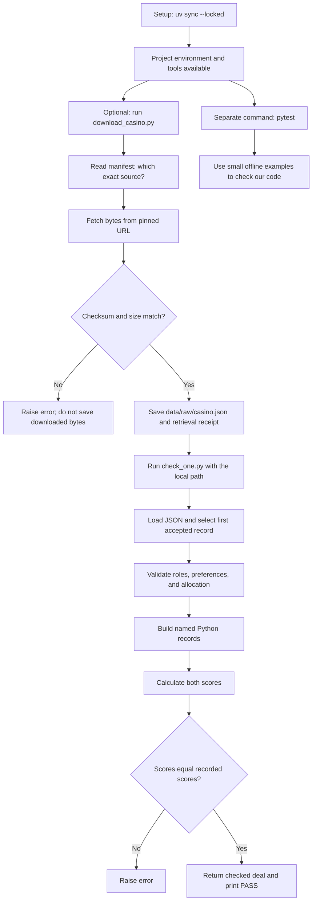
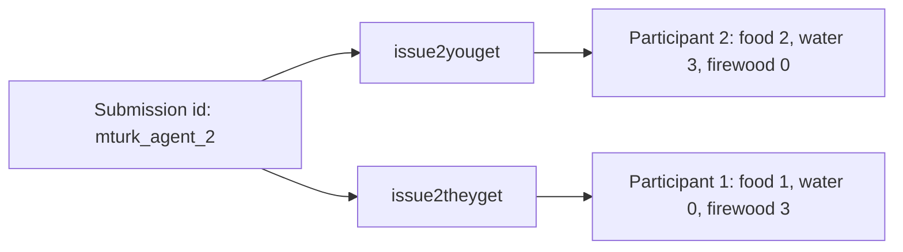
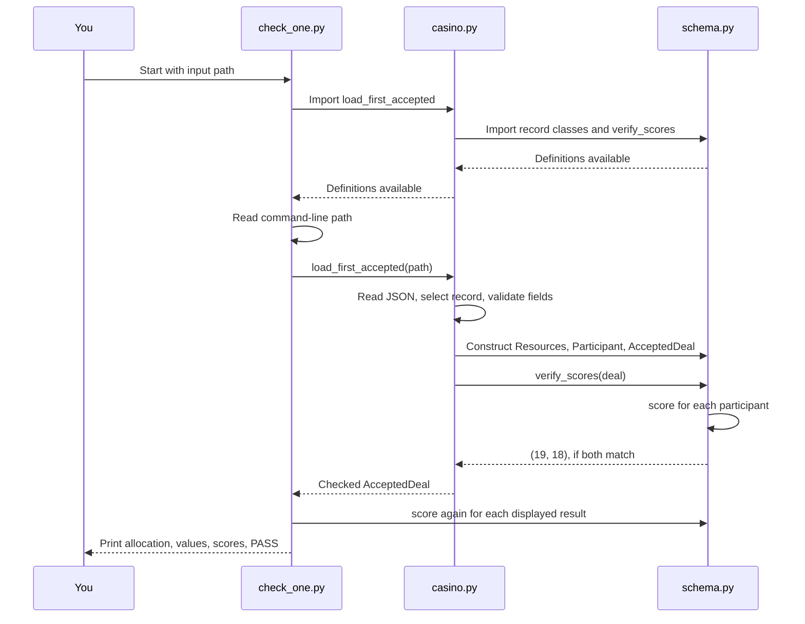
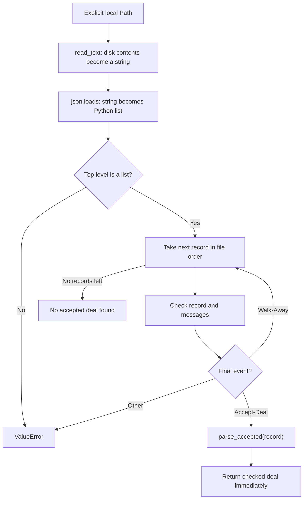
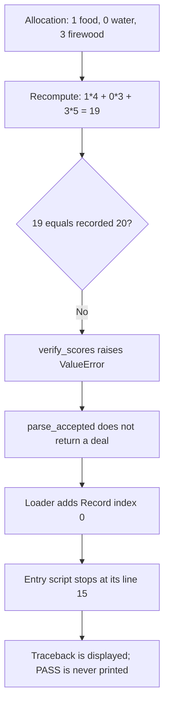
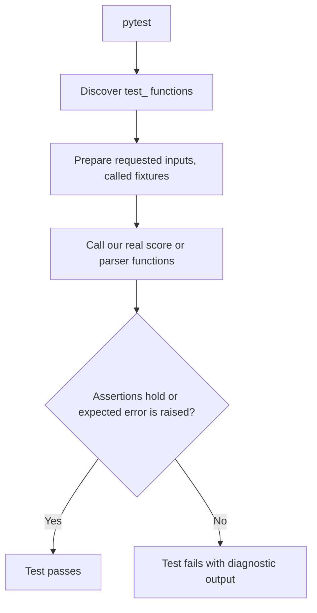

# Evidence Lab: a beginner's walkthrough

Read this beside the source files. The line numbers below refer to the code as inspected for this walkthrough. You do not need to memorize them. Blank lines separate ideas; closing brackets finish expressions and do not perform a separate task.

This guide explains the program we actually have, including its shortcuts and limitations. It does not add another study or change the program.

Code update: `casino.py` now defines `UNITS_PER_RESOURCE = 3` beside `ISSUES`.
Quantity limits, resource-total checks, and their error messages use that name.
The maximum recorded score is calculated as
`UNITS_PER_RESOURCE * sum(POINTS.values())`, which is `3 * (5 + 4 + 3) = 36`.
The worked examples below still show the concrete numbers 3 and 36; source line
numbers may have shifted as the code and your learning comments were updated.

## 1. The practical problem, before Python

Two people agreed to divide three kinds of supplies: food, water, and firewood. There are three units of each resource to divide. Each person earns points for the items they receive.

A person's High-priority resource is worth 5 points per unit, Medium is worth 4, and Low is worth 3. These numbers are the assigned scoring rules, not prices or a judgment about real-world happiness.

The data already contains a recorded score for each participant. Our question is:

> If we independently multiply the quantities received by that person's points per unit, do we get the score written in the data?

We use the recorded score only at the comparison step. We do not use it to choose the quantities or infer the points per unit.

For the selected record:

| Resource | Person 1 receives | Person 1 points/unit | Person 2 receives | Person 2 points/unit |
| --- | ---: | ---: | ---: | ---: |
| Food | 1 | 4 | 2 | 3 |
| Water | 0 | 3 | 3 | 4 |
| Firewood | 3 | 5 | 0 | 5 |

Person 1: `1 × 4 + 0 × 3 + 3 × 5 = 19`.

Person 2: `2 × 3 + 3 × 4 + 0 × 5 = 18`.

The source says 19 and 18 too. That agreement is today's result. It does not establish whether the deal is fair, optimal, or Pareto-dominated. It does not verify all other records.

## 2. Three activities, with separate starting commands



There is no automatic background process connecting these commands. You explicitly start each activity in the terminal. Running the checker does not start the downloader or pytest.

A terminal is the application where you type commands. A shell interprets those commands. Python is the program that executes a Python file. A running program is a process.

Run commands from the repository folder:

```bash
cd /home/mastii/Desktop/hustle/evidence-lab
uv sync --locked
uv run --locked python scripts/check_one.py data/raw/casino.json
```

| Part | Meaning |
| --- | --- |
| `cd` | Change the shell's current folder. |
| `/home/.../evidence-lab` | An absolute path: a location starting from the filesystem root. |
| `uv` | The tool managing this project's Python environment and dependencies. |
| `sync` | Make the environment match the project dependencies. |
| `--locked` | Require the existing lockfile to remain valid; fail if it would need updating. It does not mean “no internet.” |
| `run` | Run the following command in the project's environment. |
| `python` | Start the Python interpreter. |
| `scripts/check_one.py` | The Python file to execute. |
| `data/raw/casino.json` | A command-line argument passed to that file: the input location. |

A relative path, such as `data/raw/casino.json`, is interpreted from the current folder. A path is a location, not the contents at that location.

An environment is a folder of Python tools isolated for this project. Here it is `.venv/`. A dependency is another package our project uses. Our research code uses Python's standard library; pytest and Ruff are development tools installed separately.

## 3. The small amount of Python vocabulary we need

### Values, names, and containers

```python
quantity = 2
resource = "Food"
```

The right side is evaluated first. `=` assigns its result to a name. It is not an equality test. `==` asks whether two values are equal.

| Syntax | Meaning |
| --- | --- |
| `2` | An integer: a whole number, type `int`. |
| `"2"` | Text containing the character 2, type `str`. |
| `1.5` | A decimal-valued floating-point number, type `float`. |
| `True`, `False` | Boolean values used in decisions. |
| `None` | An explicit absence of a value; it is not zero. |
| `[1, 2, 3]` | A list: an ordered, changeable collection. |
| `(1, 2, 3)` | A tuple: an ordered collection whose entries cannot be reassigned. |
| `{"Food": 2}` | A dictionary: a mapping from keys to values. |
| `{"Food", "Water"}` | A set: distinct members; membership matters, not sequence. |

`items[0]` means the first item: Python counts positions from zero. `items[1]` is the second. `items[-1]` is the last. `items[-2:]` selects a list slice containing the last two items.

For a dictionary, `amounts["Food"]` looks up the value at the key `"Food"`; it is not position-based. Missing required indexing raises an error. `amounts.get("Food")` returns `None` if the key is absent. Our parser then checks that value instead of treating it as zero.

`participant.allocation` uses a dot to retrieve an object's named attribute. `computed.append(19)` uses a dot to access a method, then calls it. A method is a function attached to an object. Here it adds 19 to a list.

### Functions and flow

```python
def double(number: int) -> int:
    return number * 2


answer = double(3)
```

- `def` defines a function.
- `double` is its name.
- `number` is a parameter: the local name receiving an input.
- `3` in the call is an argument: the actual supplied input.
- `: int` describes the intended input type.
- `-> int` describes the intended return type.
- The final `:` starts the indented body.
- Indentation groups statements inside the function.
- `return` hands a result back to the caller and ends this function call.
- `double(3)` calls the function. Its result is 6.
- `answer = ...` stores that returned result.

**Defining a function does not run its body.** Python must reach a call such as `double(3)` to execute it. Names created inside a call are generally local to that call.

Type hints describe intended use; Python does not automatically reject bad inputs because of them. Our explicit `if` checks perform validation.

```python
if quantity > 3:
    raise ValueError("Too many units")
```

`if` runs an indented block when its condition is true. `raise` signals an exception: ordinary execution stops and Python looks for code that handles it. `ValueError` is an existing Python exception type for an unacceptable value.

`try` and `except` let us catch a specified kind of exception. If an exception remains unhandled, Python prints a traceback showing the chain of calls and exits unsuccessfully.

`for` repeats a block once per element. `and` requires both conditions; `or` requires at least one. They evaluate left to right and can stop early once the answer is known. That is why `isinstance(value, str) and value.isdecimal()` does not call a string method on `None`.

`not` reverses a true/false condition. Empty lists and dictionaries are false in a condition. `if not messages` therefore recognizes an empty list after the type check.

### Symbols that appear repeatedly

| Syntax | Meaning in this project |
| --- | --- |
| `# comment` | A note ignored by execution. |
| `"""text"""` | A string spanning one or more lines; at the beginning of a module/class/function it documents that object (a docstring). It does not print itself. |
| `import json` | Make an existing module available under the name `json`. A module is usually a Python file containing reusable definitions. |
| `from pathlib import Path` | Import the specific name `Path` from that module. |
| `f"Score: {value}"` | An f-string: evaluate the expression in braces and include its value in the text. |
| `{value!r}` in an f-string | Show the value's representation, helping distinguish `"2"`, `2`, and `None`. |
| `!=` | Not equal. |
| `in` / `not in` | Membership / non-membership. |
| `is` / `is not` | Object identity, used here to ask whether a type object is exactly `int`. |
| `_mapping` | A leading underscore signals an internal helper by convention; it does not technically prevent calls. |
| `POINTS` | Uppercase signals a value intended to stay constant by convention. Python does not enforce that. |
| `(...)` | Can call a function, group an expression, or hold tuple elements, depending on context. |
| `*values` inside a call | Unpack values into separate arguments. This differs from multiplication between two numbers. |
| `field=value` inside a call | Supply an argument by its parameter name. |
| A trailing comma | Separates items and is allowed before the closing bracket. |
| Blank line | Helps humans read; no separate operation. |

## 4. Raw JSON: what is actually in the input?

JSON is a text format for storing structured data. It is not executable Python. JSON objects become Python dictionaries, arrays become lists, strings remain strings, numbers become numeric values, `null` becomes `None`, and JSON `true`/`false` become Python `True`/`False`.

The complete source file contains a list of dialogue objects. The committed fixture contains just one reduced dialogue object.

```text
Full source text on disk
[
    { dialogue 0 fields },
    { dialogue 1 fields },
    ...
]

After json.loads(...)
Python list
    index 0 → dictionary for dialogue 0
    index 1 → dictionary for dialogue 1
```

“Parse JSON” means convert text syntax into Python containers. “Parse a CaSiNo record” is another step: interpret those containers according to the dataset's field meanings, validate them, and create our named records.

The fixture's structure, field by field:

```text
dialogue_id: 0
chat_logs: ordered list of events
    first retained event
        text: "Submit-Deal"
        id: "mturk_agent_2"
        task_data:
            issue2youget:
                Firewood: "0"
                Water: "3"
                Food: "2"
            issue2theyget:
                Firewood: "3"
                Water: "0"
                Food: "1"
    second retained event
        text: "Accept-Deal"
        id: "mturk_agent_1"
        task_data:
            data: "accept_deal"
participant_info:
    mturk_agent_1:
        value2issue:
            Medium: "Food"
            Low: "Water"
            High: "Firewood"
        outcomes:
            points_scored: 19
    mturk_agent_2:
        value2issue:
            Low: "Food"
            Medium: "Water"
            High: "Firewood"
        outcomes:
            points_scored: 18
```

Every JSON `{` opens an object; `}` closes it. `[` and `]` open and close arrays. A colon connects a key to its value. Commas separate entries. Quotes indicate strings. Thus `"0"` is text, while the dialogue ID `0` is a number.

The raw names are inherited from the dataset. `value2issue` means “priority value to resource.” `issue2youget` means “resource to quantity you receive.” We did not invent these names.

**“You” refers to the person submitting the offer.** Here that is participant 2.



An allocation is simply the quantities someone receives. Preferences determine points per unit; allocation determines how many units to multiply by those points.

The acceptance's `task_data.data` is retained in the fixture but not inspected by today's parser. The parser uses the final event's `text` and `id`. Ordinary conversation and unrelated demographics are not inputs to the score calculation.

## 5. Downloading: scripts/download_casino.py, every statement

This activity is needed only when you want to obtain the pinned full dataset. The already-downloaded file can be checked repeatedly without another download.

```bash
uv run --locked python scripts/download_casino.py
```

A manifest is a small file describing which source we expect. A checksum is a fingerprint calculated from file bytes. It checks byte identity against our expected fingerprint; it does not prove the underlying research data is truthful.

| Source line(s) | What executes and why |
| --- | --- |
| 1 | The module docstring explains this script's purpose. |
| 3 | Import `hashlib`, which supplies checksum functions. |
| 4 | Import `json`, which converts between JSON text and Python containers. |
| 5 | Import `datetime` for timestamps and `timezone` for specifying UTC. |
| 6 | Import `Path` for filesystem locations. |
| 7 | Import `urlopen`, which opens an internet resource. |
| 9 | `__file__` is this script's filename. `Path(__file__)` makes a path object; `.resolve()` makes it absolute and resolves links. `.parents[0]` is the scripts directory, so `.parents[1]` is the project directory. Save that as `ROOT`. |
| 12 | Define `download`. It has no input parameters. `-> None` says it returns no useful result: its work is downloading, writing, and printing. Its body is not run at definition time. |
| 44 | When Python runs this file directly, `__name__` is `"__main__"`, so the condition is true. When imported under a module name, it is false. |
| 45 | Call `download()`. Execution enters line 13. |

Inside `download()`:

| Source line(s) | What executes and why |
| --- | --- |
| 13 | `ROOT / "sources/casino.manifest.json"` joins a directory and filename. Here `/` joins paths; it does not divide numbers. `.read_text()` reads the file as text. `json.loads(...)` converts that text to a dictionary. Save it as `manifest`. The default text encoding is used on this particular line. |
| 14 | Look up `manifest["url"]` and open it. `timeout=60` configures a timeout for blocking network operations; it is not a guaranteed 60-second limit for the entire download. `with ... as response` gives the opened resource a name and arranges for it to be closed when this block ends, including on error. |
| 15 | Read the response body into `content`. It is bytes, not a Python dictionary. The whole small dataset is held in memory. |
| 16 | `hashlib.sha256(content)` calculates SHA256; `.hexdigest()` renders it as hexadecimal text. Store it in `actual_hash`. |
| 17 | Compare the actual fingerprint with the expected one from the manifest. |
| 18–20 | If they differ, raise `ValueError` with both fingerprints. The downloader stops before writing the dataset. Brackets just continue and close the exception call. |
| 21 | `len(content)` counts bytes. Compare it with the expected byte count. |
| 22–24 | On disagreement, raise a descriptive error before saving. |
| 25 | Join the project directory with the manifest's local destination path. |
| 26 | `.parent` is the destination directory. `.mkdir(...)` creates it; `parents=True` creates missing parent directories too; `exist_ok=True` accepts a directory that already exists. |
| 27 | Create a temporary destination name by replacing `.json` with `.json.part`. Merely constructing this path does not create a file. |
| 28 | Write the verified bytes to that temporary file. |
| 29 | Move/rename that file into the final destination, replacing an existing destination. Since this is in the same directory, the verified completed file can be substituted without writing partial contents directly over the final file. The subsequent receipt write is a separate operation. |
| 30 | Start a dictionary for a download receipt. |
| 31 | Get the current time in UTC, format it as standard date/time text, and store it under `retrieved_at_utc`. |
| 32 | Copy the source URL into the receipt. |
| 33 | Copy the pinned source revision into it. |
| 34 | Store the fingerprint calculated from these actual downloaded bytes. |
| 35 | Store their actual byte count. |
| 36 | Close the receipt dictionary. |
| 37 | Build the receipt path beside the dataset and call `write_text`. |
| 38 | `json.dumps` converts the receipt dictionary to JSON text. `indent=2` makes it readable with two-space indentation. `+ "\n"` adds a final newline. `encoding="utf-8"` selects a specific character encoding for writing. |
| 39 | Close the `write_text` call. |
| 40 | Print the size and checksum. `:,` inside the f-string formats a number with separators, such as `4,300,019`. |
| 41 | Print the saved path. The function then ends and implicitly returns `None`. |

There is no `try/except` in this script. Network errors, file errors, and checksum disagreements remain visible instead of being suppressed.

### The manifest, each field

| Manifest line(s) | Meaning |
| --- | --- |
| 1, 22 | Open/close the outer JSON object. |
| 2 | Human-readable source name. |
| 3 | Upstream repository location. |
| 4 | Exact source commit, rather than a moving branch such as `main`. |
| 5 | Exact file URL at that commit. The downloader uses this. |
| 6 | Expected SHA256. |
| 7 | Expected bytes: 4,300,019. |
| 8 | Destination path relative to the project directory. |
| 9–13 | Retrieval instructions: command, receipt location, and explanatory note. The `command` field is documentation; the downloader does not execute command text from the manifest. |
| 14–21 | Rights metadata: license identifier, source license, license link, attribution, paper link, and explanatory note. These fields document the source; they do not affect arithmetic. |

## 6. What happens when you start the checker?

Starting command:

```bash
uv run --locked python scripts/check_one.py data/raw/casino.json
```

The checker is only 23 lines. It delegates detailed work to functions in the package.



On the first import in this process, Python loads the package's `__init__.py`, the negotiation package's `__init__.py`, and the requested module. Our two `__init__.py` files contain just a one-line docstring describing the package; they perform no research calculation.

While importing `casino.py`, Python imports `schema.py`. It defines classes and functions there, then resumes `casino.py` and defines its constants and functions. None of those function bodies runs merely because it is defined.

Python normally caches loaded modules for the life of the process. The later `from ...schema import score` makes the already-loaded function available to the checker.

There is a difference between:

```python
from evidence_lab.negotiation.schema import score  # obtain the function

score(allocation, values)  # execute it with inputs
```

The distribution name is `evidence-lab` in project metadata, but the Python import name is `evidence_lab`. A hyphen would not work as part of that Python identifier. `uv sync` installs our package so Python can find the source under `src/`.

## 7. The record definitions prepared during import: schema.py

A class defines a type of object. Calling the class creates an instance: one particular object of that type.

A dataclass is a convenient way to define a class that mainly holds named fields. The `@dataclass(...)` decorator processes the following class definition, supplying useful methods such as initialization, readable representation, and field-based equality.

`frozen=True` prevents normal assignment to fields after creation. It does not itself check whether a quantity is valid.

### Lines 1–28: containers

| Line | Meaning |
| --- | --- |
| 1 | Module documentation: the parser supplies validation. |
| 3 | Import the standard-library `dataclass` decorator. |
| 6 | Apply dataclass behavior to the following class and prevent normal field reassignment. |
| 7 | Define the class named `Resources`. |
| 8 | Document that its numbers can represent either quantities or points per unit, according to where it is used. |
| 10 | Declare the `food` field, intended to hold an integer. |
| 11 | Declare `water`. |
| 12 | Declare `firewood`. |
| 15 | Apply dataclass behavior to `Participant`. |
| 16 | Define `Participant`. |
| 17 | Store that participant's ID as text. |
| 18 | Store their points per unit in a `Resources` object. |
| 19 | Store their received quantities in another `Resources` object. |
| 20 | Store the source's recorded score separately. |
| 23 | Apply dataclass behavior to `AcceptedDeal`. |
| 24 | Define `AcceptedDeal`. |
| 25 | Store the dialogue ID as an integer. |
| 26 | Preserve the ID of whoever proposed the accepted deal. |
| 27 | Store participant 1's full `Participant` record. |
| 28 | Store participant 2's record. |

Example construction:

```python
allocation = Resources(food=1, water=0, firewood=3)
```

This creates one `Resources` instance. `allocation.food` is 1.

`Resources(1, 0, 3)` creates the same field values using positional arguments: food first, water second, firewood third.

The complete clean record has this shape:

```text
AcceptedDeal
├── dialogue_id = 0
├── proposer_id = "mturk_agent_2"
├── participant_1 = Participant
│   ├── participant_id = "mturk_agent_1"
│   ├── values = Resources(food=4, water=3, firewood=5)
│   ├── allocation = Resources(food=1, water=0, firewood=3)
│   └── recorded_score = 19
└── participant_2 = Participant
    ├── participant_id = "mturk_agent_2"
    ├── values = Resources(food=3, water=4, firewood=5)
    ├── allocation = Resources(food=2, water=3, firewood=0)
    └── recorded_score = 18
```

It deliberately does not retain the source's demographics or conversation. Here “clean” means fields have been translated and checked by the parser. Calling these dataclass constructors yourself bypasses that validation.

### Lines 31–37: score

```python
def score(allocation: Resources, values: Resources) -> int:
    """Each resource contributes quantity multiplied by points per unit."""
    return (
        allocation.food * values.food
        + allocation.water * values.water
        + allocation.firewood * values.firewood
    )
```

- Line 31 defines a function with two named inputs. Both should be `Resources` objects. It returns an integer.
- Line 32 documents the calculation.
- Line 33 starts the returned expression. Parentheses allow that expression to continue across physical lines.
- Line 34 multiplies food quantity by food points per unit.
- Line 35 adds the water contribution.
- Line 36 adds the firewood contribution.
- Line 37 closes the expression. The resulting integer goes back to the caller.

For participant 1, these operations are `1 * 4`, `0 * 3`, and `3 * 5`; the returned sum is 19.

The function does not read files, print, know about CaSiNo's raw keys, or read `recorded_score`. The same inputs produce the same result without changing them. This is why we can test its arithmetic independently.

### Lines 40–52: verify_scores

| Line(s) | Meaning |
| --- | --- |
| 40 | Define a function accepting one `AcceptedDeal`. Its return hint `tuple[int, int]` describes two integers in a fixed order. |
| 41 | Document the output order and possibility of failure. |
| 42 | Create an empty list called `computed` for scores that pass comparison. |
| 43 | Loop over participant 1, then participant 2. Parentheses and the comma form a tuple of those objects. |
| 44 | Call `score` with this participant's allocation and values. Store the result in `reconstructed`. |
| 45 | Compare the calculated number against this participant's recorded number. |
| 46 | On disagreement, construct and raise `ValueError`. |
| 47 | Include dialogue and participant IDs in the error text. |
| 48 | Include the computed score. |
| 49 | Include the recorded score. Adjacent string literals inside these parentheses join into one string; they do not become three exception arguments. |
| 50 | Close the exception constructor. |
| 51 | On success, append the calculated number to the list. If line 46 raised an error, this line would not run for that participant. |
| 52 | Return the first and second list entries as a tuple. The comma creates the tuple even without surrounding parentheses. |

The list changes from `[]` to `[19]` to `[19, 18]`. The returned tuple is `(19, 18)`.

The parser calls this function for its validation effect. It does not need to retain the returned tuple. Our tests do check that returned tuple.

## 8. Back to the entry script: check_one.py

| Line(s) | What executes |
| --- | --- |
| 1 | Document how to run the file. `PATH` in this string is a placeholder in documentation, not a variable. |
| 3 | Import `argparse`, the standard library's tool for reading terminal arguments. |
| 4 | Import `Path`. |
| 6 | Import the loader from our package, triggering the definition-loading sequence above. |
| 7 | Import the calculation function for printing reconstructed scores. |
| 9–11 | Construct an `ArgumentParser` object and save it in `parser`. `description=...` supplies text for its help message. This `parser` parses command-line arguments; it is separate from the source-data parser in `casino.py`. |
| 12 | Declare one required positional argument called `path`. `type=Path` converts the supplied text to a `Path` object. `help=...` describes it in help output. |
| 13 | Read actual terminal arguments. Return an object with an attribute named `path`, saved as `args`. Missing/invalid terminal arguments are reported by argparse. |
| 15 | Call `load_first_accepted(args.path)`. **Pause this script here while the function and the functions it calls run.** The assignment to `deal` happens only if that call successfully returns. |
| 16 | After success, print the dialogue and proposer using attributes of the returned object. |
| 17 | Start a loop over the two participant records in fixed 1/2 order. |
| 18 | Print the current participant ID. |
| 19 | Print their allocation. The dataclass supplies the readable `Resources(food=..., ...)` representation. |
| 20 | Print their values per unit. |
| 21 | Call `score` again and print its result. Validation already happened inside the loader. This repeated call is only for the display. |
| 22 | Print the source's recorded score next to the reconstructed result. |
| 23 | After both loop iterations, print the success message. Notice that this line is no longer indented inside the loop. |

This script has no `if __name__ == "__main__"` guard. Its top-level command-line code runs if the file is executed or imported as a module. We use it as an entry script and do not import it from our tests.

## 9. Into casino.py: loading, selecting, and validating

### Preparation at import, lines 1–17

| Line(s) | Meaning |
| --- | --- |
| 1 | Module documentation. |
| 3 | Import JSON conversion tools. |
| 4 | Import filesystem paths. |
| 5 | Import `Any`, a type-hint word meaning the value could be of any type. Raw JSON is mixed, so it starts broadly typed. `Any` does not validate anything. |
| 7–12 | Import our three container classes and verification function. Parentheses allow a multiline import list. |
| 14 | Fixed tuple of participant IDs. Output order follows this order. |
| 15 | Fixed resource order: Food, Water, Firewood. This agrees with the `Resources` constructor's food/water/firewood field order. |
| 16 | Comment identifying the source of the scoring rule. |
| 17 | Dictionary translating priority labels into points per unit. |

All following `def` statements register functions. The first one actually called by the entry script is near the bottom, at line 135. Function position in the file is not execution order.

### load_first_accepted, lines 135–151



| Line(s) | What happens |
| --- | --- |
| 135 | Define the function taking a local `Path` and promising a checked `AcceptedDeal` on success. |
| 136 | State the deterministic choice: first accepted record in file order. “Deterministic” means the same input order produces the same selection. We do not sort by ID. |
| 137 | First evaluate `path.read_text(encoding="utf-8")`, obtaining file contents as a string. Then pass the string to `json.loads`, obtaining Python objects. Save the result as `records`. This reads the whole JSON file, although only one accepted deal is reconstructed. |
| 138–139 | Require the outer object to be a list. A dictionary at the top level is not the complete-source format. |
| 140 | `enumerate(records)` supplies pairs `(0, first_record)`, `(1, second_record)`, etc. The loop unpacks each pair into `index` and `raw`. The index helps locate failures and is not necessarily the dialogue ID. |
| 141 | Start a `try` block so errors in processing this record can be given its index. |
| 142 | Call `_mapping` to require a dictionary. See its explanation below. |
| 143 | Call `_messages` to validate the messages list, take its last entry with `[-1]`, and read that entry's `"text"`. Store the result as `terminal`. |
| 144–145 | If the last event is `Accept-Deal`, call `parse_accepted(raw)`. Wait for that call to return, then return its result to `check_one.py`. This ends the loop and the whole loader call. |
| 146 | Comment explaining why walkaways are not accepted examples. |
| 147–148 | An ending that is neither accepted nor `Walk-Away` is rejected. A walkaway reaches the end of the loop body and proceeds to the next record. |
| 149 | Catch a `ValueError` raised inside the `try` block, including inside helper calls. Save that exception as `error`. |
| 150 | Raise a new `ValueError` adding the record index. `from error` preserves the original cause in the traceback. This does not skip bad accepted records and continue. |
| 151 | If the loop finishes without returning an accepted deal, raise a clear error. |

File-reading and JSON-syntax errors occur at line 137, outside this record-specific `try`. They also fail visibly, but do not receive a record-index prefix.

Only the structure needed to select a walkaway is checked before passing it over. Records after the selected accepted deal are not parsed. This is one-record reconstruction, not whole-file validation.

### First helper reached: _mapping, lines 20–23

```python
def _mapping(value: object, field: str) -> dict[str, Any]:
    if not isinstance(value, dict):
        raise ValueError(f"{field} must be a JSON object")
    return value
```

- Line 20 accepts any Python object plus a readable field label. Its return hint says “dictionary with string keys and values of varying types.”
- Line 21 asks whether `value` is a dictionary. `not` reverses the answer.
- Line 22 raises an error if it is not. `field` is only used to locate the problem for the reader.
- Line 23 returns the existing dictionary unchanged if the check passes. It does not make a copy.

The type hint does not itself verify that every key is a string. Normal JSON object parsing supplies string keys, and later checks validate required field names.

### Next helper: _messages, lines 37–45

| Line | Meaning |
| --- | --- |
| 37 | Define a helper taking a raw dictionary and returning a list of message dictionaries. |
| 38 | Read `chat_logs`; a missing field gives `None`. |
| 39 | Reject anything other than a list, and reject an empty list. The `or` combines those alternatives. |
| 40 | Raise the error. |
| 41 | Loop through each message in the list. |
| 42 | Require each message to be a dictionary. Reassign the local name to the checked object. |
| 43–44 | Require a string under its `text` key. Missing text gives `None` and fails. |
| 45 | Return the existing messages list. |

This reads message field types; it does not analyze language. The loader calls this helper, and the accepted parser calls it again so that direct calls to `parse_accepted` also receive this validation.

### parse_accepted, first half: lines 81–106

| Line(s) | Meaning and actual value for dialogue 0 |
| --- | --- |
| 81 | Define the conversion function from a raw dictionary to an `AcceptedDeal`. |
| 82 | Document the promise to reject invalid input. |
| 83 | Ensure the input is a dictionary, even if called directly. |
| 84 | Get `dialogue_id`: here, integer 0. |
| 85 | Reject anything whose exact type is not `int`, or a negative integer. The `or` prevents comparing a non-integer with zero after the first check already fails. |
| 86 | Raise a descriptive error. |
| 87 | Validate and retrieve the message list. |
| 88 | Require at least two messages and a final `Accept-Deal`. Short-circuiting prevents unsafe assumptions on too-short input. |
| 89 | Raise an error otherwise. |
| 90 | `messages[-2:]` gives the final two events. Unpack them into `proposal` and `acceptance`. |
| 91–92 | Require the penultimate event to be `Submit-Deal`. We do not search back past a rejection to recover an older proposal. |
| 93 | Read the proposal's `id`: `"mturk_agent_2"`. |
| 94 | Read the acceptance's `id`: `"mturk_agent_1"`. |
| 95–99 | Combine three invalid cases: unknown proposer, unknown acceptor, or the same person in both roles. Parentheses allow the condition to span lines. |
| 100–102 | Raise if any of those cases holds. |
| 103 | Require `participant_info` to be a dictionary. |
| 104 | `set(info)` produces the dictionary's keys as a set. Compare with the exact two expected roles, ignoring key order. |
| 105 | Reject missing or extra participant keys. |
| 106 | Require the proposal's `task_data` to be a dictionary. |

### parse_accepted, allocation: lines 107–115

```python
allocations = {
    proposer_id: _allocation(task.get("issue2youget"), "issue2youget"),
    acceptor_id: _allocation(task.get("issue2theyget"), "issue2theyget"),
}
```

Line 107 comments on the proposer-relative meaning of “you.”

Line 108 starts a dictionary assignment. The expressions on the right are evaluated before `allocations` receives the finished dictionary.

Line 109 calls `_allocation` for the proposer's side, then uses the actual proposer ID as the dictionary key.

Line 110 calls `_allocation` for the other side and keys it by the acceptor ID.

Line 111 closes the dictionary. The resulting mapping is:

```python
{
    "mturk_agent_2": Resources(food=2, water=3, firewood=0),
    "mturk_agent_1": Resources(food=1, water=0, firewood=3),
}
```

The record's spelling/order of resource keys does not determine constructor positions. Our fixed `ISSUES` order does.

Line 112 loops through the clean attribute names `food`, `water`, `firewood`.

Line 113 calculates the total received by both people for the current resource:

```python
total = sum(getattr(amounts, resource) for amounts in allocations.values())
```

Read this from the inside:

1. `allocations.values()` supplies the two `Resources` objects.
2. `for amounts in ...` takes one object at a time.
3. `getattr(amounts, resource)` retrieves the attribute whose name is stored in the string `resource`.
4. If `resource == "food"`, it has the effect of `amounts.food`.
5. `sum(...)` adds the resulting quantities.

Equivalent longer form:

```python
total = 0
for amounts in allocations.values():
    quantity = getattr(amounts, resource)
    total = total + quantity
```

Line 114 checks whether the total differs from 3. Line 115 raises on failure.

Here food totals `2 + 1 = 3`, water `3 + 0 = 3`, and firewood `0 + 3 = 3`. This is “conservation”: no supplies are created or lost in the split.

### Helper called during allocation: _integer, lines 26–34

The allocation helper below uses this conversion:

| Line(s) | Meaning |
| --- | --- |
| 26 | Accept an arbitrary value, a field label for errors, and an allowed maximum. Return a checked integer. |
| 27 | Explain why conversion must reject missing values, fractions, and booleans. |
| 28 | Convert only when the input is a string, contains only ASCII characters, and consists of decimal digits. All three conditions must hold. |
| 29 | Convert a string such as `"2"` to integer `2`. |
| 30 | Reject a value that is not exactly an integer, or is outside the inclusive range `0 <= value <= maximum`. |
| 31–33 | Raise a message identifying the field, expected range, and actual representation. |
| 34 | Return the checked integer. |

Why use `type(value) is not int`? In Python, booleans are a subtype of integers: `isinstance(True, int)` is true. We deliberately reject `True` and `False` as quantities.

Examples with maximum 3:

| Input | Outcome |
| --- | --- |
| `"2"` | Converted to 2 and accepted. |
| `2` | Accepted unchanged. |
| `0` | Accepted: zero is a real quantity. |
| `None` | Rejected: missing is not zero. |
| `True` | Rejected: a boolean is not a quantity. |
| `1.5` or `"1.5"` | Rejected: units must be whole numbers. |
| `"4"` | Converts to 4, then fails the range check. |
| `"-1"` | Does not pass the decimal-string check and is rejected. |
| `" 2 "` | Rejected; the parser does not strip spaces. |
| `"02"` | Accepted as 2; the present rule permits leading zeros. |

### _allocation, lines 48–54

| Line(s) | Meaning |
| --- | --- |
| 48 | Define the conversion from a raw allocation object into `Resources`. |
| 49 | Require a dictionary. |
| 50–51 | Require exactly the three resource keys, ignoring dictionary ordering. |
| 52–54 | Read each quantity in our fixed resource order, validate it using maximum 3, and construct `Resources`. |

The compact line is:

```python
return Resources(*(_integer(amounts[issue], f"{field}.{issue}", 3) for issue in ISSUES))
```

`(... for issue in ISSUES)` is a generator expression: it supplies results one at a time as requested. It does not initially build a whole list. `*` in the function call consumes and expands those results into separate positional arguments.

For the proposer in dialogue 0, it becomes `Resources(2, 3, 0)`.

Equivalent explicit version:

```python
food = _integer(amounts["Food"], f"{field}.Food", 3)
water = _integer(amounts["Water"], f"{field}.Water", 3)
firewood = _integer(amounts["Firewood"], f"{field}.Firewood", 3)
return Resources(food=food, water=water, firewood=firewood)
```

The error label such as `issue2youget.Food` is a string describing where a bad value came from. The dot inside that string does not access an attribute.

### parse_accepted, constructing the deal: lines 116–132

| Line(s) | Meaning |
| --- | --- |
| 116 | Comment explaining fixed participant 1/2 output order. |
| 117 | Start constructing an `AcceptedDeal`. Each argument expression must be evaluated before the object can be returned. |
| 118 | Give it the validated dialogue ID. |
| 119 | Give it the validated proposer ID. |
| 120–124 | Build participant 1 by calling `_participant` with three inputs: ID at position 0, that ID's source information, and that ID's allocation. |
| 125–129 | Build participant 2 using the ID at position 1 and its corresponding information/allocation. |
| 130 | Finish construction and assign the resulting object to `deal`. |
| 131 | Call `verify_scores(deal)`. A mismatch raises here, so the next line is not reached. |
| 132 | On success, return the checked object. Control goes back to the loader, which returns it to the entry script. |

The source's dictionary insertion order does not decide which participant becomes `participant_1`. We look up the explicit ID every time.

### The nested participant builder: _participant, lines 57–78

| Line(s) | Meaning |
| --- | --- |
| 57–59 | Define a helper taking a participant ID, that participant's raw information, and their already-checked allocation. It returns a `Participant`. The signature continues over several lines inside parentheses. |
| 60 | Require the raw information to be a dictionary. |
| 61 | Require its `value2issue` field to be a dictionary. |
| 62 | Compare its keys with exactly High, Medium, Low. Start a second check with `or`. |
| 63–64 | Compare sorted preference resource names with sorted expected resource names. This requires each of the three resources exactly once and detects duplicates. `key=str` uses string representations only for sorting, so unusual mixed values do not crash the sorting comparison; it does not replace the original values with strings. Invalid values still fail the equality comparison. |
| 65–67 | Raise if the rank names or assigned resources are invalid. |
| 68 | Translate priority-to-resource into resource-to-points using a dictionary comprehension, explained below. |
| 69 | Require the outcomes dictionary. |
| 70–72 | Read the recorded score and validate it as an integer from 0 to 36. The maximum is `3 * (5 + 4 + 3) = 36`, corresponding to receiving all supplies. |
| 73 | Construct and return a `Participant`. |
| 74 | Set its ID. |
| 75 | Construct its points-per-resource object in Food, Water, Firewood order. |
| 76 | Attach the allocation that was already constructed and validated. |
| 77 | Attach the source's checked recorded score. |
| 78 | Close the constructor call. |

Line 68:

```python
values = {preferences[rank]: points for rank, points in POINTS.items()}
```

`POINTS.items()` supplies key/value pairs: `("High", 5)`, `("Medium", 4)`, `("Low", 3)`. The loop unpacks each pair into `rank` and `points`. `preferences[rank]` finds the resource that participant assigned to the rank. The new dictionary maps that resource to the numeric points.

For participant 1:

```text
High   → Firewood → 5
Medium → Food     → 4
Low    → Water    → 3

values = {"Firewood": 5, "Food": 4, "Water": 3}
Resources(food=4, water=3, firewood=5)
```

Equivalent longhand:

```python
values = {}
for rank, points in POINTS.items():
    resource_name = preferences[rank]
    values[resource_name] = points
```

Line 75 uses generator expansion just like the allocation helper. It retrieves `values["Food"]`, then `values["Water"]`, then `values["Firewood"]` and passes them to `Resources`.

## 10. The complete call-and-return trace for this record

Indentation below means “this function calls the function underneath.”

```text
check_one.py, line 15
└── load_first_accepted(Path("data/raw/casino.json"))
    ├── read_text() → string
    ├── json.loads() → list of raw dialogue dictionaries
    ├── index=0, raw=first dialogue
    ├── _mapping(raw, "dialogue") → same dictionary, checked
    ├── _messages(raw) → checked messages list
    ├── final text = "Accept-Deal"
    └── parse_accepted(raw)
        ├── _mapping(raw, "dialogue")
        ├── validate dialogue_id = 0
        ├── _messages(raw)
        ├── validate final Submit-Deal / Accept-Deal
        ├── proposer = participant 2; acceptor = participant 1
        ├── validate participant_info and task_data dictionaries
        ├── _allocation(issue2youget)
        │   ├── _mapping(...)
        │   ├── _integer("2", ..., 3) → 2
        │   ├── _integer("3", ..., 3) → 3
        │   ├── _integer("0", ..., 3) → 0
        │   └── Resources(2, 3, 0)
        ├── _allocation(issue2theyget) → Resources(1, 0, 3)
        ├── check resource totals: 3, 3, 3
        ├── _participant("mturk_agent_1", ...)
        │   ├── validate preference mapping
        │   ├── rank-to-resource → resource-to-points
        │   ├── _integer(19, ..., 36) → 19
        │   └── Participant(values=(4,3,5), allocation=(1,0,3), recorded=19)
        ├── _participant("mturk_agent_2", ...)
        │   └── Participant(values=(3,4,5), allocation=(2,3,0), recorded=18)
        ├── AcceptedDeal(...)
        ├── verify_scores(deal)
        │   ├── score(participant 1) → 19; compare with 19
        │   ├── score(participant 2) → 18; compare with 18
        │   └── return (19, 18)
        └── return deal
    ← loader returns the same deal
← entry script assigns it to deal
check_one.py, lines 16–23
├── print dialogue and proposer
├── print participant 1, including score(...) → 19
├── print participant 2, including score(...) → 18
└── print PASS
```

The short `values=(...)` notation in this trace is explanatory shorthand; the actual fields contain `Resources` objects.

A function call temporarily transfers execution to that function. A return resumes the waiting caller. That is the main reason the program's execution order differs from the files' printed order.

### What changes at each stage?

| Stage | Example | Kind of value |
| --- | --- | --- |
| Disk | JSON file | Bytes stored in a file |
| `read_text` | `'[{"dialogue_id": 0, ...}]'` | Python string |
| `json.loads` | `[{"dialogue_id": 0, ...}]` | Python list containing dictionaries |
| Record selection | `{"dialogue_id": 0, ...}` | One raw dictionary |
| Raw quantity | `"2"` | String |
| `_integer` | `2` | Validated integer |
| `_allocation` | `Resources(food=2, water=3, firewood=0)` | Named object |
| `_participant` | `Participant(...)` | Participant object |
| `parse_accepted` | `AcceptedDeal(...)` | Checked deal object |
| `score` | `19` | Computed integer |
| `verify_scores` | `(19, 18)` | Tuple, if comparisons passed |
| `print` | Human-readable output | Text sent to the terminal |

## 11. Failure is part of the intended flow

Suppose we change participant 1's recorded score in a test to 20 while leaving the accepted allocation and values unchanged.



The program does not overwrite the recorded score to force agreement. It does not skip this bad accepted record and find an easier one.

A `None` quantity fails even earlier in `_integer`. An allocation of 3 food for participant 2 and 1 food for participant 1 fails conservation even though each individual quantity is within 0–3.

Identity checks on downloaded bytes, validation of source fields, and comparison of scores answer different questions:

| Check | Question |
| --- | --- |
| Download checksum | Did we get the expected exact file? |
| Field validation | Can these required fields represent a valid deal under our rules? |
| Resource conservation | Did the allocation divide the available quantities exactly? |
| Score reconstruction | Does the recorded score agree with independently calculated points? |

The checker accepts any explicit local path; it does not recheck that path's checksum. The downloader establishes the pinned file identity. A local file edited afterward should not be treated as the unmodified pinned source.

## 12. Tests: tests/test_casino.py, every statement

A test is a small program that checks an expectation. Pytest finds test functions and runs them. It is a separate execution path from the example script.

```bash
uv run --locked pytest
```



A test function is not run merely by importing its definition. Pytest performs discovery and then calls it.

### Imports and fixture: lines 1–15

| Line(s) | Meaning |
| --- | --- |
| 1 | Import JSON reading/writing tools. |
| 2 | Import `deepcopy`, which copies a nested data structure so test changes do not also alter the original structure. |
| 3 | Import `Path`. |
| 5 | Import the separately installed pytest package. |
| 7 | Import our actual loading and parsing functions. |
| 8 | Import our actual container, calculation, and comparison function. |
| 10 | Locate the small fixture file relative to this test file. This avoids relying on the current folder for its location. |
| 13 | The decorator registers the following function as a pytest fixture: a provider of test inputs. |
| 14 | Define the provider named `raw`. |
| 15 | Read the small committed JSON excerpt and return its parsed dictionary. |

When a test has a parameter called `raw`, pytest calls the fixture provider and passes its result to the test. This is pytest behavior, not a special Python meaning of that variable name.

The fixture uses the default function scope: each test invocation receives newly loaded data, so mutations in one test do not contaminate another. A fixture file is stored example data; a pytest fixture function is code supplying test inputs. They are related here but are different concepts.

### Hand arithmetic: lines 18–23

| Line | Meaning |
| --- | --- |
| 18 | Define a test with no fixture inputs. |
| 19 | Comment explaining this deliberately invented example. |
| 20 | Construct received quantities: 2 food, 0 water, 3 firewood. |
| 21 | Construct points per unit: 5, 4, 3. |
| 22 | Call `score` and assert that the result equals the known answer 19. |
| 23 | Assert that receiving zero of everything gives score zero. |

`assert condition` means the test expects the condition to be true. A false assertion fails the test. Tests use assertions; runtime data validation uses `raise ValueError`, because ordinary Python assertions can be disabled with optimization settings.

An independent hand calculation matters: if a test used the same calculation to generate both the “expected” and “actual” values, the same mistake could appear in both.

### Proposer orientation: lines 26–46

| Line(s) | Meaning |
| --- | --- |
| 26 | Parameterize this test: run it once with each listed proposer ID. |
| 27 | Receive fresh `raw` fixture data and the current proposer parameter. |
| 28 | Unpack the fixture's two retained messages. This fixture has only the final two; the complete source contains earlier conversation too. |
| 29 | Enter the modification block only for the constructed participant-1-proposer variant. |
| 30 | Explain that the deal itself remains the same. |
| 31 | Swap the proposal and acceptance role IDs. Python evaluates the entire right side before assigning to the left side. |
| 32 | Give the nested task dictionary a shorter local name. It refers to the same dictionary; this is not a copy. |
| 33–36 | Swap “you get” and “they get” so quantities continue to belong to the same people after the proposer changes. |
| 37 | Run the real parser on the input. |
| 38 | Check dialogue ID 0. |
| 39 | Check the recorded proposer identity. |
| 40 | Check participant 1 has the correct fixed role ID. |
| 41 | Check participant 2 has the correct fixed role ID. |
| 42 | Check participant 1's three received quantities. |
| 43 | Check participant 2's quantities. |
| 44 | Check participant 1's numeric resource values. |
| 45 | Check participant 2's resource values. |
| 46 | Check that verification returns the expected score pair. |

Dataclass equality compares fields, so the `Resources(...)` comparisons inspect the three stored numbers.

The role-2 case is the retained real example. The role-1 case is a constructed alternative representation, not a claim about another actual source record.

### Invalid quantities: lines 49–53

| Line(s) | Meaning |
| --- | --- |
| 49 | Run the test six times with six invalid inputs. |
| 50 | Receive a fresh raw record and one invalid quantity. |
| 51 | Follow the nested keys into the proposal and replace its Food quantity. |
| 52 | `with pytest.raises(ValueError, match=...)` expects the following block to raise that exception type with a matching message. |
| 53 | Call the parser. The test passes if it rejects the bad value as expected; accepting it would fail the test. |

`match` is a regular-expression pattern. It is used here to check the useful part of the error message. A dot in a regex means any character, not only a literal dot; these current patterns are intentionally simple rather than exact full-message comparisons.

### Other bad inputs: lines 56–89

Each test has three practical steps: change one thing, declare the expected error, call the real parser.

| Lines | Each statement's role |
| --- | --- |
| 56 | Define the conservation test, requesting fresh `raw`. |
| 57 | Change the proposer’s Food quantity to the valid individual quantity `"3"`. |
| 58 | Expect the “allocations must sum to 3” error, because the other participant still has 1. |
| 59 | Invoke the parser. |
| 62 | Define the missing-preference test. |
| 63 | `del` removes the `High` entry from participant 1's preference dictionary. |
| 64 | Expect incomplete preference validation to fail. |
| 65 | Invoke the parser. |
| 68 | Define the missing-score test. |
| 69 | Replace the recorded score with `None`. |
| 70 | Expect a missing/invalid integer error. |
| 71 | Invoke the parser. |
| 74 | Define the disagreement test. |
| 75 | Change the recorded score to 20, keeping the true reconstruction at 19. |
| 76 | Expect the mismatch message. |
| 77 | Invoke the parser. |
| 80 | Define the same-person submission/acceptance test. |
| 81 | Change the last message's role to participant 2, who already proposed. |
| 82 | Expect the two-different-roles error. |
| 83 | Invoke the parser. |
| 86 | Define the missing-submission test. |
| 87 | Replace the proposal event's text with `Reject-Deal`. |
| 88 | Expect an error about a submission immediately preceding acceptance. |
| 89 | Invoke the parser. |

### Selecting from a file: lines 92–98

| Line | Meaning |
| --- | --- |
| 92 | Request `tmp_path`, a pytest-provided temporary directory, and our `raw` fixture. |
| 93 | Construct a minimal walkaway record sufficient for selection. It is not a full real-source record. |
| 94 | Deep-copy the accepted example, including its nested dictionaries. |
| 95 | Change the copy's dialogue ID to 1 so we can distinguish it from the first accepted record. |
| 96 | Create the intended temporary file path. |
| 97 | Serialize a list containing walkaway, first accepted record, and later accepted record into that temporary file. |
| 98 | Call the real file loader and assert it selects dialogue 0. |

This checks both walking past a walkaway and selecting the first accepted deal. It never writes to the real dataset.

### Do not skip a broken accepted record: lines 101–107

| Line | Meaning |
| --- | --- |
| 101 | Define the test and request its inputs. |
| 102 | Make an independent nested copy named `bad`. |
| 103 | Give the copy an incorrect score. |
| 104 | Choose a temporary destination. |
| 105 | Write a list containing the bad accepted record first, followed by the good accepted record. |
| 106 | Expect an indexed mismatch error. `.*` in the regular expression matches intervening message characters. |
| 107 | Call the loader. If it silently skipped the bad record and returned the good one, the test would fail. |

### Invalid outer inputs: lines 110–123

| Line(s) | Meaning |
| --- | --- |
| 110 | Begin a multiline parameterization decorator. |
| 111 | Name two parameters: the input `records` and expected error `message`. |
| 112 | Start the list of test cases. |
| 113 | Case 1: outer dictionary instead of a list. |
| 114 | Case 2: empty list, with no accepted deal. |
| 115 | Case 3: record with empty chat logs. |
| 116 | Case 4: record ending with an unrecognized event. |
| 117–118 | Close the cases list and decorator call. |
| 119 | Define the test accepting those two case values and `tmp_path`. |
| 120 | Build a temporary source-file path. |
| 121 | Serialize the supplied case into that file. |
| 122 | Declare the expected exception/message for this case. |
| 123 | Run the real loader. |

There are 21 executed test cases because parameterized functions run multiple times:

`1 arithmetic + 2 orientation + 6 quantity + 6 other bad-input + 1 selection + 1 no-skipping + 4 outer-input = 21`.

These tests are evidence about the behaviors they exercise. They are not proof that every possible input is handled perfectly.

## 13. Configuration files: what makes the commands work?

Configuration describes how tools should behave. It is not part of the score-calculation call chain.

### pyproject.toml, all settings

TOML is another text format for structured settings. `[section]` starts a table; `key = value` defines a setting; quotes mark strings and square brackets hold arrays.

| Setting | Practical meaning |
| --- | --- |
| `[project]` | Start the project's metadata. |
| `name = "evidence-lab"` | Package distribution name. |
| `version = "0.1.0"` | Our project's version label. |
| `description = ...` | Short explanation for packaging tools. |
| `readme = "README.md"` | Use that file as the longer project description. |
| `requires-python = ">=3.12,<3.13"` | Accept Python 3.12 releases, excluding 3.13. |
| `dependencies = []` | No extra runtime dependencies; the research code uses the standard library. |
| `[build-system]` | Settings for installing/building our own package. |
| `requires = ["hatchling>=1.27,<2"]` | Use a compatible Hatchling build tool to build package metadata/installable forms. |
| `build-backend = "hatchling.build"` | Tell installers which build backend to call. A build backend prepares the package for installation. |
| `[dependency-groups]` | Group development tools separately. |
| `dev = ["pytest>=8,<10", "ruff>=0.14,<1"]` | Allowed versions of the testing and code-checking tools. The lockfile records the selected exact versions. |
| `[tool.hatch.build.targets.wheel]` | Configure one build output type: a wheel, an installable Python package format. |
| `packages = ["src/evidence_lab"]` | Include our package from the src layout. |
| `[tool.pytest.ini_options]` | Start pytest-specific settings. |
| `testpaths = ["tests"]` | Look for tests in this directory. |
| `addopts = "--import-mode=importlib"` | Use pytest's importlib mode to load test modules, avoiding its default path manipulation for test imports. Our application package is available through installation. |
| `[tool.ruff]` | Start Ruff settings. |
| `target-version = "py312"` | Check code for the selected Python syntax level. |
| `[tool.ruff.lint]` | Start lint-rule selection. Linting checks code for common mistakes/style problems without running the research example. |
| `select = ["E", "F", "I"]` | Enable the selected pycodestyle error, Pyflakes, and import-sorting rule groups. |

`uv.lock` records the project/development dependency resolution. The separate `build-system.requires` declaration is a version range; do not read this as a claim that every build-environment component is exact-pinned in this lockfile.

### .python-version

Its only line, `3.12`, asks uv to use that Python series. It does not pin a particular patch version such as 3.12.0. Together with `requires-python`, it keeps this small project on one chosen series.

### uv.lock, including the repeated generated lines

This is generated TOML, not an instruction sequence you should manually execute. It is long because it includes available installation artifacts for multiple platforms.

| Line(s) | Meaning |
| --- | --- |
| 1 | `version = 1`: lockfile format version, not our project's version. |
| 2 | `revision = 5`: lockfile format revision, not the dataset's Git revision. |
| 3 | Resolved Python compatibility: Python 3.12 releases. The `*` is a version wildcard. |
| 5–12 | A package entry for colorama. Line 5 begins a new table in an array of package tables; 6 is its name, 7 exact version, 8 registry, 9 source archive, 10–12 wheel list. |
| 14–17 | Our own package entry. `editable = "."` points to this project directory as an editable installation, so local source edits are used without manually copying files into the environment. |
| 19–23 | Our development dependency group refers to pytest and Ruff by name. |
| 25 | Begin package metadata. |
| 27–31 | Preserve the declared development requirement ranges for checking consistency. |
| 33–40 | iniconfig's package identity and downloadable artifacts, with the same structure as colorama's block. |
| 42–49 | packaging's identity and artifacts. |
| 51–58 | pluggy's identity and artifacts. |
| 60–67 | pygments' identity and artifacts. |
| 69–72 | pytest's exact package identity and registry. |
| 73–79 | pytest's own dependencies. These explain why more packages were installed than just pytest and Ruff. |
| 74 | colorama is conditional on `sys_platform == 'win32'`; the lock includes it even though this Linux environment does not install it. |
| 75–78 | Other package names pytest depends on. |
| 80 | pytest source-distribution archive metadata. |
| 81–83 | Its wheel artifact list. |
| 85–89 | Ruff's exact identity, registry, and source-distribution archive. |
| 90 | Open Ruff's wheel list. |
| 91 | Wheel for Linux ARMv6. |
| 92 | Wheel for Intel macOS. |
| 93 | Wheel for Apple Silicon macOS. |
| 94 | Wheel for Linux ARM64 with the listed manylinux compatibility. |
| 95 | Wheel for Linux ARMv7. |
| 96 | Wheel for 32-bit x86 Linux. |
| 97 | Wheel for Linux PowerPC little-endian. |
| 98 | Wheel for Linux s390x. |
| 99 | Wheel for 64-bit x86 Linux, matching this machine's architecture and listed platform family. |
| 100 | Wheel for Linux RISC-V. |
| 101 | Wheel for ARM64 Linux using musl. |
| 102 | Wheel for ARMv7 Linux using musl. |
| 103 | Wheel for 32-bit x86 Linux using musl. |
| 104 | Wheel for 64-bit x86 Linux using musl. |
| 105 | Wheel for 32-bit Windows. |
| 106 | Wheel for 64-bit x86 Windows. |
| 107 | Wheel for ARM64 Windows. |
| 108 | Close the wheel list. |

You do not need CPU-platform details to understand scores. These lines let the installer select a compatible build.

Every artifact dictionary uses the same fields:

- `url`: where to get that package artifact.
- `hash`: fingerprint used to verify its bytes.
- `size`: artifact size in bytes.
- `upload-time`: metadata about when the artifact was uploaded.
- `sdist`: a source distribution archive.
- `wheels`: available already-built installation artifacts.

These package fingerprints are different from the dataset fingerprint in the source manifest.

### .gitignore, every line

Git tracks project file snapshots. Ignore patterns keep generated/local files out of ordinary staging of new files.

| Line | Pattern | Why |
| --- | --- | --- |
| 1 | `.venv/` | The environment can be recreated. |
| 2 | `__pycache__/` | Python generates bytecode caches. |
| 3 | `*.py[cod]` | Match filenames ending in .pyc, .pyo, or .pyd. `*` matches any filename prefix; `[cod]` means one of those three characters. |
| 4 | `.pytest_cache/` | Ignore pytest's generated cache. |
| 5 | `.ruff_cache/` | Ignore Ruff's generated cache. |
| 6 | `*.egg-info/` | Ignore generated package metadata directories. |
| 7 | `build/` | Ignore build intermediates. |
| 8 | `dist/` | Ignore built distribution outputs. |
| 9 | `data/raw/` | Keep the external dataset and local retrieval receipt outside version control. |

A trailing slash indicates a directory pattern. `data/raw/` is located relative to this root ignore file. Ignoring a file does not delete it, protect it from local programs, or untrack a file that was already committed.

### .github/workflows/checks.yml, every setting

YAML describes the GitHub Actions workflow. Indentation expresses nesting; `-` introduces a list item. This file is used by GitHub after you put the repository there; it is not executed just because it exists locally.

| Setting | Meaning |
| --- | --- |
| `name: Checks` | Human-readable workflow name. |
| `on: [push, pull_request]` | Request this workflow for repository pushes and pull-request events. |
| `permissions:` | Begin the workflow token-permission configuration. |
| `contents: read` | Permit reading repository contents. |
| `jobs:` | Start the group of jobs. |
| `checks:` | Name this one job. |
| `runs-on: ubuntu-latest` | Request a GitHub-hosted Ubuntu runner. |
| `steps:` | Begin the ordered steps. |
| `uses: actions/checkout@v7` | Use the checkout action to obtain the repository files. |
| `uses: astral-sh/setup-uv@v9` | Use the setup action to install uv. These action version labels are separate from Python dependency versions. |
| `with:` | Provide inputs to that setup action. |
| `version: "0.12.23"` | Request the selected uv executable version. |
| `run: uv sync --locked` | Install/sync the project environment using the lockfile. |
| `run: uv run --locked ruff check .` | Lint this directory; `.` means the current directory. |
| `run: uv run --locked ruff format --check .` | Report formatting differences without modifying files. |
| `run: uv run --locked pytest` | Run the offline examples and assertions. |

`ruff format .` writes formatting changes; `ruff format --check .` checks without writing. Ruff passing means its enabled checks passed, not that the arithmetic is scientifically correct. That is why we also have pytest and the real-source example.

No workflow step calls the dataset downloader. Installing development tools can require network access; the test examples themselves are offline.

### The remaining Markdown files

Markdown is formatted prose, not Python:

- `README.md` gives the project introduction, commands, source-field meanings, and learning order.
- `docs/STATUS.md` records verified behavior, limits, and one next task.
- `docs/DECISIONS.md` explains why the current choices were made.
- `tests/fixtures/README.md` identifies the source excerpt, attribution, omitted fields, and constructed test variant.
- This file explains the code. It does not run as part of checking a deal.

## 14. A small practical study session

Start by running the complete example:

```bash
cd /home/mastii/Desktop/hustle/evidence-lab
uv run --locked python scripts/check_one.py data/raw/casino.json
```

Expected output:

```text
Dialogue 0; proposer: mturk_agent_2
mturk_agent_1
  allocation: Resources(food=1, water=0, firewood=3)
  values per unit: Resources(food=4, water=3, firewood=5)
  computed: 19
  recorded: 19
mturk_agent_2
  allocation: Resources(food=2, water=3, firewood=0)
  values per unit: Resources(food=3, water=4, firewood=5)
  computed: 18
  recorded: 18
PASS: both reconstructed scores match the source.
```

Then open `schema.py` and find `score`. Calculate the result yourself before running this tiny terminal example:

```bash
uv run --locked python - <<'PY'
from evidence_lab.negotiation.schema import Resources, score

allocation = Resources(food=1, water=0, firewood=3)
values = Resources(food=4, water=3, firewood=5)
print(score(allocation, values))
PY
```

The shell syntax `<<'PY'` passes the following lines into the command until the closing line `PY`. The quotes prevent the shell from expanding variables inside that block. `python -` tells Python to read its program from this input rather than a filename. It should print 19.

Next run only the hand-calculated test:

```bash
uv run --locked pytest tests/test_casino.py::test_hand_calculated_score -v
```

`file.py::test_name` selects one test. `-v` asks for verbose reporting.

Finally run only the deliberate mismatch test:

```bash
uv run --locked pytest tests/test_casino.py::test_recorded_score_disagreement_fails -v
```

It should **pass**, because this test's expectation is that bad input produces an error. A passing rejection test means our code refused the bad data.

Check your understanding by answering these using the source:

1. Who does `issue2youget` refer to in dialogue 0?
2. Why must `"2"` become `2` before arithmetic?
3. What does `return` do to the rest of a function call?
4. Which line first checks that food totals three units?
5. Which function compares 19 with the recorded score?
6. Why is the result not printed if the recorded score is changed to 20?
7. Does importing `score` run the calculation?
8. Do passing tests mean every real dialogue was checked?

Answers: participant 2, the proposer; because the first is text and the second an integer; it ends the call and returns a result to its caller; casino.py lines 112–115 perform that loop/check; `verify_scores`; an exception stops the entry script before it reaches its print statements; no, it must be called; no, these are focused tests and the real-source example selects one deal.
